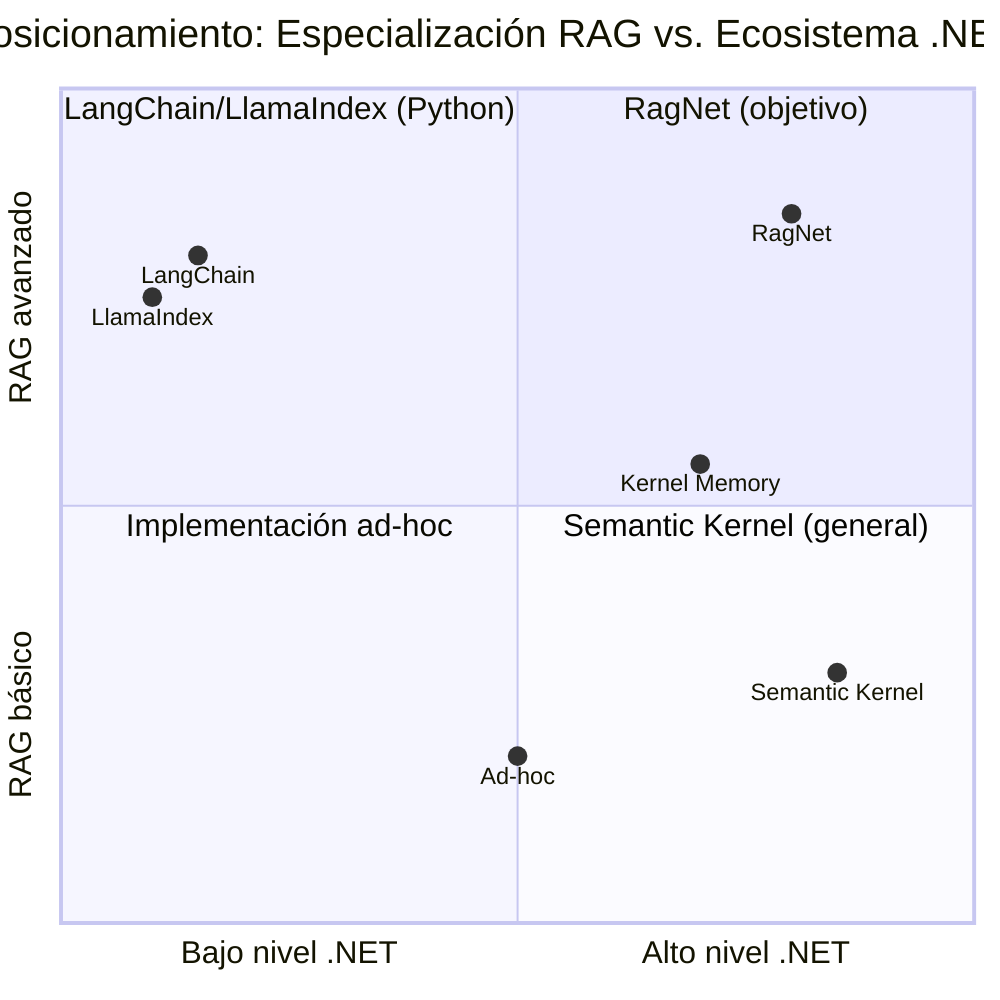
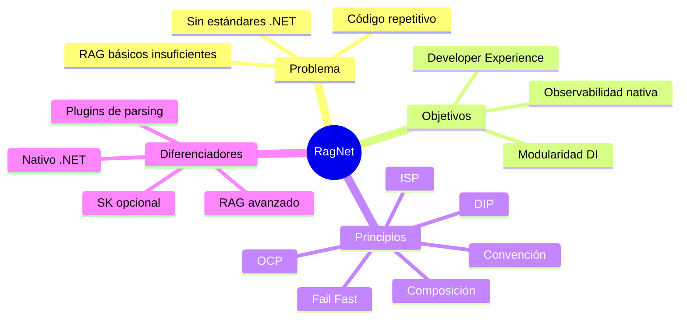

# 2. Contexto y Objetivos del Sistema

> **Documento:** `docs/02-contexto-objetivos.md`  
> **Versión:** 1.0  
> **Última actualización:** 2026-05-01

---

## 2.1. Problema que Resuelve RagNet

Los sistemas de Generación Aumentada por Recuperación (RAG) se han convertido en el estándar para conectar modelos de lenguaje con conocimiento privado o actualizado. Sin embargo, implementar un RAG de calidad empresarial en .NET presenta múltiples desafíos:

### Problemas de los RAG básicos

| Problema | Descripción | Consecuencia |
|----------|-------------|-------------|
| **Particionado estático** | Dividir documentos por número fijo de caracteres o tokens | Chunks incoherentes que cortan ideas a mitad de frase, degradando la recuperación |
| **Búsqueda unidimensional** | Solo búsqueda vectorial (sin keywords) | Falla con términos exactos, acrónimos y nombres propios |
| **Sin transformación de queries** | La query del usuario se usa tal cual para buscar | Queries ambiguas o cortas producen resultados irrelevantes |
| **Sin reranking** | Los resultados del retriever se usan directamente | Documentos irrelevantes "contaminan" el contexto del LLM |
| **Acoplamiento a proveedores** | Código atado a un LLM o vector store específico | Migrar de proveedor requiere reescribir la aplicación |
| **Sin observabilidad** | Pipeline opaco sin trazas ni métricas | Imposible diagnosticar por qué una respuesta es mala |
| **Código repetitivo** | Cada equipo reimplementa el mismo pipeline desde cero | Desperdicio de esfuerzo y calidad inconsistente |

### Lo que necesita la industria

Un desarrollador .NET que quiere construir un RAG empresarial necesita:

1. **Una biblioteca**, no un framework completo — que se integre en su aplicación existente, no que la reemplace.
2. **Abstracciones estándar de Microsoft** — no wrappers propietarios que se queden obsoletos.
3. **Calidad de recuperación avanzada** — chunking semántico, búsqueda híbrida, reranking.
4. **Configuración simple** — que funcione con pocas líneas en `Program.cs`.
5. **Flexibilidad total** — poder reemplazar cualquier componente sin reescribir todo.

**RagNet existe para cubrir esta necesidad.**

---

## 2.2. Posicionamiento frente a Alternativas Existentes

### Panorama actual

| Solución | Lenguaje | Enfoque | Limitación para .NET empresarial |
|----------|---------|---------|--------------------------------|
| **LangChain** | Python | Framework RAG completo | No nativo .NET. Requiere microservicio Python separado. |
| **LlamaIndex** | Python | Indexación y RAG | No nativo .NET. |
| **Semantic Kernel (solo)** | C# | Orquestación LLM general | No incluye chunking semántico, hybrid search, ni reranking. Es un framework general, no un RAG especializado. |
| **Kernel Memory** | C# | Pipeline de ingestión RAG | Orientado a memoria de agentes; menos control sobre el pipeline de retrieval. Acoplado a SK. |
| **Implementación ad-hoc** | C# | Custom por equipo | Repetitivo, sin patrones establecidos, calidad variable. |

### Posicionamiento de RagNet



**Diferenciadores clave de RagNet:**

| Diferenciador | Detalle |
|--------------|---------|
| **Nativo .NET** | Construido sobre abstracciones de Microsoft (MEAI, MEVD, SK), no wrappers. |
| **Especializado en RAG** | No intenta ser un framework general de IA. Cada componente está optimizado para el pipeline RAG. |
| **Modular** | Cada pieza (chunker, retriever, reranker, generator) es reemplazable vía DI. |
| **SK como opción, no obligación** | Usa SK solo donde aporta valor (generación) y lo hace opcional. |
| **Calidad de recuperación** | Incluye técnicas avanzadas (HyDE, RRF, reranking) que otras librerías .NET no ofrecen. |

---

## 2.3. Objetivos de Diseño

### 2.3.1. Modularidad e Intercambiabilidad (DI)

**Objetivo:** Cada componente del pipeline RAG debe ser un servicio inyectable e intercambiable sin afectar al resto del sistema.

**Cómo se materializa:**

- Todas las dependencias entre componentes se definen mediante **interfaces** en `RagNet.Abstractions`.
- Las implementaciones concretas se registran en el contenedor de DI de .NET.
- El **Strategy Pattern** permite cambiar algoritmos (chunkers, retrievers, rerankers) con una sola línea de configuración.
- Los **Parsers** son plugins que se instalan como paquetes NuGet independientes.

**Ejemplo de intercambiabilidad:**

```csharp
// Cambiar de búsqueda vectorial a híbrida:
// Antes:
pipeline.UseRetrieval<VectorRetriever>(topK: 5)
// Después (1 línea de cambio):
pipeline.UseHybridRetrieval(alpha: 0.5)
```

### 2.3.2. Developer Experience (DX) — Fluent API y Builders

**Objetivo:** Un desarrollador .NET debe poder configurar un RAG empresarial completo en menos de 20 líneas en `Program.cs`, usando patrones que ya conoce.

**Cómo se materializa:**

- **Builder Pattern** con Fluent API: `AddAdvancedRag()`, `AddIngestion()`, `AddPipeline()`.
- **Options Pattern** estándar de .NET para configuración desde `appsettings.json`.
- **IntelliSense** completo: los métodos disponibles guían al desarrollador.
- **Fail fast:** errores de configuración se detectan en el arranque, no en runtime.
- **Coherencia con el ecosistema:** sigue las mismas convenciones que ASP.NET Core, EF Core, etc.

**Métrica de éxito:** Un desarrollador con experiencia en ASP.NET Core debe ser capaz de integrar RagNet en su aplicación en **menos de 30 minutos** leyendo solo el README.

### 2.3.3. Observabilidad Nativa (OpenTelemetry)

**Objetivo:** Cada paso del pipeline RAG debe ser trazable, medible y diagnosticable sin configuración adicional.

**Cómo se materializa:**

- **`System.Diagnostics.Activity`** (OpenTelemetry nativo de .NET) para trazas distribuidas.
- **`System.Diagnostics.Metrics`** para contadores e histogramas.
- **`ILogger<T>`** estructurado para logging.
- **Health Checks** para verificar disponibilidad de servicios externos.
- Un solo método `AddRagNetInstrumentation()` habilita toda la telemetría.

**Métrica de éxito:** Un ingeniero de SRE debe poder visualizar el pipeline RAG completo (Transform → Retrieve → Rerank → Generate) con latencias y errores en Aspire Dashboard o Application Insights **sin escribir código de instrumentación**.

---

## 2.4. Restricciones y Supuestos

### Restricciones técnicas

| Restricción | Detalle |
|------------|---------|
| **.NET 8.0+** | Target framework mínimo. Usa features de C# 12 (primary constructors, collection expressions). |
| **Biblioteca de clases** | RagNet es una library, no una aplicación ejecutable ni un servicio. |
| **Sin estado propio** | RagNet no almacena estado internamente. Todo el estado reside en el VectorStore externo. |
| **Sin UI** | No incluye componentes de frontend. Es backend-only. |
| **Sin hosting propio** | No levanta servidores ni procesos. Se integra en el host de la aplicación consumidora. |

### Supuestos

| Supuesto | Implicación |
|---------|-------------|
| El consumidor tiene acceso a un LLM provider | RagNet no incluye modelos; requiere MEAI configurado. |
| El consumidor tiene acceso a un Vector Store | RagNet no incluye base de datos; requiere MEVD configurado. |
| Los documentos caben en memoria durante la ingestión | No se implementa streaming de documentos multi-GB en v1.0. |
| El LLM soporta streaming | Para `ExecuteStreamingAsync`, el provider debe soportar streaming. |

---

## 2.5. Principios Arquitectónicos Rectores

Los siguientes principios guían todas las decisiones de diseño en RagNet:

### 1. Dependency Inversion Principle (DIP)

> *"Depende de abstracciones, no de concreciones."*

Todas las capas dependen de interfaces definidas en `RagNet.Abstractions`. Ningún proyecto depende de implementaciones concretas de otro proyecto.

### 2. Interface Segregation Principle (ISP)

> *"Ningún consumidor debe depender de métodos que no utiliza."*

Cada interfaz modela una responsabilidad atómica: `IRetriever` solo recupera, `IDocumentReranker` solo reordena. No existen interfaces "monolíticas" que mezclen responsabilidades.

### 3. Open/Closed Principle (OCP)

> *"Abierto para extensión, cerrado para modificación."*

El sistema se extiende añadiendo nuevas implementaciones (nuevo parser, nuevo retriever), no modificando las existentes. El Pipeline Pattern y el Strategy Pattern materializan este principio.

### 4. Composition over Inheritance

> *"Prefiere la composición de objetos sobre la herencia de clases."*

RagNet no usa herencia para extensibilidad. Los decoradores, middlewares y strategies se componen en tiempo de configuración vía DI.

### 5. Convention over Configuration

> *"Los valores por defecto razonables reducen la configuración necesaria."*

Un pipeline funcional se configura con pocas líneas. Los valores por defecto (alpha=0.5, topK=5, threshold=0.85) cubren el caso general. El consumidor solo configura lo que quiere cambiar.

### 6. Fail Fast

> *"Los errores deben detectarse lo antes posible, preferiblemente en el arranque."*

La validación de configuración ocurre en `Build()`, durante el arranque de la aplicación. Un pipeline sin retriever o sin generator lanza una excepción al iniciar, no cuando un usuario hace la primera consulta.

---


