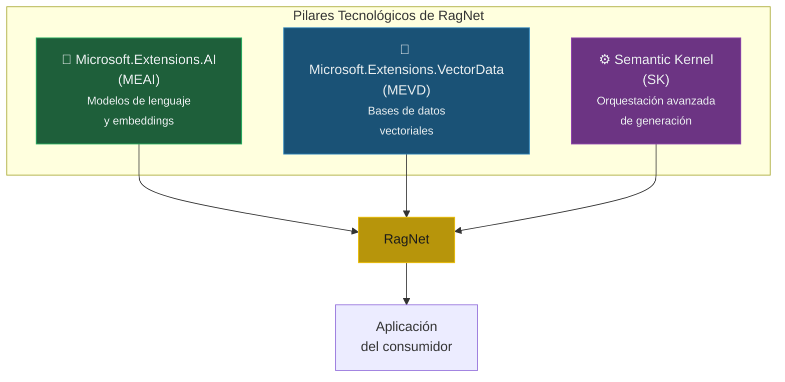
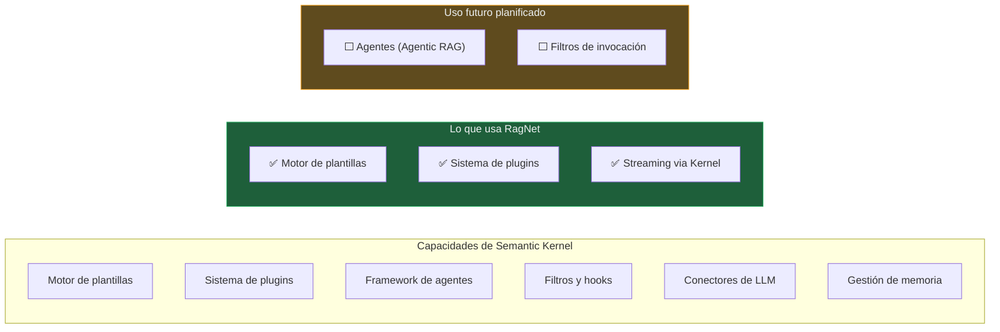

# 3. Pilares Tecnológicos

> **Documento:** `docs/03-pilares-tecnologicos.md`  
> **Versión:** 1.0  
> **Última actualización:** 2026-05-01

---

## 3.1. Visión General

RagNet se construye sobre tres pilares tecnológicos del ecosistema Microsoft que, combinados, proporcionan las abstracciones necesarias para un sistema RAG empresarial sin acoplamientos a proveedores concretos:



**Relación entre los pilares:**

| Pilar | Rol en RagNet | Obligatorio | Proyecto que lo consume |
|-------|-------------|:-----------:|----------------------|
| MEAI | Comunicación con LLMs y generación de embeddings | ✅ | `RagNet.Core` |
| MEVD | Almacenamiento y búsqueda vectorial | ✅ | `RagNet.Core` |
| SK | Generación avanzada con plantillas y plugins | ❌ (opcional) | `RagNet.SemanticKernel` |

---

## 3.2. Microsoft.Extensions.AI (MEAI)

### 3.2.1. Qué es y Por Qué es Importante

MEAI es un conjunto de abstracciones estándar que Microsoft ha integrado en el runtime de .NET para interactuar con modelos de IA. Es el equivalente a lo que `ILogger`, `IConfiguration` o `IHostedService` representan para logging, configuración y servicios en background: **una abstracción estándar que todos los proveedores implementan.**

**Antes de MEAI:**

```csharp
// ❌ Código acoplado a OpenAI
var client = new OpenAIClient("sk-...");
var result = await client.GetChatCompletionsAsync(new ChatCompletionsOptions
{
    DeploymentName = "gpt-4",
    Messages = { new ChatRequestUserMessage("Hola") }
});
```

**Con MEAI:**

```csharp
// ✅ Código desacoplado — funciona con cualquier proveedor
var response = await chatClient.CompleteAsync("Hola");
```

### 3.2.2. Interfaces Utilizadas por RagNet

#### `IChatClient`

```csharp
public interface IChatClient : IDisposable
{
    Task<ChatCompletion> CompleteAsync(
        IList<ChatMessage> chatMessages,
        ChatOptions? options = null,
        CancellationToken cancellationToken = default);

    IAsyncEnumerable<StreamingChatCompletionUpdate> CompleteStreamingAsync(
        IList<ChatMessage> chatMessages,
        ChatOptions? options = null,
        CancellationToken cancellationToken = default);
}
```

**Dónde lo usa RagNet:**

| Componente | Método | Propósito |
|-----------|--------|----------|
| `QueryRewriter` | `CompleteAsync` | Reescribir queries ambiguas |
| `HyDETransformer` | `CompleteAsync` | Generar documentos hipotéticos |
| `StepBackTransformer` | `CompleteAsync` | Abstraer queries específicas |
| `LLMMetadataEnricher` | `CompleteAsync` | Extraer entidades, keywords, resúmenes |
| `LLMReranker` | `CompleteAsync` | Puntuar relevancia de documentos |
| `SemanticKernelRagGenerator` | `CompleteStreamingAsync` (via SK) | Generar respuestas con streaming |

#### `IEmbeddingGenerator<string, Embedding<float>>`

```csharp
public interface IEmbeddingGenerator<TInput, TEmbedding> : IDisposable
{
    Task<GeneratedEmbeddings<TEmbedding>> GenerateAsync(
        IEnumerable<TInput> values,
        EmbeddingGenerationOptions? options = null,
        CancellationToken cancellationToken = default);
}
```

**Dónde lo usa RagNet:**

| Componente | Propósito |
|-----------|----------|
| `EmbeddingSimilarityChunker` | Calcular similitud entre oraciones para particionado semántico |
| Pipeline de ingestión | Generar embeddings de chunks para almacenamiento |
| `VectorRetriever` | Generar embedding de la query para búsqueda vectorial |
| `SemanticCache` | Generar embedding de la query para cache semántico |

### 3.2.3. Modelo de Middleware de MEAI

MEAI permite componer capacidades transversales (caching, logging, telemetría) como middlewares que envuelven la implementación real:

```csharp
// Cadena de middlewares MEAI
services.AddChatClient(pipeline => pipeline
    .Use(new DistributedCachingChatClient(...))   // Capa 1: Cache
    .Use(new OpenTelemetryChatClient(...))         // Capa 2: Telemetría
    .Use(new RateLimitingChatClient(...))          // Capa 3: Rate limiting
    .Use(new AzureOpenAIChatClient(...))           // Capa 4: Implementación real
);
```

**Relevancia para RagNet:** Este modelo de middleware es complementario al de RagNet. MEAI maneja la resiliencia a nivel de **llamada al LLM individual**, mientras que RagNet maneja la resiliencia a nivel de **pipeline RAG completo**.

### 3.2.4. Proveedores Compatibles

| Proveedor | Paquete NuGet | IChatClient | IEmbeddingGenerator |
|-----------|-------------|:-----------:|:------------------:|
| Azure OpenAI | `Microsoft.Extensions.AI.AzureAIInference` | ✅ | ✅ |
| OpenAI | `Microsoft.Extensions.AI.OpenAI` | ✅ | ✅ |
| Ollama (local) | `Microsoft.Extensions.AI.Ollama` | ✅ | ✅ |
| Amazon Bedrock | `Amazon.Extensions.AI` | ✅ | ✅ |
| Google Gemini | Community packages | ✅ | ✅ |
| Anthropic Claude | Community packages | ✅ | ❌ |
| HuggingFace | Community packages | ✅ | ✅ |

> [!TIP]
> **Implicación para RagNet:** Cualquier proveedor que implemente `IChatClient` y/o `IEmbeddingGenerator` funciona automáticamente con RagNet. **Cero código de adaptación.**

---

## 3.3. Microsoft.Extensions.VectorData (MEVD)

### 3.3.1. Qué es y Por Qué es Importante

MEVD proporciona abstracciones estándar para interactuar con bases de datos vectoriales, análogo a lo que `IDbConnection` hizo para bases de datos relacionales.

**Antes de MEVD:**

```csharp
// ❌ Código acoplado a Qdrant
var qdrantClient = new QdrantClient("localhost", 6334);
var searchResult = await qdrantClient.SearchAsync("my-collection",
    new float[] { 0.1f, 0.2f, ... }, limit: 5);
```

**Con MEVD:**

```csharp
// ✅ Código desacoplado — funciona con cualquier vector store
var results = await collection.VectorizedSearchAsync(queryVector,
    new VectorSearchOptions { Top = 5 });
```

### 3.3.2. Interfaces Utilizadas por RagNet

#### `IVectorStore`

```csharp
public interface IVectorStore
{
    IVectorStoreRecordCollection<TKey, TRecord>
        GetCollection<TKey, TRecord>(string name)
        where TKey : notnull;

    IAsyncEnumerable<string> ListCollectionNamesAsync(
        CancellationToken cancellationToken = default);
}
```

**Uso en RagNet:** Punto de acceso raíz para obtener colecciones y verificar conectividad (health checks).

#### `IVectorStoreRecordCollection<TKey, TRecord>`

```csharp
public interface IVectorStoreRecordCollection<TKey, TRecord>
    where TKey : notnull
{
    Task CreateCollectionIfNotExistsAsync(CancellationToken ct = default);
    Task<TRecord?> GetAsync(TKey key, CancellationToken ct = default);
    Task<TKey> UpsertAsync(TRecord record, CancellationToken ct = default);
    Task DeleteAsync(TKey key, CancellationToken ct = default);

    Task<VectorSearchResults<TRecord>> VectorizedSearchAsync(
        ReadOnlyMemory<float> vector,
        VectorSearchOptions? options = null,
        CancellationToken ct = default);
}
```

**Uso en RagNet:**

| Método | Componente | Propósito |
|--------|-----------|----------|
| `CreateCollectionIfNotExistsAsync` | Pipeline de ingestión | Crear la colección si no existe |
| `UpsertAsync` | Pipeline de ingestión | Almacenar chunks con vectores |
| `VectorizedSearchAsync` | `VectorRetriever` | Buscar documentos por similitud |

### 3.3.3. Modelo de Registro con Atributos

MEVD usa atributos para mapear propiedades de la clase a campos del vector store:

```csharp
public class DefaultRagVectorRecord
{
    [VectorStoreRecordKey]
    public string Id { get; set; }

    [VectorStoreRecordData(IsFilterable = true)]
    public string Content { get; set; }

    [VectorStoreRecordData(IsFullTextSearchable = true)]
    public string Keywords { get; set; }

    [VectorStoreRecordVector(Dimensions = 1536, DistanceFunction.CosineSimilarity)]
    public ReadOnlyMemory<float> Vector { get; set; }
}
```

| Atributo | Propósito |
|---------|----------|
| `[VectorStoreRecordKey]` | Identifica el campo como clave primaria |
| `[VectorStoreRecordData]` | Campo de datos almacenado con opciones de filtrado y FTS |
| `[VectorStoreRecordVector]` | Campo vectorial con dimensiones y función de distancia |

### 3.3.4. Proveedores Compatibles

| Proveedor | Paquete NuGet | Búsqueda vectorial | Full-text search | Filtrado |
|-----------|-------------|:------------------:|:---------------:|:-------:|
| Azure AI Search | `Microsoft.Extensions.VectorData.Azure` | ✅ | ✅ | ✅ |
| Qdrant | `Microsoft.Extensions.VectorData.Qdrant` | ✅ | ✅ | ✅ |
| Pinecone | `Microsoft.Extensions.VectorData.Pinecone` | ✅ | ❌ | ✅ |
| Weaviate | `Microsoft.Extensions.VectorData.Weaviate` | ✅ | ✅ | ✅ |
| Chroma | `Microsoft.Extensions.VectorData.Chroma` | ✅ | ❌ | ✅ |
| In-Memory | `Microsoft.Extensions.VectorData.InMemory` | ✅ | ❌ | ✅ |

> [!IMPORTANT]
> **Impacto en `HybridRetriever`:** La búsqueda híbrida requiere que el proveedor soporte Full-Text Search (`IsFullTextSearchable`). Si el proveedor no lo soporta, el `HybridRetriever` degrada automáticamente a solo búsqueda vectorial.

---

## 3.4. Semantic Kernel (SK)

### 3.4.1. Rol Limitado y Justificado en RagNet

Semantic Kernel es un framework completo de orquestación de IA. Sin embargo, RagNet lo utiliza **exclusivamente** en el módulo de generación, aislado en `RagNet.SemanticKernel`.



### 3.4.2. Componentes SK Utilizados

| Componente SK | Uso en RagNet | Alternativa sin SK |
|--------------|-------------|-------------------|
| `Kernel` | Contenedor de `SemanticKernelRagGenerator` | Invocar `IChatClient` directamente |
| `PromptTemplateConfig` + `KernelPromptTemplateFactory` | Renderizar prompts con `{{context}}`, `{{query}}` | String interpolation / `StringBuilder` |
| `Kernel.InvokePromptAsync` | Generación síncrona | `IChatClient.CompleteAsync` |
| `Kernel.InvokePromptStreamingAsync` | Generación en streaming | `IChatClient.CompleteStreamingAsync` |
| `[KernelFunction]` | Plugins de citas y verificación | Métodos estáticos manuales |
| `KernelArguments` | Pasar variables a plantillas | `Dictionary<string, object>` |

### 3.4.3. Relación entre MEAI y SK

SK se construye **sobre** MEAI. Internamente, `Kernel` usa `IChatClient` para comunicarse con LLMs. Esto significa que RagNet tiene una cadena coherente:

```
Proveedor LLM (Azure OpenAI, Ollama...)
    ↓ implementa
IChatClient (MEAI)
    ↓ consume
Kernel (SK)
    ↓ consume
SemanticKernelRagGenerator (RagNet.SemanticKernel)
    ↓ expone
IRagGenerator (RagNet.Abstractions)
    ↓ consume
DefaultRagPipeline (RagNet.Core)
```

> [!NOTE]
> Si SK cambia su API interna, solo afecta a `RagNet.SemanticKernel`. El resto de RagNet (Core, Abstractions, Parsers) no se ve afectado. Véase el [Apéndice C](./apendice-c-sk-vs-meai.md) para la matriz de decisión completa.

---

## 3.5. Ecosistema .NET Complementario

Además de los tres pilares principales, RagNet se apoya en estándares del ecosistema .NET:

| Área | Tecnología | Uso en RagNet |
|------|-----------|-------------|
| **Inyección de dependencias** | `Microsoft.Extensions.DependencyInjection` | Registro de todos los servicios y resolución de pipelines |
| **Configuración** | `Microsoft.Extensions.Options` | Options Pattern para todas las clases de opciones |
| **Logging** | `Microsoft.Extensions.Logging` | Logging estructurado en todos los componentes |
| **Observabilidad** | `System.Diagnostics.Activity` / `Metrics` | Trazas y métricas OpenTelemetry |
| **Health Checks** | `Microsoft.Extensions.Diagnostics.HealthChecks` | Verificación de VectorStore y LLM |
| **Resiliencia** | `Polly` (via `Microsoft.Extensions.Resilience`) | Retry, circuit breaker, fallback |
| **Tokenización** | `Microsoft.ML.Tokenizers` | Conteo de tokens para gestión del context window |
| **Hosting** | `Microsoft.Extensions.Hosting` | Integración con el host de la aplicación consumidora |

**Principio rector:** RagNet usa estándares de Microsoft siempre que existan. Solo introduce dependencias externas cuando no hay alternativa estándar (Markdig para Markdown, PdfPig para PDF, OpenXml para Office).
