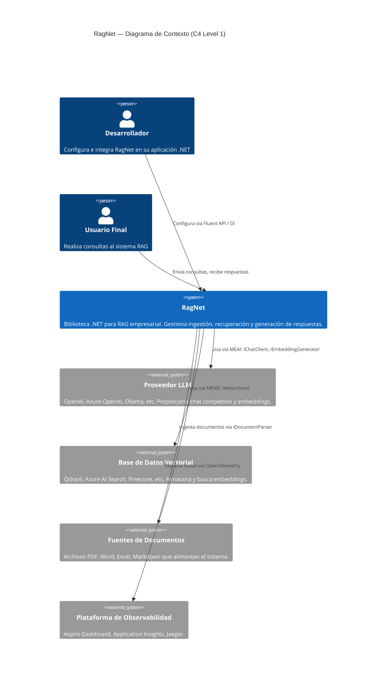
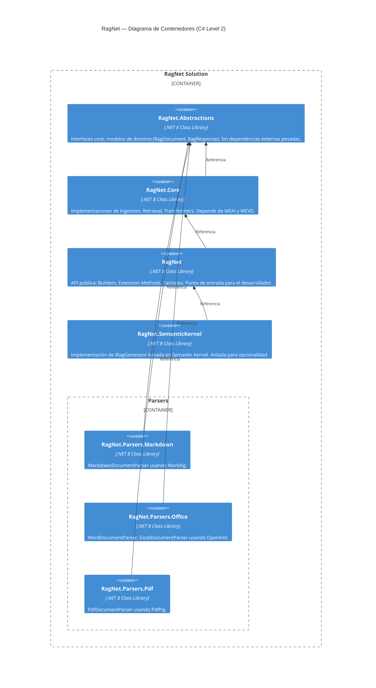
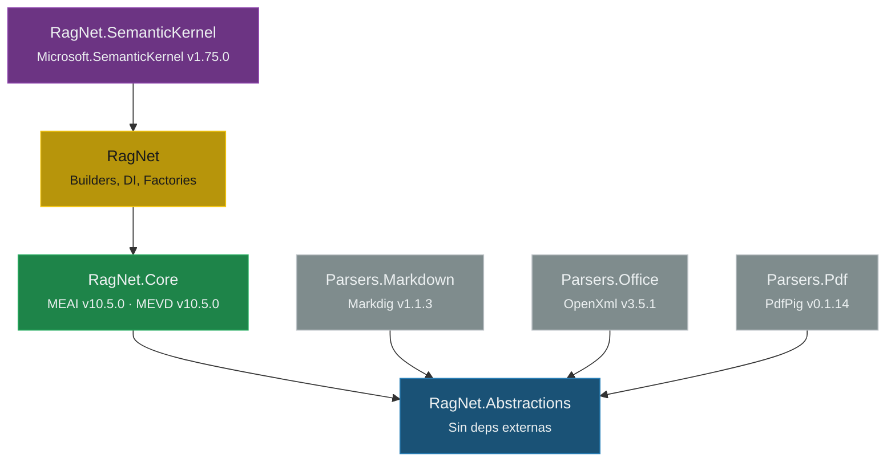
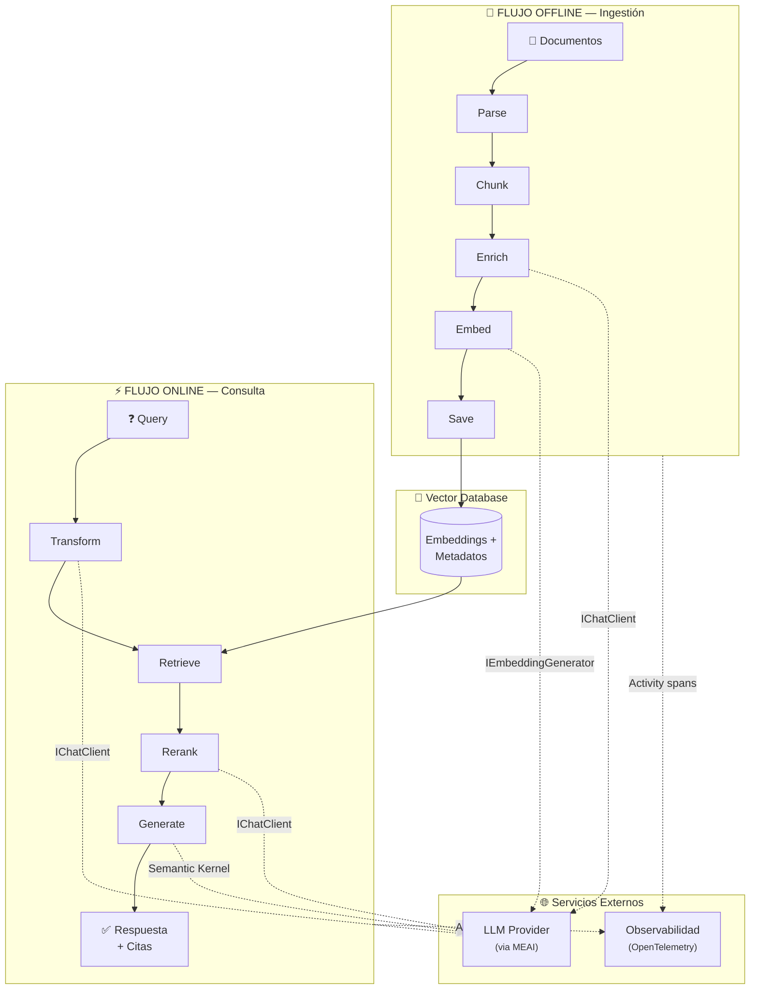
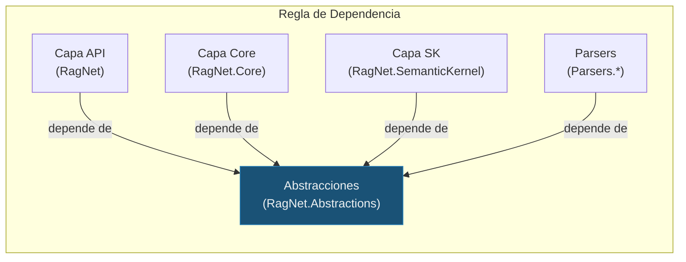
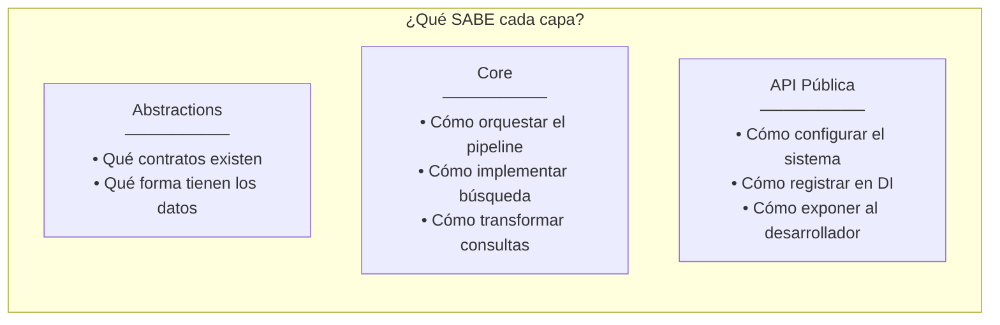

# 4. Arquitectura de Alto Nivel

> **Documento:** `docs/04-arquitectura-alto-nivel.md`  
> **Versión:** 1.0  
> **Última actualización:** 2026-05-01

---

## 4.1. Vista de Capas (Layered Architecture)

RagNet adopta una **arquitectura en capas estricta** donde cada capa solo puede depender de la capa inmediatamente inferior. Este diseño garantiza que los cambios en la infraestructura no propaguen rupturas hacia la lógica de negocio, y que la API pública pueda evolucionar independientemente del motor interno.

La arquitectura se organiza en **tres capas horizontales** y **una columna vertical de parsers** que se conecta lateralmente:

```
┌─────────────────────────────────────────────────────────────────┐
│                  CAPA 1 — API Pública / Builders                │
│                                                                 │
│  ┌─────────────────┐  ┌──────────────────────┐  ┌───────────┐  │
│  │ RagPipeline     │  │ IngestionPipeline    │  │ Extension │  │
│  │ Builder         │  │ Builder              │  │ Methods   │  │
│  └─────────────────┘  └──────────────────────┘  └───────────┘  │
│  Proyecto: RagNet                                               │
├─────────────────────────────────────────────────────────────────┤
│                  CAPA 2 — Motor Core RAG                        │
│                                                                 │
│  ┌───────────────┐  ┌──────────────────┐  ┌─────────────────┐  │
│  │  Ingestion    │  │   Retrieval      │  │   Generation    │  │
│  │  ─────────    │  │   ─────────      │  │   ──────────    │  │
│  │  • Semantic   │  │  • Query         │  │  • SK Prompts   │  │
│  │    Chunking   │  │    Transform     │  │  • Citation     │  │
│  │  • Metadata   │  │  • Hybrid Search │  │    Generation   │  │
│  │    Enrichment │  │  • Re-Ranking    │  │  • Streaming    │  │
│  └───────────────┘  └──────────────────┘  └─────────────────┘  │
│  Proyectos: RagNet.Core, RagNet.SemanticKernel                  │
├─────────────────────────────────────────────────────────────────┤
│             CAPA 3 — Abstracciones de Infraestructura           │
│                                                                 │
│  ┌────────────────┐  ┌──────────────────┐  ┌────────────────┐  │
│  │ Semantic       │  │ Microsoft.       │  │ Microsoft.     │  │
│  │ Kernel         │  │ Extensions.AI    │  │ Extensions.    │  │
│  │                │  │ (MEAI)           │  │ VectorData     │  │
│  └────────────────┘  └──────────────────┘  └────────────────┘  │
│  Proyecto: RagNet.Abstractions (contratos propios)              │
└─────────────────────────────────────────────────────────────────┘

  ┌─────────────────────┐
  │  Parsers (lateral)  │
  │  ───────────────    │
  │  • Markdown         │
  │  • Office (Word/XL) │  ← Dependen solo de RagNet.Abstractions
  │  • PDF              │
  └─────────────────────┘
```

### 4.1.1. Capa de API Pública / Builders

**Proyecto:** `RagNet`

Esta capa es la **única superficie visible** para el desarrollador consumidor. Su responsabilidad exclusiva es proporcionar una experiencia de configuración fluida y registrar los servicios en el contenedor de Inyección de Dependencias de .NET.

**Responsabilidades:**
- Exponer métodos de extensión sobre `IServiceCollection` (e.g., `AddAdvancedRag(...)`).
- Implementar los Builders (`RagPipelineBuilder`, `IngestionPipelineBuilder`) que permiten configurar el comportamiento del sistema mediante Fluent API.
- Proporcionar la factoría `IRagPipelineFactory` para resolver pipelines nombrados en tiempo de ejecución.
- Ocultar la complejidad interna: el consumidor no interactúa directamente con `RagNet.Core`.

**Principio de diseño:** Esta capa **no contiene lógica de negocio**. Actúa como fachada (*Facade Pattern*) sobre el Motor Core.

### 4.1.2. Capa del Motor Core RAG

**Proyectos:** `RagNet.Core` + `RagNet.SemanticKernel`

Es el corazón funcional de la biblioteca. Contiene las implementaciones concretas de los tres dominios del pipeline RAG:

| Submódulo | Responsabilidad | Interfaces que implementa |
|-----------|----------------|--------------------------|
| **Ingestion** | Particionado semántico, enriquecimiento de metadatos, generación de embeddings | `ISemanticChunker`, `IMetadataEnricher` |
| **Retrieval** | Transformación de consultas, búsqueda híbrida, reordenamiento | `IQueryTransformer`, `IRetriever`, `IDocumentReranker` |
| **Generation** | Síntesis de respuestas, streaming, citas, validación | `IRagGenerator` |

**Separación Core vs. SemanticKernel:**
- `RagNet.Core` contiene todo lo que depende exclusivamente de MEAI y MEVD.
- `RagNet.SemanticKernel` aísla las implementaciones que requieren Semantic Kernel (e.g., `SemanticKernelRagGenerator`), permitiendo que usuarios avanzados usen MEAI directamente sin arrastrar la dependencia de SK.

### 4.1.3. Capa de Abstracciones de Infraestructura

**Proyecto:** `RagNet.Abstractions`

Define los **contratos estables** del sistema: interfaces, records y modelos de dominio. Esta capa:

- **No tiene dependencias pesadas** (solo `Microsoft.Bcl.AsyncInterfaces` o similares).
- **No contiene lógica de negocio.**
- Sirve como el **contrato de inversión de dependencias**: tanto la capa Core como los Parsers dependen de ella, pero ella no depende de nadie.

Incluye: `RagDocument`, `DocumentNode`, `RagResponse`, `StreamingRagResponse`, y todas las interfaces (`IRetriever`, `IQueryTransformer`, `IDocumentReranker`, `IRagPipeline`, `ISemanticChunker`, `IDocumentParser`, `IRagGenerator`).

---

## 4.2. Diagrama de Arquitectura General (C4 — Nivel Contexto)

El diagrama de contexto muestra cómo RagNet se posiciona dentro del ecosistema más amplio de una aplicación empresarial.



**Actores:**
- **Desarrollador:** Integra RagNet en una aplicación ASP.NET Core, Worker Service, o cualquier host .NET. Configura los pipelines en `Program.cs`.
- **Usuario Final:** Interactúa con la aplicación que consume RagNet (chatbot, buscador, asistente). No conoce RagNet directamente.

**Sistemas externos:**
- **Proveedor LLM:** Cualquier servicio compatible con MEAI (`IChatClient`, `IEmbeddingGenerator`). RagNet es agnóstico al proveedor.
- **Base de Datos Vectorial:** Cualquier almacén compatible con MEVD (`IVectorStore`). Se abstrae completamente.
- **Fuentes de Documentos:** Los archivos crudos que alimentan la ingestión.
- **Observabilidad:** Backend que recibe los `Activity` spans generados por RagNet.

---

## 4.3. Diagrama de Contenedores (C4 — Nivel Contenedor)

Este diagrama descompone RagNet en sus proyectos/paquetes NuGet y muestra las dependencias internas.



### Grafo de dependencias entre proyectos



**Reglas de dependencia:**

| Proyecto | Puede referenciar | NO puede referenciar |
|----------|-------------------|----------------------|
| `RagNet.Abstractions` | — (ninguno) | Todo lo demás |
| `RagNet.Core` | `Abstractions` | `RagNet`, `SemanticKernel`, `Parsers.*` |
| `RagNet` | `Core` (transitivamente `Abstractions`) | `SemanticKernel`, `Parsers.*` |
| `RagNet.SemanticKernel` | `RagNet` (transitivamente `Core`, `Abstractions`) | `Parsers.*` |
| `Parsers.*` | `Abstractions` | `Core`, `RagNet`, `SemanticKernel` |

Esta tabla codifica la **Dependency Rule** de Clean Architecture: las dependencias siempre apuntan hacia el centro (Abstractions).

---

## 4.4. Flujo de Datos End-to-End

RagNet gestiona dos flujos de datos fundamentales que, combinados, componen el ciclo de vida completo de un sistema RAG.

### 4.4.1. Flujo de Ingestión

El flujo de ingestión transforma documentos crudos en representaciones vectoriales enriquecidas, listas para ser recuperadas.

```mermaid
flowchart LR
    subgraph INPUT["Entrada"]
        A["📄 Archivo Crudo<br/>(PDF, Word, MD)"]
    end

    subgraph PARSE["1. Parsing"]
        B["IDocumentParser<br/><small>Extrae estructura</small>"]
        C["DocumentNode[]<br/><small>Árbol jerárquico</small>"]
    end

    subgraph CHUNK["2. Chunking Semántico"]
        D["ISemanticChunker<br/><small>Agrupa por similitud</small>"]
        E["RagDocument[]<br/><small>Chunks semánticos</small>"]
    end

    subgraph ENRICH["3. Enriquecimiento"]
        F["IMetadataEnricher<br/><small>Extrae entidades,<br/>keywords, resúmenes</small>"]
        G["RagDocument[]<br/><small>Con metadatos</small>"]
    end

    subgraph EMBED["4. Embedding"]
        H["IEmbeddingGenerator<br/><small>MEAI</small>"]
        I["RagDocument[]<br/><small>Con vectores</small>"]
    end

    subgraph STORE["5. Almacenamiento"]
        J["IVectorStore<br/><small>MEVD</small>"]
        K[("💾 Vector DB")]
    end

    A --> B --> C --> D --> E --> F --> G --> H --> I --> J --> K
```



**Descripción de cada etapa:**

| # | Etapa | Componente | Entrada | Salida | Tecnología base |
|---|-------|-----------|---------|--------|----------------|
| 1 | **Parsing** | `IDocumentParser` | Archivo binario (bytes/stream) | `DocumentNode[]` (árbol jerárquico) | Markdig, OpenXml, PdfPig |
| 2 | **Chunking** | `ISemanticChunker` | `DocumentNode[]` | `RagDocument[]` (chunks) | MEAI (`IEmbeddingGenerator`) |
| 3 | **Enriquecimiento** | `IMetadataEnricher` | `RagDocument[]` | `RagDocument[]` (con metadata) | MEAI (`IChatClient`) |
| 4 | **Embedding** | `IEmbeddingGenerator` | Texto de cada chunk | Vectores `ReadOnlyMemory<float>` | MEAI |
| 5 | **Almacenamiento** | `IVectorStore` | `RagDocument[]` completos | Registros persistidos | MEVD |

**Orquestación:** El `IngestionPipelineBuilder` compone estas etapas en un pipeline secuencial. Cada etapa es un componente reemplazable vía Strategy Pattern.

### 4.4.2. Flujo de Consulta (Query → Response)

El flujo de consulta recibe una pregunta del usuario y produce una respuesta fundamentada con citas.

```mermaid
flowchart LR
    subgraph INPUT["Entrada"]
        A["❓ Consulta<br/>del Usuario"]
    end

    subgraph TRANSFORM["1. Transformación"]
        B["IQueryTransformer<br/><small>HyDE, Rewrite,<br/>StepBack</small>"]
        C["Query[]<br/><small>Consultas optimizadas</small>"]
    end

    subgraph RETRIEVE["2. Recuperación"]
        D["IRetriever<br/><small>Vector + Keyword<br/>→ Hybrid (RRF)</small>"]
        E["RagDocument[]<br/><small>Top-N candidatos</small>"]
    end

    subgraph RERANK["3. Re-Ranking"]
        F["IDocumentReranker<br/><small>CrossEncoder o<br/>LLM scoring</small>"]
        G["RagDocument[]<br/><small>Top-K relevantes</small>"]
    end

    subgraph GENERATE["4. Generación"]
        H["IRagGenerator<br/><small>Semantic Kernel<br/>+ Prompt Template</small>"]
        I["RagResponse<br/><small>Respuesta + Citas</small>"]
    end

    A --> B --> C --> D --> E --> F --> G --> H --> I
```



**Descripción de cada etapa:**

| # | Etapa | Componente | Entrada | Salida | Propósito |
|---|-------|-----------|---------|--------|-----------|
| 1 | **Transformación** | `IQueryTransformer` | Query original (string) | `IEnumerable<string>` (queries expandidas) | Mejorar el *recall*: reescribir consultas ambiguas, generar documentos hipotéticos (HyDE), abstraer conceptos (StepBack) |
| 2 | **Recuperación** | `IRetriever` | Queries transformadas + Top-N | `IEnumerable<RagDocument>` (candidatos) | Obtener un conjunto amplio de documentos relevantes combinando búsqueda vectorial y por keywords |
| 3 | **Re-Ranking** | `IDocumentReranker` | Candidatos + Query + Top-K | `IEnumerable<RagDocument>` (filtrados) | Refinar resultados: pasar de Top-20 candidatos a los Top-5 más relevantes usando modelos especializados |
| 4 | **Generación** | `IRagGenerator` | Documentos relevantes + Query | `RagResponse` / `IAsyncEnumerable<StreamingRagResponse>` | Sintetizar respuesta con citas, validar alucinaciones, soportar streaming |

**Orquestación:** El `RagPipelineBuilder` compone este flujo como un pipeline de middleware, análogo al request pipeline de ASP.NET Core. Cada paso puede ser interceptado, decorado o reemplazado.

### 4.4.3. Diagrama Integrado: Ciclo de Vida Completo



**Aspectos clave del ciclo integrado:**

1. **Desacoplamiento temporal:** La ingestión (offline) y la consulta (online) son independientes. Los documentos se ingestan una vez y se consultan muchas veces.
2. **Base de datos vectorial como nexo:** El Vector Store es el punto de unión entre ambos flujos.
3. **LLM como servicio transversal:** Tanto la ingestión (enriquecimiento, embedding) como la consulta (transformación, reranking, generación) consumen el LLM, pero siempre a través de abstracciones MEAI.
4. **Observabilidad omnipresente:** Ambos flujos emiten `Activity` spans que permiten trazabilidad completa.

---

## 4.5. Principio de Separación de Concerns entre Capas

La arquitectura de RagNet aplica rigurosamente varios principios de separación que garantizan la mantenibilidad y evolución independiente de cada componente.

### 4.5.1. Dependency Inversion Principle (DIP)

Todas las capas superiores dependen de **abstracciones** definidas en `RagNet.Abstractions`, nunca de implementaciones concretas.



Esto permite:
- **Reemplazar implementaciones** sin tocar los consumidores (e.g., cambiar `EmbeddingSimilarityChunker` por `NLPBoundaryChunker`).
- **Testear** cada capa aisladamente usando mocks de las interfaces.
- **Distribuir paquetes NuGet** de forma granular: un usuario puede usar solo `Abstractions` + `Core` sin incluir SK ni parsers específicos.

### 4.5.2. Separación por Dominio Funcional

Dentro de la Capa Core, los tres submódulos (Ingestion, Retrieval, Generation) están **separados por dominio funcional**, no por capa técnica. Cada submódulo encapsula:

- Sus propias interfaces de estrategia (`ISemanticChunker`, `IRetriever`, etc.)
- Sus implementaciones concretas
- Su propia fuente de `Activity` para trazabilidad

### 4.5.3. Separación de Dependencia Opcional (SK)

La decisión de separar `RagNet.SemanticKernel` en su propio proyecto responde a un principio de **dependencia opcional**:

| Escenario del consumidor | Paquetes necesarios |
|--------------------------|-------------------|
| RAG completo con SK | `RagNet` + `RagNet.SemanticKernel` + Parser(s) |
| RAG con MEAI directo (sin SK) | `RagNet` + Parser(s) + implementación propia de `IRagGenerator` |
| Solo ingestión | `RagNet` + Parser(s) |
| Implementación custom total | `RagNet.Abstractions` + implementaciones propias |

### 4.5.4. Parsers como Plugins Desacoplados

Los proyectos `Parsers.*` solo dependen de `RagNet.Abstractions`. Esto los convierte en **plugins puros**:

- El consumidor instala únicamente los parsers que necesita.
- Cada parser puede evolucionar y versionarse independientemente.
- Añadir soporte para un nuevo formato (e.g., HTML, CSV) solo requiere crear un nuevo proyecto que implemente `IDocumentParser` y referencie `Abstractions`.
- La biblioteca core **nunca tiene dependencias transitivas** sobre librerías de parsing (Markdig, OpenXml, PdfPig).

### 4.5.5. Resumen de Responsabilidades por Capa



| Pregunta | Capa responsable |
|----------|-----------------|
| *¿Qué forma tiene un documento RAG?* | Abstractions |
| *¿Cómo se particiona un documento semánticamente?* | Core |
| *¿Cómo se combina búsqueda vectorial con keyword?* | Core |
| *¿Cómo se genera una respuesta con Semantic Kernel?* | SemanticKernel |
| *¿Cómo se configura todo esto en `Program.cs`?* | RagNet (API) |
| *¿Cómo se extrae texto de un PDF?* | Parsers.Pdf |

---

> [!IMPORTANT]
> La adherencia a estas reglas de separación es **crítica** para el éxito de RagNet como biblioteca reutilizable. Cualquier violación (e.g., que Core referencie directamente a un Parser, o que Abstractions incluya lógica de negocio) debe ser tratada como un defecto arquitectónico y corregida antes del merge.
