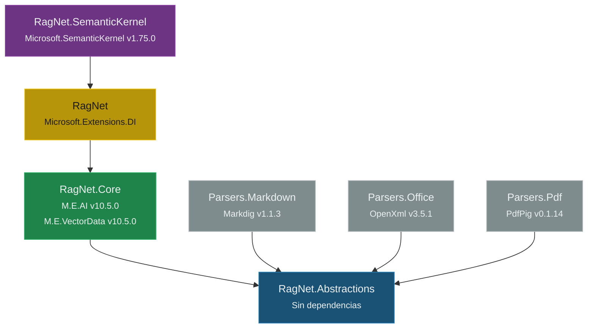

# 5. Estructura de la Solución y Proyectos

## Parte 1 — Organización de la Solución y Mapa de Proyectos

> **Documento:** `docs/05-01-estructura-solucion-proyectos.md`  
> **Versión:** 1.0  
> **Última actualización:** 2026-05-01

---

## 5.1. Organización de la Solución (`RagNet.slnx`)

La solución utiliza el formato moderno `.slnx` (XML) de .NET y organiza los proyectos en dos niveles: raíz y carpeta `Parsers/`.

```
RagNet.slnx
│
├── RagNet.Abstractions/          ← Contratos y modelos de dominio
│   ├── RagNet.Abstractions.csproj
│   └── readme.md
│
├── RagNet.Core/                  ← Lógica principal y orquestación
│   ├── RagNet.Core.csproj
│   └── readme.md
│
├── RagNet/                       ← API pública, Builders, DI
│   ├── RagNet.csproj
│   └── readme.md
│
├── RagNet.SemanticKernel/        ← Integración con Semantic Kernel
│   ├── RagNet.SemanticKernel.csproj
│   └── readme.md
│
└── Parsers/                      ← Carpeta de solución (Solution Folder)
    ├── RagNet.Parsers.Markdown/  ← Parser Markdown (Markdig)
    │   ├── RagNet.Parsers.Markdown.csproj
    │   └── readme.md
    ├── RagNet.Parsers.Office/    ← Parser Word/Excel (OpenXml)
    │   ├── RagNet.Parsers.Office.csproj
    │   └── readme.md
    └── RagNet.Parsers.Pdf/       ← Parser PDF (PdfPig)
        ├── RagNet.Parsers.Pdf.csproj
        └── readme.md
```

**Estructura del archivo `RagNet.slnx`:**

```xml
<Solution>
  <Folder Name="/Parsers/">
    <Project Path="Parsers/RagNet.Parsers.Markdown/RagNet.Parsers.Markdown.csproj" />
    <Project Path="Parsers/RagNet.Parsers.Office/RagNet.Parsers.Office.csproj" />
    <Project Path="Parsers/RagNet.Parsers.Pdf/RagNet.Parsers.Pdf.csproj" />
  </Folder>
  <Project Path="RagNet.Abstractions/RagNet.Abstractions.csproj" />
  <Project Path="RagNet.Core/RagNet.Core.csproj" />
  <Project Path="RagNet.SemanticKernel/RagNet.SemanticKernel.csproj" />
  <Project Path="RagNet/RagNet.csproj" />
</Solution>
```

**Configuración común:** Todos los proyectos comparten:

| Propiedad | Valor |
|-----------|-------|
| Target framework | `net8.0` |
| Implicit usings | `enable` |
| Nullable | `enable` |

---

## 5.2. Mapa de Proyectos y Responsabilidades

### 5.2.1. `RagNet.Abstractions` — Contratos y Modelos de Dominio

| Aspecto | Detalle |
|---------|---------|
| **Propósito** | Definir las interfaces core y modelos de dominio del sistema. No contiene lógica de negocio. |
| **Dependencias NuGet** | Ninguna (o solo `Microsoft.Bcl.AsyncInterfaces`) |
| **Dependencias de proyecto** | Ninguna |
| **Quién lo referencia** | Todos los demás proyectos |

**Contenido:**

```
RagNet.Abstractions/
├── Models/
│   ├── RagDocument.cs
│   ├── DocumentNode.cs
│   ├── DocumentNodeType.cs
│   ├── RagResponse.cs
│   ├── StreamingRagResponse.cs
│   └── Citation.cs
├── Interfaces/
│   ├── IDocumentParser.cs
│   ├── ISemanticChunker.cs
│   ├── IMetadataEnricher.cs
│   ├── IQueryTransformer.cs
│   ├── IRetriever.cs
│   ├── IDocumentReranker.cs
│   ├── IRagPipeline.cs
│   ├── IRagPipelineFactory.cs
│   └── IRagGenerator.cs
└── Options/
    ├── SemanticChunkerOptions.cs
    └── ...
```

---

### 5.2.2. `RagNet.Core` — Lógica Principal y Orquestación

| Aspecto | Detalle |
|---------|---------|
| **Propósito** | Implementaciones por defecto de los módulos de Ingestión, Recuperación y Transformación. |
| **Dependencias NuGet** | `Microsoft.Extensions.AI` (v10.5.0), `Microsoft.Extensions.VectorData.Abstractions` (v10.5.0) |
| **Dependencias de proyecto** | `RagNet.Abstractions` |
| **Quién lo referencia** | `RagNet` |

**Contenido:**

```
RagNet.Core/
├── Ingestion/
│   ├── Chunkers/
│   │   ├── NLPBoundaryChunker.cs
│   │   ├── MarkdownStructureChunker.cs
│   │   └── EmbeddingSimilarityChunker.cs
│   ├── Enrichment/
│   │   └── LLMMetadataEnricher.cs
│   └── Storage/
│       └── DefaultRagVectorRecord.cs
├── Retrieval/
│   ├── VectorRetriever.cs
│   ├── KeywordRetriever.cs
│   └── HybridRetriever.cs
├── Transformation/
│   ├── QueryRewriter.cs
│   ├── HyDETransformer.cs
│   ├── StepBackTransformer.cs
│   └── CompositeQueryTransformer.cs
├── Reranking/
│   ├── CrossEncoderReranker.cs
│   └── LLMReranker.cs
├── Pipeline/
│   ├── DefaultRagPipeline.cs
│   ├── RagPipelineContext.cs
│   └── Middlewares/
│       ├── QueryTransformationMiddleware.cs
│       ├── RetrievalMiddleware.cs
│       ├── RerankingMiddleware.cs
│       └── GenerationMiddleware.cs
├── Diagnostics/
│   ├── RagNetActivitySources.cs
│   ├── RagNetMetrics.cs
│   └── HealthChecks/
│       ├── VectorStoreHealthCheck.cs
│       └── LlmProviderHealthCheck.cs
└── Options/
    ├── NLPBoundaryChunkerOptions.cs
    ├── MarkdownStructureChunkerOptions.cs
    ├── EmbeddingSimilarityChunkerOptions.cs
    ├── LLMMetadataEnricherOptions.cs
    └── HybridRetrieverOptions.cs
```

---

### 5.2.3. `RagNet` — API Pública, Builders y DI

| Aspecto | Detalle |
|---------|---------|
| **Propósito** | Punto de entrada para el consumidor. Fluent API, extension methods y factories. |
| **Dependencias NuGet** | `Microsoft.Extensions.DependencyInjection` (transitivo) |
| **Dependencias de proyecto** | `RagNet.Core` |
| **Quién lo referencia** | `RagNet.SemanticKernel`, aplicación consumidora |

**Contenido:**

```
RagNet/
├── Builders/
│   ├── RagBuilder.cs
│   ├── RagPipelineBuilder.cs
│   └── IngestionPipelineBuilder.cs
├── Factories/
│   └── RagPipelineFactory.cs
├── Extensions/
│   ├── RagServiceCollectionExtensions.cs
│   ├── RagNetTelemetryExtensions.cs
│   └── RagNetHealthCheckExtensions.cs
└── Pipeline/
    └── IIngestionPipeline.cs
```

---

### 5.2.4. `RagNet.SemanticKernel` — Integración con SK

| Aspecto | Detalle |
|---------|---------|
| **Propósito** | Implementación de `IRagGenerator` basada en Semantic Kernel. Separada porque SK es opcional. |
| **Dependencias NuGet** | `Microsoft.SemanticKernel` (v1.75.0) |
| **Dependencias de proyecto** | `RagNet` |
| **Quién lo referencia** | Aplicación consumidora (si desea SK) |

**Contenido:**

```
RagNet.SemanticKernel/
├── SemanticKernelRagGenerator.cs
├── Plugins/
│   ├── CitationPlugin.cs
│   └── FactCheckPlugin.cs
├── Options/
│   ├── SemanticKernelGeneratorOptions.cs
│   └── SelfRagOptions.cs
└── Extensions/
    └── RagPipelineBuilderSkExtensions.cs
```

---

### 5.2.5-7. Parsers — Markdown, Office y PDF

| Proyecto | Extensiones | Dependencia NuGet | Componentes |
|----------|------------|-------------------|-------------|
| `RagNet.Parsers.Markdown` | `.md`, `.markdown` | `Markdig` v1.1.3 | `MarkdownDocumentParser` |
| `RagNet.Parsers.Office` | `.docx`, `.xlsx` | `DocumentFormat.OpenXml` v3.5.1 | `WordDocumentParser`, `ExcelDocumentParser` |
| `RagNet.Parsers.Pdf` | `.pdf` | `PdfPig` v0.1.14 | `PdfDocumentParser` |

Todos dependen **únicamente** de `RagNet.Abstractions`. Son plugins aislados.

---

## 5.3. Grafo de Dependencias entre Proyectos



**Reglas de dependencia formales:**

| Proyecto | Puede referenciar | NO puede referenciar |
|----------|-------------------|----------------------|
| `Abstractions` | Nada | Todo |
| `Core` | `Abstractions` | `RagNet`, `SemanticKernel`, `Parsers.*` |
| `RagNet` | `Core` → `Abstractions` | `SemanticKernel`, `Parsers.*` |
| `SemanticKernel` | `RagNet` → `Core` → `Abstractions` | `Parsers.*` |
| `Parsers.*` | `Abstractions` | `Core`, `RagNet`, `SemanticKernel` |

> [!IMPORTANT]
> Los Parsers y SemanticKernel **nunca** se referencian mutuamente. Son ramas independientes del grafo de dependencias que solo convergen en Abstractions.

---

> [!NOTE]
> Continúa en [Parte 2 — Dependencias Externas y Versionado](./05-02-dependencias-externas-versionado.md).
