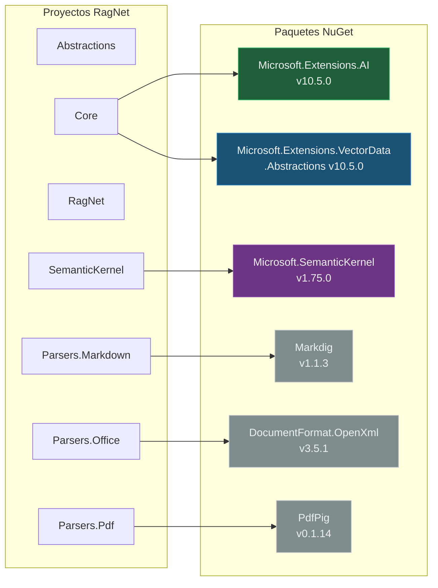
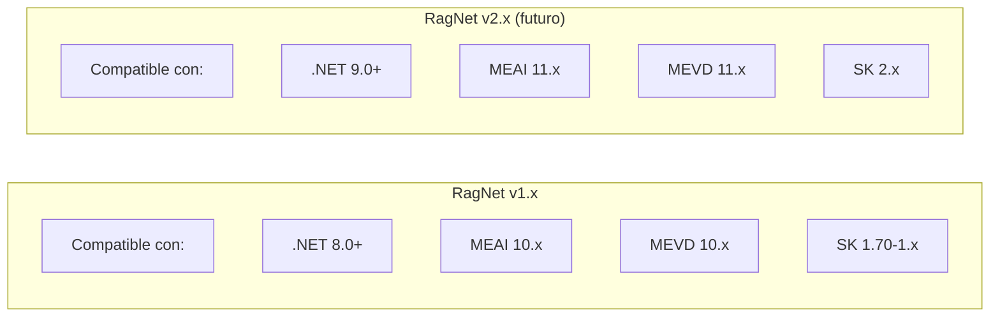

# 5. Estructura de la Solución y Proyectos

## Parte 2 — Dependencias Externas y Estrategia de Versionado

> **Documento:** `docs/05-02-dependencias-externas-versionado.md`  
> **Versión:** 1.0  
> **Última actualización:** 2026-05-01

---

## 5.4. Dependencias Externas (NuGet)

### Mapa Completo de Dependencias



---

### 5.4.1. Microsoft.Extensions.AI (v10.5.0)

| Aspecto | Detalle |
|---------|---------|
| **Paquete** | `Microsoft.Extensions.AI` |
| **Versión** | 10.5.0 |
| **Consumido por** | `RagNet.Core` |
| **Propósito** | Abstracciones estándar para chat (`IChatClient`) y embeddings (`IEmbeddingGenerator`) |
| **Estabilidad** | Estable — Parte del runtime oficial de .NET |
| **Licencia** | MIT |

**Interfaces utilizadas por RagNet:**

| Interfaz MEAI | Usado en | Para qué |
|--------------|---------|----------|
| `IChatClient` | `QueryRewriter`, `HyDETransformer`, `StepBackTransformer`, `LLMMetadataEnricher`, `LLMReranker` | Enviar prompts y recibir respuestas de texto |
| `IChatClient.CompleteStreamingAsync` | `SemanticKernelRagGenerator` (via SK) | Streaming de tokens |
| `IEmbeddingGenerator<string, Embedding<float>>` | `EmbeddingSimilarityChunker`, `VectorRetriever`, Pipeline de ingestión | Generar vectores de embedding |

**Proveedores compatibles:** Cualquier implementación de `IChatClient` funciona con RagNet:

| Proveedor | Paquete NuGet |
|-----------|-------------|
| Azure OpenAI | `Microsoft.Extensions.AI.AzureAIInference` |
| OpenAI | `Microsoft.Extensions.AI.OpenAI` |
| Ollama (local) | `Microsoft.Extensions.AI.Ollama` |
| Amazon Bedrock | `Amazon.Extensions.AI` |
| Google Gemini | Implementación comunitaria |

---

### 5.4.2. Microsoft.Extensions.VectorData.Abstractions (v10.5.0)

| Aspecto | Detalle |
|---------|---------|
| **Paquete** | `Microsoft.Extensions.VectorData.Abstractions` |
| **Versión** | 10.5.0 |
| **Consumido por** | `RagNet.Core` |
| **Propósito** | Abstracciones estándar para bases de datos vectoriales (`IVectorStore`) |
| **Estabilidad** | Estable |
| **Licencia** | MIT |

**Interfaces utilizadas:**

| Interfaz MEVD | Usado en | Para qué |
|--------------|---------|----------|
| `IVectorStore` | Pipeline de ingestión, configuración | Punto de acceso al almacén vectorial |
| `IVectorStoreRecordCollection<TKey, TRecord>` | `VectorRetriever`, Pipeline de ingestión | CRUD de registros vectoriales |
| `VectorizedSearchAsync` | `VectorRetriever`, `SemanticCache` | Búsqueda por similitud vectorial |

**Proveedores compatibles:**

| Proveedor | Paquete NuGet |
|-----------|-------------|
| Azure AI Search | `Microsoft.Extensions.VectorData.Azure` |
| Qdrant | `Microsoft.Extensions.VectorData.Qdrant` |
| Pinecone | `Microsoft.Extensions.VectorData.Pinecone` |
| Weaviate | `Microsoft.Extensions.VectorData.Weaviate` |
| In-Memory (testing) | `Microsoft.Extensions.VectorData.InMemory` |

---

### 5.4.3. Microsoft.SemanticKernel (v1.75.0)

| Aspecto | Detalle |
|---------|---------|
| **Paquete** | `Microsoft.SemanticKernel` |
| **Versión** | 1.75.0 |
| **Consumido por** | `RagNet.SemanticKernel` (aislado) |
| **Propósito** | Motor de plantillas de prompts, invocación de funciones, streaming avanzado |
| **Estabilidad** | Releases frecuentes, API en evolución |
| **Licencia** | MIT |

**Componentes de SK utilizados:**

| Componente SK | Uso en RagNet |
|--------------|-------------|
| `Kernel` | Contenedor central para `SemanticKernelRagGenerator` |
| `KernelPromptTemplateFactory` | Renderizado de plantillas `{{context}}`, `{{query}}` |
| `Kernel.InvokePromptAsync` | Generación síncrona de respuestas |
| `Kernel.InvokePromptStreamingAsync` | Generación en streaming |
| `KernelFunction` / `[KernelFunction]` | Plugins (`CitationPlugin`, `FactCheckPlugin`) |

> [!WARNING]
> SK es la dependencia con mayor riesgo de breaking changes. Por eso se aísla en su propio proyecto. Actualizaciones de SK deben testearse exhaustivamente antes de bump de versión.

---

### 5.4.4. Markdig (v1.1.3)

| Aspecto | Detalle |
|---------|---------|
| **Paquete** | `Markdig` |
| **Versión** | 1.1.3 |
| **Consumido por** | `RagNet.Parsers.Markdown` |
| **Propósito** | Parsear Markdown a un AST (Abstract Syntax Tree) |
| **Estabilidad** | Muy estable, mantenimiento activo |
| **Licencia** | BSD-2-Clause |

**Uso en RagNet:** `MarkdownDocumentParser` usa Markdig para construir un `MarkdownDocument` AST y luego lo transforma a `DocumentNode`.

---

### 5.4.5. DocumentFormat.OpenXml (v3.5.1)

| Aspecto | Detalle |
|---------|---------|
| **Paquete** | `DocumentFormat.OpenXml` |
| **Versión** | 3.5.1 |
| **Consumido por** | `RagNet.Parsers.Office` |
| **Propósito** | Lectura de archivos Word (.docx) y Excel (.xlsx) |
| **Estabilidad** | Muy estable, mantenido por Microsoft |
| **Licencia** | MIT |

**Uso en RagNet:**
- `WordDocumentParser`: Abre `WordprocessingDocument`, itera `Body.Elements`, detecta estilos de heading.
- `ExcelDocumentParser`: Abre `SpreadsheetDocument`, itera hojas y filas.

---

### 5.4.6. PdfPig (v0.1.14)

| Aspecto | Detalle |
|---------|---------|
| **Paquete** | `PdfPig` |
| **Versión** | 0.1.14 |
| **Consumido por** | `RagNet.Parsers.Pdf` |
| **Propósito** | Extracción de texto y estructura desde archivos PDF |
| **Estabilidad** | Estable para lectura de PDF |
| **Licencia** | Apache-2.0 |

**Uso en RagNet:** `PdfDocumentParser` usa PdfPig para extraer bloques de texto con posición y tamaño de fuente, infiriendo headings y párrafos heurísticamente.

---

## 5.5. Estrategia de Versionado de Paquetes

### Versionado Semántico (SemVer)

RagNet sigue SemVer 2.0 para todos sus paquetes:

```
MAJOR.MINOR.PATCH[-prerelease]

MAJOR: Cambios incompatibles en la API pública (breaking changes)
MINOR: Funcionalidad nueva compatible hacia atrás
PATCH: Correcciones de errores compatibles hacia atrás
```

### Versionado de Paquetes NuGet de RagNet

| Paquete | Versión inicial | Política de bump |
|---------|----------------|-----------------|
| `RagNet.Abstractions` | 1.0.0 | Muy conservador. Cualquier cambio en interfaces es MAJOR. |
| `RagNet.Core` | 1.0.0 | MINOR para nuevas implementaciones, PATCH para fixes. |
| `RagNet` | 1.0.0 | Sigue a Core. MINOR para nuevos builders/extension methods. |
| `RagNet.SemanticKernel` | 1.0.0 | Puede divergir al actualizar SK. MINOR para features SK. |
| `RagNet.Parsers.*` | 1.0.0 | Independiente. MINOR para mejoras de parsing. |

### Política de Actualización de Dependencias Externas

| Dependencia | Frecuencia de actualización | Riesgo | Estrategia |
|------------|---------------------------|--------|-----------|
| MEAI | Cada release de .NET | Bajo (estable) | Actualizar con cada versión de .NET |
| MEVD | Cada release de .NET | Bajo (estable) | Actualizar con cada versión de .NET |
| Semantic Kernel | Mensual (releases frecuentes) | Alto (breaking changes) | Actualizar trimestralmente tras validación |
| Markdig | Anual | Muy bajo | Actualizar con PATCH/MINOR |
| OpenXml | Semestral | Bajo | Actualizar con MINOR |
| PdfPig | Variable | Bajo | Actualizar con MINOR tras testing |

### Compatibilidad de Versiones



> [!TIP]
> **Regla clave:** Los paquetes `Parsers.*` pueden actualizarse independientemente de Core/API, ya que solo dependen de `Abstractions`. Esto permite fixes rápidos de parsing sin afectar al resto del sistema.

---

> **Navegación de la sección 5:**
> - [Parte 1 — Organización y Mapa de Proyectos](./05-01-estructura-solucion-proyectos.md)
> - **Parte 2 — Dependencias Externas y Versionado** *(este documento)*
