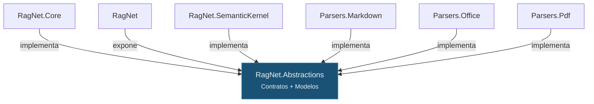
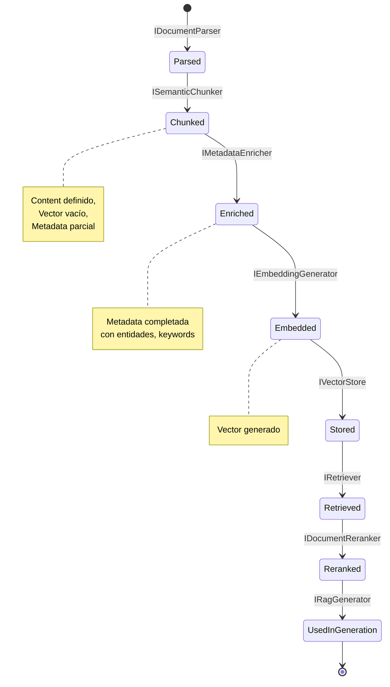
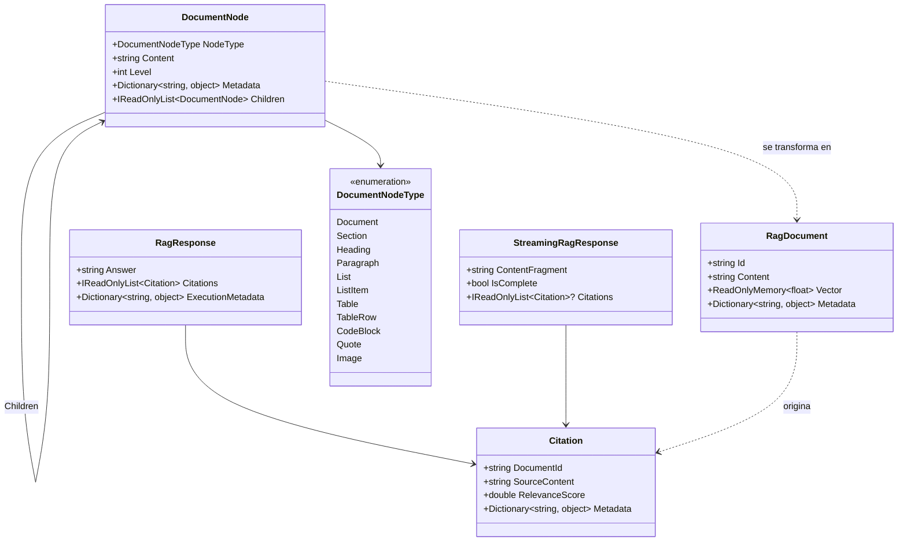

# 6. Diseño del Módulo de Abstracciones (`RagNet.Abstractions`)

## Parte 1 — Filosofía de Diseño y Modelos de Dominio

> **Documento:** `docs/06-01-abstractions-filosofia-y-modelos.md`  
> **Versión:** 1.0  
> **Última actualización:** 2026-05-01

---

## 6.1. Filosofía de Diseño: Contratos Ligeros sin Lógica de Negocio

`RagNet.Abstractions` es el proyecto más importante de toda la solución desde el punto de vista arquitectónico. Actúa como el **núcleo gravitacional** alrededor del cual orbitan todos los demás proyectos.

### Principios fundamentales

1. **Zero-logic:** Este proyecto no debe contener ninguna lógica de negocio, algoritmo ni orquestación. Solo define *qué* existe, nunca *cómo* funciona.

2. **Dependencias mínimas:** La única dependencia externa permitida es `Microsoft.Bcl.AsyncInterfaces` (para `IAsyncEnumerable` en targets legacy). Nunca debe depender de MEAI, MEVD, SK ni de ninguna librería de parsing.

3. **Estabilidad contractual:** Las interfaces y records definidos aquí constituyen la **API pública estable** de RagNet. Los cambios en este proyecto son *breaking changes* que afectan a toda la solución y a todos los consumidores.

4. **Segregación de interfaces (ISP):** Cada interfaz modela una responsabilidad única y atómica. Un `IRetriever` solo recupera, un `IDocumentReranker` solo reordena. No existen "God Interfaces".

5. **Inmutabilidad de datos:** Los modelos de dominio se implementan como `record` de C#, promoviendo la inmutabilidad y facilitando la comparación estructural.

### Relación con la arquitectura general



Todos los proyectos dependen de Abstractions; Abstractions no depende de ninguno. Esta es la materialización del **Dependency Inversion Principle (DIP)**.

### Criterios para incluir un tipo en Abstractions

| ¿Incluir? | Tipo de artefacto | Ejemplo |
|-----------|------------------|---------|
| ✅ Sí | Interfaz de estrategia | `IRetriever`, `ISemanticChunker` |
| ✅ Sí | Record/modelo de dominio | `RagDocument`, `RagResponse` |
| ✅ Sí | Enumeraciones de dominio | `ChunkingStrategy`, `RetrievalMode` |
| ✅ Sí | Clases de opciones (POCO) | `SemanticChunkerOptions` |
| ❌ No | Implementación concreta | `VectorRetriever`, `HyDETransformer` |
| ❌ No | Builder o Factory | `RagPipelineBuilder` |
| ❌ No | Extension methods de DI | `AddAdvancedRag(...)` |
| ❌ No | Lógica de orquestación | `DefaultRagPipeline` |

---

## 6.2. Modelos de Dominio

Los modelos de dominio son las estructuras de datos que fluyen a través de todo el pipeline RAG. Se implementan como **C# records** para garantizar inmutabilidad, igualdad estructural y sintaxis concisa.

### 6.2.1. `RagDocument` — Representación Unificada de Datos

`RagDocument` es el modelo central que representa un fragmento de documento enriquecido, listo para ser almacenado, recuperado y utilizado en la generación de respuestas.

```csharp
namespace RagNet.Abstractions;

/// <summary>
/// Representación unificada de un fragmento de documento en el sistema RAG.
/// Contiene el contenido textual, su representación vectorial y metadatos enriquecidos.
/// </summary>
public record RagDocument(
    string Id,
    string Content,
    ReadOnlyMemory<float> Vector,
    Dictionary<string, object> Metadata);
```

**Análisis de cada propiedad:**

| Propiedad | Tipo | Propósito | Ejemplo |
|-----------|------|-----------|---------|
| `Id` | `string` | Identificador único del chunk. Debe ser determinístico para permitir upserts. | `"doc-001-chunk-003"` |
| `Content` | `string` | Texto plano del fragmento. Es el contenido que se envía al LLM como contexto. | `"La fotosíntesis es el proceso..."` |
| `Vector` | `ReadOnlyMemory<float>` | Embedding vectorial del contenido. Generado por `IEmbeddingGenerator`. | Vector de 1536 dimensiones |
| `Metadata` | `Dictionary<string, object>` | Metadatos enriquecidos: entidades, keywords, fuente, página, etc. | `{"source": "manual.pdf", "page": 12}` |

**Decisiones de diseño:**

- **¿Por qué `Dictionary<string, object>` y no un tipo fuertemente tipado?** Flexibilidad. Los metadatos varían según el dominio y el enriquecimiento aplicado. Un diccionario permite que `IMetadataEnricher` añada campos arbitrarios sin requerir cambios en el record.
- **¿Por qué `ReadOnlyMemory<float>`?** Es el tipo estándar usado por MEAI (`IEmbeddingGenerator`) y MEVD (`[VectorStoreRecordVector]`). Evita copias innecesarias de arrays grandes.
- **¿Por qué `record` y no `class`?** Igualdad estructural: dos `RagDocument` con los mismos valores son iguales. Inmutabilidad: reduce errores por mutación accidental en pipelines concurrentes.

**Ciclo de vida del `RagDocument`:**



### 6.2.2. `DocumentNode` — Estructura Jerárquica Intermedia

`DocumentNode` modela la estructura de un documento parseado preservando la jerarquía original (títulos, secciones, párrafos, listas, tablas).

```csharp
namespace RagNet.Abstractions;

/// <summary>
/// Nodo en el árbol jerárquico de un documento parseado.
/// Preserva la estructura original del documento fuente.
/// </summary>
public record DocumentNode
{
    /// <summary>Tipo de nodo estructural.</summary>
    public required DocumentNodeType NodeType { get; init; }

    /// <summary>Contenido textual del nodo.</summary>
    public required string Content { get; init; }

    /// <summary>Nivel jerárquico (0 = raíz, 1 = H1, 2 = H2, etc.).</summary>
    public int Level { get; init; }

    /// <summary>Metadatos del nodo (fuente, página, posición).</summary>
    public Dictionary<string, object> Metadata { get; init; } = new();

    /// <summary>Nodos hijos en la jerarquía.</summary>
    public IReadOnlyList<DocumentNode> Children { get; init; } = Array.Empty<DocumentNode>();
}

/// <summary>
/// Tipos de nodo estructural reconocidos por los parsers.
/// </summary>
public enum DocumentNodeType
{
    Document,    // Raíz del documento
    Section,     // Sección delimitada por encabezado
    Heading,     // Título (H1-H6)
    Paragraph,   // Párrafo de texto
    List,        // Lista (ordenada o desordenada)
    ListItem,    // Elemento de lista
    Table,       // Tabla completa
    TableRow,    // Fila de tabla
    CodeBlock,   // Bloque de código
    Quote,       // Cita o blockquote
    Image        // Referencia a imagen
}
```

**¿Por qué un árbol y no una lista plana?**

El particionado semántico necesita **contexto estructural**. Un `MarkdownStructureChunker` puede decidir que cada `Section` (H2) es un chunk natural, mientras que un `NLPBoundaryChunker` puede fusionar `Paragraph` nodes hasta alcanzar un umbral semántico. Sin la jerarquía, el chunker perdería información crítica sobre los límites lógicos del documento.

```
DocumentNode (Document)
├── DocumentNode (Heading, H1, "Manual de Usuario")
├── DocumentNode (Section, "Introducción")
│   ├── DocumentNode (Paragraph, "Este manual describe...")
│   └── DocumentNode (Paragraph, "Para comenzar...")
├── DocumentNode (Section, "Instalación")
│   ├── DocumentNode (Paragraph, "Requisitos previos...")
│   ├── DocumentNode (List)
│   │   ├── DocumentNode (ListItem, ".NET 8.0+")
│   │   └── DocumentNode (ListItem, "Docker 24+")
│   └── DocumentNode (CodeBlock, "dotnet add package...")
```

### 6.2.3. `RagResponse` — Respuesta del Pipeline

```csharp
namespace RagNet.Abstractions;

/// <summary>
/// Resultado completo de la ejecución de un pipeline RAG.
/// Incluye la respuesta generada y las citas de las fuentes utilizadas.
/// </summary>
public record RagResponse
{
    /// <summary>Texto de la respuesta generada por el LLM.</summary>
    public required string Answer { get; init; }

    /// <summary>Citas/referencias a los documentos fuente utilizados.</summary>
    public IReadOnlyList<Citation> Citations { get; init; } = Array.Empty<Citation>();

    /// <summary>Metadatos de la ejecución del pipeline (tiempos, tokens, etc.).</summary>
    public Dictionary<string, object> ExecutionMetadata { get; init; } = new();
}

/// <summary>
/// Referencia a un documento fuente utilizado en la generación de la respuesta.
/// </summary>
public record Citation(
    string DocumentId,
    string SourceContent,
    double RelevanceScore,
    Dictionary<string, object> Metadata);
```

**Propiedades clave:**

| Propiedad | Propósito |
|-----------|-----------|
| `Answer` | Respuesta sintetizada. Texto listo para mostrar al usuario final. |
| `Citations` | Lista de fuentes con su `RelevanceScore`, permitiendo que la UI muestre la procedencia de cada afirmación. |
| `ExecutionMetadata` | Datos de diagnóstico: tokens consumidos, latencia por etapa, modelo utilizado, etc. |

### 6.2.4. `StreamingRagResponse` — Respuesta en Streaming

```csharp
namespace RagNet.Abstractions;

/// <summary>
/// Fragmento parcial de una respuesta RAG, emitido durante streaming.
/// Permite enviar tokens al cliente mientras el LLM genera la respuesta.
/// </summary>
public record StreamingRagResponse
{
    /// <summary>Fragmento de texto (token o grupo de tokens).</summary>
    public required string ContentFragment { get; init; }

    /// <summary>Indica si este es el último fragmento de la respuesta.</summary>
    public bool IsComplete { get; init; }

    /// <summary>
    /// Citas disponibles hasta el momento. Se populan progresivamente
    /// o solo en el fragmento final (IsComplete = true).
    /// </summary>
    public IReadOnlyList<Citation>? Citations { get; init; }
}
```

**Relación con `IRagPipeline`:**

```csharp
// Uso síncrono → RagResponse completo
RagResponse response = await pipeline.ExecuteAsync(query);

// Uso streaming → IAsyncEnumerable<StreamingRagResponse>
await foreach (var fragment in pipeline.ExecuteStreamingAsync(query))
{
    Console.Write(fragment.ContentFragment); // Token a token
    if (fragment.IsComplete)
        ShowCitations(fragment.Citations);   // Citas al final
}
```

### 6.2.5. Diagrama de Relación entre Modelos



---

> [!NOTE]
> Continúa en [Parte 2 — Interfaces Core](./06-02-abstractions-interfaces-core.md): catálogo completo de las 8 interfaces fundamentales del módulo.
