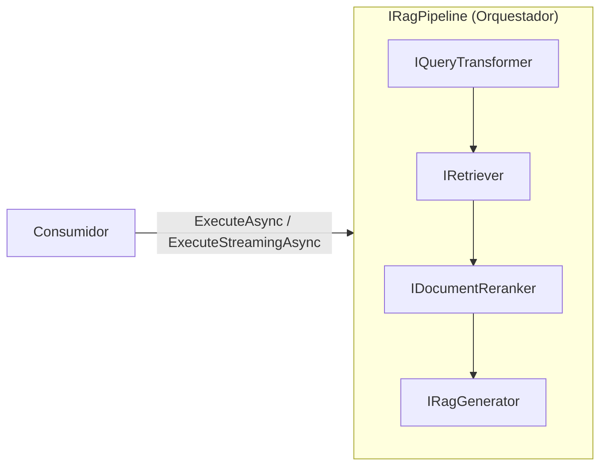
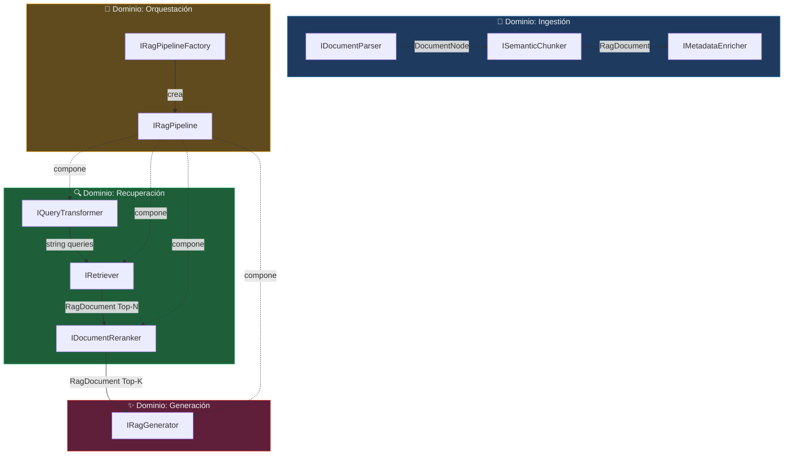

# 6. Diseño del Módulo de Abstracciones (`RagNet.Abstractions`)

## Parte 3 — Interfaces de Pipeline, Generación y Diagrama de Clases

> **Documento:** `docs/06-03-abstractions-pipeline-y-diagrama.md`  
> **Versión:** 1.0  
> **Última actualización:** 2026-05-01

---

### 6.3.7. `IRagPipeline` — Pipeline RAG Principal

**Dominio:** Orquestación  
**Implementación principal:** `DefaultRagPipeline` en `RagNet.Core`

```csharp
namespace RagNet.Abstractions;

/// <summary>
/// Pipeline completo de RAG que orquesta transformación, recuperación,
/// reordenamiento y generación en un flujo unificado.
/// Soporta tanto ejecución completa como streaming.
/// </summary>
public interface IRagPipeline
{
    /// <summary>
    /// Ejecuta el pipeline RAG completo y retorna la respuesta final.
    /// </summary>
    /// <param name="query">Consulta del usuario.</param>
    /// <param name="ct">Token de cancelación.</param>
    /// <returns>Respuesta completa con citas y metadatos de ejecución.</returns>
    Task<RagResponse> ExecuteAsync(
        string query,
        CancellationToken ct = default);

    /// <summary>
    /// Ejecuta el pipeline RAG con streaming de la respuesta.
    /// Los fragmentos se emiten a medida que el LLM genera tokens.
    /// </summary>
    /// <param name="query">Consulta del usuario.</param>
    /// <param name="ct">Token de cancelación.</param>
    /// <returns>Stream asíncrono de fragmentos de respuesta.</returns>
    IAsyncEnumerable<StreamingRagResponse> ExecuteStreamingAsync(
        string query,
        CancellationToken ct = default);
}
```

**Dualidad síncrona/streaming:**

`IRagPipeline` ofrece dos modos de ejecución para cubrir distintos escenarios:

| Método | Retorno | Escenario |
|--------|---------|-----------|
| `ExecuteAsync` | `Task<RagResponse>` | APIs REST, procesamiento batch, testing. El consumidor espera la respuesta completa. |
| `ExecuteStreamingAsync` | `IAsyncEnumerable<StreamingRagResponse>` | UIs interactivas (chatbots, SSE, WebSockets). Los tokens se envían al cliente en tiempo real. |

**Relación con el resto de interfaces:**

`IRagPipeline` es la **fachada orquestadora** que compone internamente las demás interfaces. El consumidor solo interactúa con `IRagPipeline`; las dependencias internas se resuelven vía DI.



**Pipeline nombrados y Factory:**

El sistema soporta múltiples pipelines con diferentes configuraciones. `IRagPipelineFactory` los resuelve por nombre:

```csharp
namespace RagNet.Abstractions;

/// <summary>
/// Factory para resolver pipelines RAG registrados por nombre.
/// </summary>
public interface IRagPipelineFactory
{
    /// <summary>
    /// Crea o resuelve un pipeline RAG por su nombre registrado.
    /// </summary>
    /// <param name="pipelineName">Nombre del pipeline configurado.</param>
    /// <returns>Instancia del pipeline configurado.</returns>
    IRagPipeline Create(string pipelineName);
}
```

**Ejemplo de uso con pipelines nombrados:**

```csharp
// Registro en DI - dos pipelines distintos
builder.Services.AddAdvancedRag(rag =>
{
    rag.AddPipeline("fast", p => p
        .UseQueryTransformation<QueryRewriter>()
        .UseRetrieval<VectorRetriever>(topK: 5)
        .UseSemanticKernelGenerator());

    rag.AddPipeline("precise", p => p
        .UseQueryTransformation<HyDETransformer>()
        .UseHybridRetrieval(alpha: 0.5)
        .UseReranking<CrossEncoderReranker>(topK: 5)
        .UseSemanticKernelGenerator());
});

// Uso - resolver por nombre
public class ChatController
{
    private readonly IRagPipeline _pipeline;

    public ChatController(IRagPipelineFactory factory)
    {
        _pipeline = factory.Create("precise");
    }
}
```

---

### 6.3.8. `IRagGenerator` — Generación de Respuestas

**Dominio:** Generación  
**Implementación principal:** `SemanticKernelRagGenerator` en `RagNet.SemanticKernel`

```csharp
namespace RagNet.Abstractions;

/// <summary>
/// Genera respuestas sintetizadas a partir de los documentos recuperados
/// y la consulta del usuario, utilizando un modelo de lenguaje.
/// </summary>
public interface IRagGenerator
{
    /// <summary>
    /// Genera una respuesta completa basada en el contexto proporcionado.
    /// </summary>
    /// <param name="query">Consulta original del usuario.</param>
    /// <param name="context">Documentos relevantes recuperados y reordenados.</param>
    /// <param name="ct">Token de cancelación.</param>
    /// <returns>Respuesta completa con citas.</returns>
    Task<RagResponse> GenerateAsync(
        string query,
        IEnumerable<RagDocument> context,
        CancellationToken ct = default);

    /// <summary>
    /// Genera una respuesta con streaming de tokens.
    /// </summary>
    /// <param name="query">Consulta original del usuario.</param>
    /// <param name="context">Documentos relevantes recuperados y reordenados.</param>
    /// <param name="ct">Token de cancelación.</param>
    /// <returns>Stream de fragmentos de respuesta.</returns>
    IAsyncEnumerable<StreamingRagResponse> GenerateStreamingAsync(
        string query,
        IEnumerable<RagDocument> context,
        CancellationToken ct = default);
}
```

**Diferencia entre `IRagPipeline` e `IRagGenerator`:**

| Aspecto | `IRagPipeline` | `IRagGenerator` |
|---------|---------------|----------------|
| **Responsabilidad** | Orquesta todo el flujo (transform → retrieve → rerank → generate) | Solo genera la respuesta dado un contexto ya recuperado |
| **Entrada** | Solo la query del usuario | Query + documentos de contexto |
| **Quién lo usa** | El consumidor final (Controller, Service) | El pipeline internamente |
| **Analogía** | El director de orquesta | El solista que interpreta |

**Responsabilidades de `IRagGenerator`:**

1. **Composición del prompt:** Fusiona la query del usuario con el contexto de los documentos usando una plantilla.
2. **Invocación del LLM:** Llama al modelo de lenguaje (vía SK o MEAI).
3. **Extracción de citas:** Identifica qué fragmentos del contexto se usaron en la respuesta.
4. **Streaming:** Propaga los tokens del LLM como `StreamingRagResponse`.
5. **Validación (Self-RAG):** Opcionalmente verifica que la respuesta esté fundamentada en el contexto.

---

## 6.4. Diagrama de Clases Completo del Módulo

### 6.4.1. Vista General de Interfaces

```mermaid
classDiagram
    direction TB

    class IDocumentParser {
        <<interface>>
        +IReadOnlySet~string~ SupportedExtensions
        +ParseAsync(Stream, string, CancellationToken) Task~DocumentNode~
    }

    class ISemanticChunker {
        <<interface>>
        +ChunkAsync(DocumentNode, CancellationToken) Task~IEnumerable~RagDocument~~
    }

    class IMetadataEnricher {
        <<interface>>
        +EnrichAsync(IEnumerable~RagDocument~, CancellationToken) Task~IEnumerable~RagDocument~~
    }

    class IQueryTransformer {
        <<interface>>
        +TransformAsync(string, CancellationToken) Task~IEnumerable~string~~
    }

    class IRetriever {
        <<interface>>
        +RetrieveAsync(string, int, CancellationToken) Task~IEnumerable~RagDocument~~
    }

    class IDocumentReranker {
        <<interface>>
        +RerankAsync(string, IEnumerable~RagDocument~, int, CancellationToken) Task~IEnumerable~RagDocument~~
    }

    class IRagGenerator {
        <<interface>>
        +GenerateAsync(string, IEnumerable~RagDocument~, CancellationToken) Task~RagResponse~
        +GenerateStreamingAsync(string, IEnumerable~RagDocument~, CancellationToken) IAsyncEnumerable~StreamingRagResponse~
    }

    class IRagPipeline {
        <<interface>>
        +ExecuteAsync(string, CancellationToken) Task~RagResponse~
        +ExecuteStreamingAsync(string, CancellationToken) IAsyncEnumerable~StreamingRagResponse~
    }

    class IRagPipelineFactory {
        <<interface>>
        +Create(string) IRagPipeline
    }
```



### 6.4.2. Agrupación por Dominio Funcional



### 6.4.3. Mapa de Tipos de Datos entre Interfaces

Esta tabla muestra cómo los datos fluyen de una interfaz a otra, formando la cadena de transformaciones del pipeline:

| Interfaz origen | Tipo de dato producido | Interfaz destino | Rol del dato |
|----------------|----------------------|-----------------|-------------|
| — | `Stream` + `string` | `IDocumentParser` | Archivo crudo |
| `IDocumentParser` | `DocumentNode` | `ISemanticChunker` | Árbol jerárquico |
| `ISemanticChunker` | `IEnumerable<RagDocument>` (sin vector) | `IMetadataEnricher` | Chunks con contenido |
| `IMetadataEnricher` | `IEnumerable<RagDocument>` (con metadata) | `IEmbeddingGenerator` (MEAI) | Chunks enriquecidos |
| `IEmbeddingGenerator` | `IEnumerable<RagDocument>` (con vector) | `IVectorStore` (MEVD) | Chunks embebidos |
| — | `string` (query) | `IQueryTransformer` | Consulta del usuario |
| `IQueryTransformer` | `IEnumerable<string>` | `IRetriever` | Queries optimizadas |
| `IRetriever` | `IEnumerable<RagDocument>` (Top-N) | `IDocumentReranker` | Candidatos amplios |
| `IDocumentReranker` | `IEnumerable<RagDocument>` (Top-K) | `IRagGenerator` | Contexto refinado |
| `IRagGenerator` | `RagResponse` / `StreamingRagResponse` | Consumidor | Respuesta final |

### 6.4.4. Resumen del Módulo

| Aspecto | Detalle |
|---------|---------|
| **Proyecto** | `RagNet.Abstractions` |
| **Target framework** | .NET 8.0 |
| **Dependencias externas** | Ninguna pesada |
| **Interfaces definidas** | 9 (8 de dominio + 1 factory) |
| **Modelos de dominio** | 5 records (`RagDocument`, `DocumentNode`, `RagResponse`, `StreamingRagResponse`, `Citation`) |
| **Enumeraciones** | 1 (`DocumentNodeType` con 11 valores) |
| **Principio rector** | Contratos estables, zero-logic, ISP |

> [!IMPORTANT]
> Cualquier modificación en este proyecto es un **breaking change potencial**. Los cambios deben pasar por un proceso de revisión estricto y considerar el impacto en todos los consumidores downstream.

---

> **Navegación de la sección 6:**
> - [Parte 1 — Filosofía y Modelos de Dominio](./06-01-abstractions-filosofia-y-modelos.md)
> - [Parte 2 — Interfaces Core: Ingestión y Recuperación](./06-02-abstractions-interfaces-core.md)
> - **Parte 3 — Interfaces de Pipeline, Generación y Diagrama de Clases** *(este documento)*
