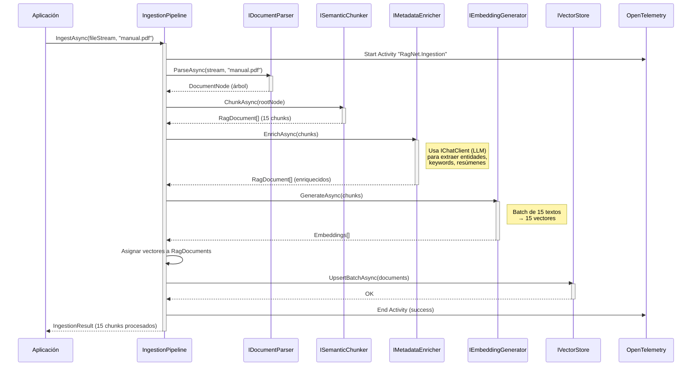

# 7. Diseño del Módulo de Ingestión Inteligente

## Parte 1 — Visión General y Parsing de Documentos

> **Documento:** `docs/07-01-ingestion-vision-y-parsing.md`  
> **Versión:** 1.0  
> **Última actualización:** 2026-05-01

---

## 7.1. Visión General del Pipeline de Ingestión

El módulo de ingestión es responsable de transformar documentos crudos (PDF, Word, Excel, Markdown) en representaciones vectoriales enriquecidas almacenadas en una base de datos vectorial. Es el proceso **offline** que alimenta al sistema RAG con conocimiento.

### 7.1.1. Flujo Completo

```
Raw File → Parse → Semantic Chunk → Enrich → Embed → Save
```

Cada etapa está representada por una interfaz de `RagNet.Abstractions`, lo que permite reemplazar cualquier paso sin afectar al resto del pipeline.

```mermaid
flowchart LR
    subgraph S1["1. Parsing"]
        A["📄 Archivo<br/>(PDF, DOCX, MD)"]
        B["IDocumentParser"]
        C["DocumentNode<br/>(árbol jerárquico)"]
        A --> B --> C
    end

    subgraph S2["2. Chunking"]
        D["ISemanticChunker"]
        E["RagDocument[]<br/>(sin vector)"]
        C --> D --> E
    end

    subgraph S3["3. Enriquecimiento"]
        F["IMetadataEnricher"]
        G["RagDocument[]<br/>(con metadata)"]
        E --> F --> G
    end

    subgraph S4["4. Embedding"]
        H["IEmbeddingGenerator<br/>(MEAI)"]
        I["RagDocument[]<br/>(con vector)"]
        G --> H --> I
    end

    subgraph S5["5. Almacenamiento"]
        J["IVectorStore<br/>(MEVD)"]
        K[("💾 Vector DB")]
        I --> J --> K
    end
```



### 7.1.2. Diagrama de Secuencia



### 7.1.3. Tabla Resumen de Etapas

| # | Etapa | Interfaz | Proyecto que implementa | Dependencia externa |
|---|-------|----------|------------------------|-------------------|
| 1 | Parsing | `IDocumentParser` | `Parsers.Markdown`, `Parsers.Office`, `Parsers.Pdf` | Markdig, OpenXml, PdfPig |
| 2 | Chunking | `ISemanticChunker` | `RagNet.Core` | MEAI (solo `EmbeddingSimilarityChunker`) |
| 3 | Enriquecimiento | `IMetadataEnricher` | `RagNet.Core` | MEAI (`IChatClient`) |
| 4 | Embedding | `IEmbeddingGenerator` | Externo (MEAI) | Proveedor LLM |
| 5 | Almacenamiento | `IVectorStore` | Externo (MEVD) | Proveedor Vector DB |

---

## 7.2. Parsing de Documentos (`IDocumentParser`)

### 7.2.1. Diseño de `DocumentNode` y Estructura Jerárquica

El objetivo del parsing **no es extraer texto plano**, sino construir un **árbol jerárquico** (`DocumentNode`) que preserve la estructura semántica del documento original. Esta estructura permite que los chunkers tomen decisiones inteligentes sobre dónde dividir.

**Principios de diseño del parser:**

1. **Preservar la jerarquía:** Títulos, secciones, subsecciones deben mantener su relación padre-hijo.
2. **Preservar el tipo:** Distinguir entre párrafos, listas, tablas, código.
3. **Metadata de origen:** Cada nodo debe incluir información de trazabilidad (nombre de archivo, página, posición).
4. **Tolerancia a errores:** Un documento malformado debe producir el mejor árbol posible, no una excepción.

**Ejemplo de transformación — Documento Word:**

```
┌─────────────────────────────┐        DocumentNode (Document)
│ Manual de Instalación       │   ──►  ├── Heading (H1, "Manual de Instalación")
│                             │        ├── Section
│ 1. Requisitos               │        │   ├── Heading (H2, "Requisitos")
│                             │        │   ├── Paragraph ("El sistema necesita...")
│ El sistema necesita...      │        │   └── List
│                             │        │       ├── ListItem (".NET 8.0 SDK")
│ - .NET 8.0 SDK              │        │       └── ListItem ("Docker 24+")
│ - Docker 24+                │        └── Section
│                             │            ├── Heading (H2, "Pasos")
│ 2. Pasos                    │            ├── Paragraph ("Ejecute el siguiente...")
│                             │            └── CodeBlock ("dotnet new install...")
│ Ejecute el siguiente...     │
│                             │
│   dotnet new install...     │
└─────────────────────────────┘
```

### 7.2.2. Implementaciones por Formato

#### 7.2.2.1. `MarkdownDocumentParser` (Markdig)

**Proyecto:** `RagNet.Parsers.Markdown`  
**Dependencia:** `Markdig v1.1.3`  
**Extensiones soportadas:** `.md`, `.markdown`

```csharp
public class MarkdownDocumentParser : IDocumentParser
{
    public IReadOnlySet<string> SupportedExtensions { get; } =
        new HashSet<string> { ".md", ".markdown" };

    public Task<DocumentNode> ParseAsync(
        Stream documentStream, string fileName, CancellationToken ct = default)
    {
        // 1. Leer el stream como texto UTF-8
        // 2. Parsear con Markdig (MarkdownDocument AST)
        // 3. Recorrer el AST de Markdig y transformar a DocumentNode
        // 4. Mapear HeadingBlock → Heading, ParagraphBlock → Paragraph, etc.
        // 5. Construir jerarquía por niveles de heading (H1 > H2 > H3...)
    }
}
```

**Mapeo Markdig AST → DocumentNode:**

| Tipo Markdig | `DocumentNodeType` | Notas |
|-------------|-------------------|-------|
| `HeadingBlock` | `Heading` | `Level` = nivel del heading (1-6) |
| `ParagraphBlock` | `Paragraph` | Contenido inline concatenado |
| `ListBlock` / `ListItemBlock` | `List` / `ListItem` | Preserva orden/desorden |
| `FencedCodeBlock` | `CodeBlock` | Incluye lenguaje en metadata |
| `Table` | `Table` | Requiere extensión Markdig.Tables |
| `QuoteBlock` | `Quote` | Blockquotes |

**Estrategia de jerarquización:** Los headings definen la estructura de secciones. Un `H2` crea un `Section` que contiene todo el contenido hasta el siguiente `H2` (o `H1`). Los `H3` crean sub-secciones dentro del `H2`.

#### 7.2.2.2. `WordDocumentParser` (OpenXml)

**Proyecto:** `RagNet.Parsers.Office`  
**Dependencia:** `DocumentFormat.OpenXml v3.5.1`  
**Extensiones soportadas:** `.docx`

```csharp
public class WordDocumentParser : IDocumentParser
{
    public IReadOnlySet<string> SupportedExtensions { get; } =
        new HashSet<string> { ".docx" };

    public Task<DocumentNode> ParseAsync(
        Stream documentStream, string fileName, CancellationToken ct = default)
    {
        // 1. Abrir WordprocessingDocument desde stream
        // 2. Iterar Body.Elements
        // 3. Detectar estilos de párrafo (Heading1, Heading2, Normal, ListParagraph)
        // 4. Detectar tablas (Table → TableRow → TableCell)
        // 5. Construir jerarquía por estilos de heading
    }
}
```

**Desafíos específicos de Word:**

| Desafío | Solución |
|---------|----------|
| Headings por estilo, no por tag | Inspeccionar `ParagraphProperties.ParagraphStyleId` para detectar "Heading1", "Heading2", etc. |
| Listas por numeración, no por tag | Detectar `NumberingProperties` en el párrafo y agrupar en nodos `List`/`ListItem` |
| Tablas anidadas | Procesamiento recursivo de `Table` → `TableRow` → `TableCell` → contenido |
| Imágenes embebidas | Extraer `Drawing`/`Picture` y crear nodo `Image` con referencia al blob |
| Estilos personalizados | Mapeo configurable de nombres de estilo a niveles de heading |

#### 7.2.2.3. `ExcelDocumentParser` (OpenXml)

**Proyecto:** `RagNet.Parsers.Office`  
**Dependencia:** `DocumentFormat.OpenXml v3.5.1`  
**Extensiones soportadas:** `.xlsx`

```csharp
public class ExcelDocumentParser : IDocumentParser
{
    public IReadOnlySet<string> SupportedExtensions { get; } =
        new HashSet<string> { ".xlsx" };

    public Task<DocumentNode> ParseAsync(
        Stream documentStream, string fileName, CancellationToken ct = default)
    {
        // 1. Abrir SpreadsheetDocument desde stream
        // 2. Iterar cada Sheet como un Section
        // 3. Detectar rangos con datos (filas no vacías)
        // 4. Convertir cada rango a Table → TableRow
        // 5. Primera fila como header (metadata)
    }
}
```

**Estructura resultante para Excel:**

```
DocumentNode (Document, "report.xlsx")
├── Section ("Hoja: Ventas Q1")
│   └── Table
│       ├── TableRow (header: "Producto | Cantidad | Total")
│       ├── TableRow ("Widget A | 150 | $4,500")
│       └── TableRow ("Widget B | 230 | $6,900")
├── Section ("Hoja: Ventas Q2")
│   └── Table (...)
```

#### 7.2.2.4. `PdfDocumentParser` (PdfPig)

**Proyecto:** `RagNet.Parsers.Pdf`  
**Dependencia:** `PdfPig v0.1.14`  
**Extensiones soportadas:** `.pdf`

```csharp
public class PdfDocumentParser : IDocumentParser
{
    public IReadOnlySet<string> SupportedExtensions { get; } =
        new HashSet<string> { ".pdf" };

    public Task<DocumentNode> ParseAsync(
        Stream documentStream, string fileName, CancellationToken ct = default)
    {
        // 1. Abrir PdfDocument desde stream (PdfPig)
        // 2. Iterar páginas
        // 3. Extraer bloques de texto con posición y tamaño de fuente
        // 4. Inferir headings por tamaño de fuente (> umbral = heading)
        // 5. Agrupar texto en párrafos por proximidad espacial
        // 6. Detectar tablas por alineación de columnas
        // 7. Incluir número de página en metadata de cada nodo
    }
}
```

**Desafíos específicos de PDF:**

| Desafío | Estrategia |
|---------|-----------|
| Sin estructura semántica nativa | Inferencia heurística por tamaño/peso de fuente |
| Texto no lineal (columnas) | Algoritmos de agrupación espacial (reading order) |
| Tablas sin markup | Detección por alineación de coordenadas X/Y |
| PDFs escaneados (imágenes) | Fuera de alcance v1.0; extensible vía OCR en futuras versiones |
| Headers/footers repetidos | Detección de texto repetido en mismas coordenadas entre páginas |

### 7.2.3. Extensión: Cómo Añadir Nuevos Parsers

Para añadir soporte de un nuevo formato (e.g., HTML, CSV, PowerPoint):

**Paso 1:** Crear un nuevo proyecto `RagNet.Parsers.{Formato}` que referencie solo `RagNet.Abstractions`.

**Paso 2:** Implementar `IDocumentParser`:

```csharp
public class HtmlDocumentParser : IDocumentParser
{
    public IReadOnlySet<string> SupportedExtensions { get; } =
        new HashSet<string> { ".html", ".htm" };

    public async Task<DocumentNode> ParseAsync(
        Stream documentStream, string fileName, CancellationToken ct = default)
    {
        // Implementación usando HtmlAgilityPack, AngleSharp, etc.
    }
}
```

**Paso 3:** Registrar en DI:

```csharp
builder.Services.AddAdvancedRag(rag =>
{
    rag.AddIngestion(ingest => ingest
        .AddParser<HtmlDocumentParser>()  // Nuevo parser registrado
        .UseSemanticChunker(...)
    );
});
```

El pipeline resolverá automáticamente el parser correcto basándose en `SupportedExtensions`.

---

> [!NOTE]
> Continúa en [Parte 2 — Particionado Semántico](./07-02-ingestion-chunking-semantico.md): estrategias de chunking (`NLPBoundaryChunker`, `MarkdownStructureChunker`, `EmbeddingSimilarityChunker`).
