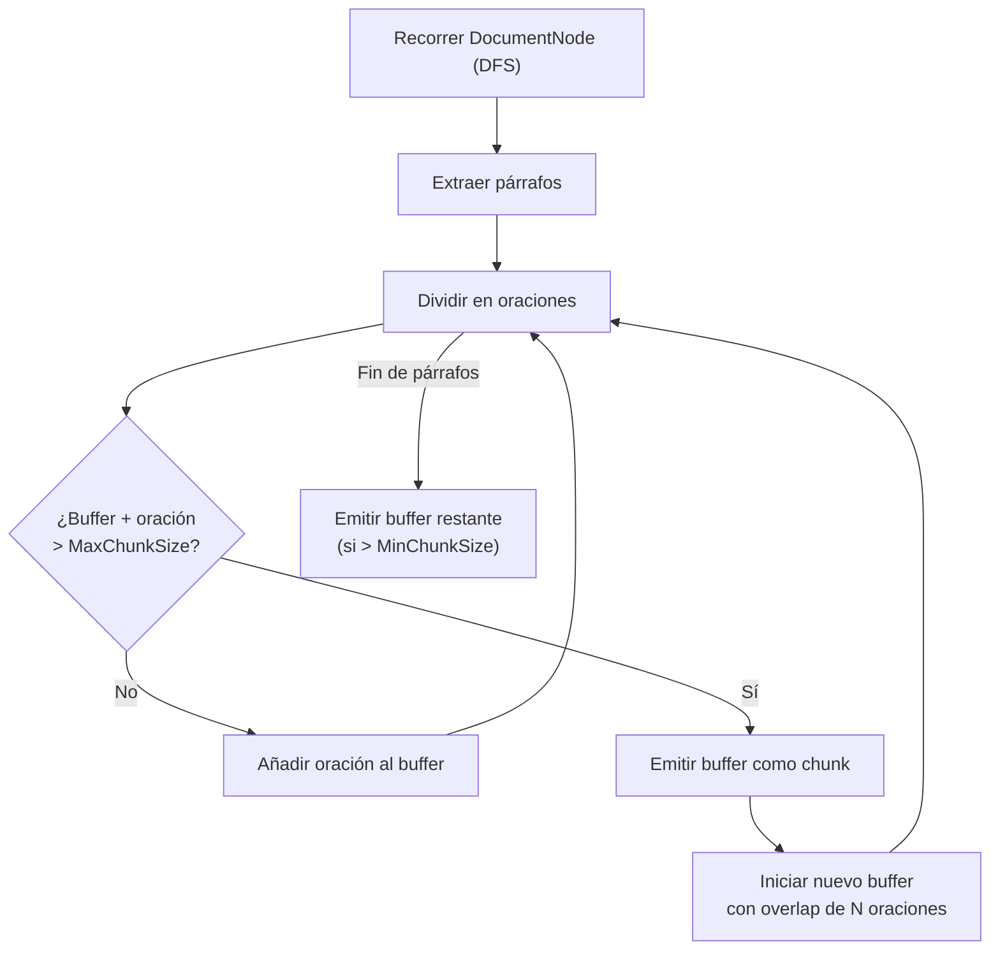
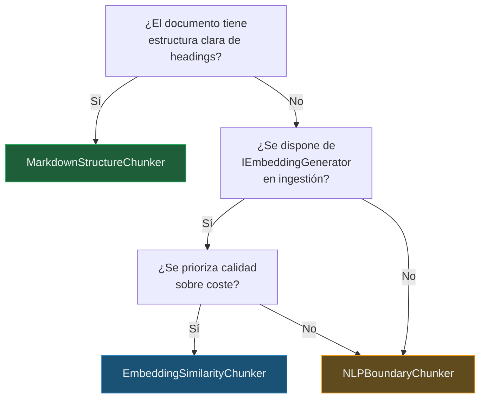

# 7. Diseño del Módulo de Ingestión Inteligente

## Parte 2 — Particionado Semántico (`ISemanticChunker`)

> **Documento:** `docs/07-02-ingestion-chunking-semantico.md`  
> **Versión:** 1.0  
> **Última actualización:** 2026-05-01

---

## 7.3. Particionado Semántico (`ISemanticChunker`)

### 7.3.1. Problema del Particionado Estático vs. Semántico

El particionado estático (split by character count / token count) es el enfoque más común en sistemas RAG básicos. Sin embargo, presenta problemas graves de calidad:

| Aspecto | Particionado Estático | Particionado Semántico (RagNet) |
|---------|----------------------|-------------------------------|
| **Criterio de corte** | Número fijo de caracteres/tokens | Límites semánticos o estructurales |
| **Coherencia del chunk** | Puede cortar mitad de frase u oración | Cada chunk es una unidad de significado completa |
| **Contexto** | Se pierde la relación con la estructura | Preserva la relación con secciones y títulos |
| **Recuperación** | Chunks irrelevantes "contaminan" el Top-K | Chunks más precisos mejoran la relevancia |
| **Solapamiento** | Overlap mecánico de N caracteres | Overlap semántico inteligente (contexto compartido) |

**Ejemplo del problema:**

```
─── Particionado estático (500 chars) ───────────────────────

Chunk 1: "...La fotosíntesis es el proceso por el cual las plantas
          convierten la luz solar en energía. Este proceso ocurre en
          los cloroplastos y requiere agua y dióx"  ← CORTE ABRUPTO

Chunk 2: "ido de carbono. Los productos principales son glucosa y
          oxígeno. 2. Respiración Celular. La respiración celular es
          el proceso inverso..."  ← MEZCLA DE TEMAS

─── Particionado semántico ──────────────────────────────────

Chunk 1: "La fotosíntesis es el proceso por el cual las plantas
          convierten la luz solar en energía. Este proceso ocurre en
          los cloroplastos y requiere agua y dióxido de carbono.
          Los productos principales son glucosa y oxígeno."

Chunk 2: "Respiración Celular. La respiración celular es el proceso
          inverso a la fotosíntesis..."
```

### 7.3.2. `NLPBoundaryChunker` — Límites Lingüísticos

**Estrategia:** Detecta límites naturales del lenguaje (fin de oración, fin de párrafo, cambio de tema) para determinar dónde cortar.

**Proyecto:** `RagNet.Core`  
**Dependencias:** Ninguna externa (usa heurísticas de NLP)

```csharp
public class NLPBoundaryChunker : ISemanticChunker
{
    private readonly NLPBoundaryChunkerOptions _options;

    public NLPBoundaryChunker(IOptions<NLPBoundaryChunkerOptions> options)
    {
        _options = options.Value;
    }

    public Task<IEnumerable<RagDocument>> ChunkAsync(
        DocumentNode rootNode, CancellationToken ct = default)
    {
        // 1. Aplanar el árbol a una secuencia de párrafos
        // 2. Dividir cada párrafo en oraciones (sentence splitting)
        // 3. Agrupar oraciones hasta alcanzar MaxChunkSize
        // 4. Cortar siempre en un límite de oración
        // 5. Aplicar solapamiento de N oraciones con el chunk anterior
        // 6. Incluir metadata: título de sección padre, fuente, posición
    }
}
```

**Opciones de configuración:**

```csharp
public class NLPBoundaryChunkerOptions
{
    /// <summary>Tamaño máximo del chunk en caracteres.</summary>
    public int MaxChunkSize { get; set; } = 1000;

    /// <summary>Tamaño mínimo del chunk en caracteres.</summary>
    public int MinChunkSize { get; set; } = 200;

    /// <summary>Número de oraciones de solapamiento entre chunks consecutivos.</summary>
    public int OverlapSentences { get; set; } = 2;

    /// <summary>Incluir el título de la sección padre como prefijo del chunk.</summary>
    public bool IncludeSectionTitle { get; set; } = true;
}
```

**Algoritmo simplificado:**



**Cuándo usarlo:**
- Documentos con texto libre sin estructura clara (novelas, artículos, transcripciones).
- Cuando no se dispone de `IEmbeddingGenerator` en la fase de chunking.
- Como chunker por defecto por su simplicidad y eficiencia.

---

### 7.3.3. `MarkdownStructureChunker` — Límites Estructurales

**Estrategia:** Usa la jerarquía del documento (`DocumentNode`) como guía para los cortes. Cada sección definida por un heading es un chunk candidato.

**Proyecto:** `RagNet.Core`  
**Dependencias:** Ninguna externa

```csharp
public class MarkdownStructureChunker : ISemanticChunker
{
    private readonly MarkdownStructureChunkerOptions _options;

    public MarkdownStructureChunker(
        IOptions<MarkdownStructureChunkerOptions> options)
    {
        _options = options.Value;
    }

    public Task<IEnumerable<RagDocument>> ChunkAsync(
        DocumentNode rootNode, CancellationToken ct = default)
    {
        // 1. Recorrer el árbol por niveles de sección
        // 2. Cada Section con heading al nivel configurado = 1 chunk
        // 3. Si una sección excede MaxChunkSize, subdividir por sub-secciones
        // 4. Si una sección es menor que MinChunkSize, fusionar con la siguiente
        // 5. Incluir la cadena de títulos como contexto (breadcrumb)
    }
}
```

**Opciones de configuración:**

```csharp
public class MarkdownStructureChunkerOptions
{
    /// <summary>Nivel de heading que define el límite de chunk (2 = H2).</summary>
    public int ChunkAtHeadingLevel { get; set; } = 2;

    /// <summary>Tamaño máximo antes de subdividir por sub-secciones.</summary>
    public int MaxChunkSize { get; set; } = 2000;

    /// <summary>Tamaño mínimo para fusionar con sección adyacente.</summary>
    public int MinChunkSize { get; set; } = 100;

    /// <summary>
    /// Incluir breadcrumb de títulos padres como prefijo.
    /// Ejemplo: "Manual > Instalación > Requisitos"
    /// </summary>
    public bool IncludeBreadcrumb { get; set; } = true;
}
```

**Ejemplo de particionado con `ChunkAtHeadingLevel = 2`:**

```
Documento:
├── H1: "Manual de Usuario"
├── H2: "Introducción"           ──► Chunk 1: "[Manual > Introducción] ..."
│   ├── Párrafo A
│   └── Párrafo B
├── H2: "Instalación"            ──► Chunk 2: "[Manual > Instalación] ..."
│   ├── Párrafo C
│   ├── H3: "Requisitos"              (incluido en chunk 2)
│   │   └── Lista de requisitos
│   └── H3: "Pasos"                   (incluido en chunk 2)
│       └── Párrafo D
└── H2: "Configuración"          ──► Chunk 3: "[Manual > Configuración] ..."
    └── Párrafo E
```

**Cuándo usarlo:**
- Documentos Markdown con estructura clara de headings.
- Documentación técnica, wikis, manuales.
- Cuando la estructura del documento refleja la organización del conocimiento.

---

### 7.3.4. `EmbeddingSimilarityChunker` — Similitud por Embedding

**Estrategia:** Agrupa oraciones o párrafos consecutivos basándose en la **similitud coseno** de sus embeddings. Cuando el embedding de la siguiente oración difiere significativamente del grupo actual, se crea un nuevo chunk.

**Proyecto:** `RagNet.Core`  
**Dependencias:** MEAI (`IEmbeddingGenerator`)

```csharp
public class EmbeddingSimilarityChunker : ISemanticChunker
{
    private readonly IEmbeddingGenerator<string, Embedding<float>> _embeddingGenerator;
    private readonly EmbeddingSimilarityChunkerOptions _options;

    public EmbeddingSimilarityChunker(
        IEmbeddingGenerator<string, Embedding<float>> embeddingGenerator,
        IOptions<EmbeddingSimilarityChunkerOptions> options)
    {
        _embeddingGenerator = embeddingGenerator;
        _options = options.Value;
    }

    public async Task<IEnumerable<RagDocument>> ChunkAsync(
        DocumentNode rootNode, CancellationToken ct = default)
    {
        // 1. Aplanar el árbol a una lista de oraciones/párrafos
        // 2. Generar embeddings para cada unidad
        // 3. Calcular similitud coseno entre unidades consecutivas
        // 4. Detectar "rupturas" donde similitud < threshold
        // 5. Agrupar unidades entre rupturas como un chunk
        // 6. Aplicar restricciones de tamaño máximo/mínimo
    }
}
```

**Opciones de configuración:**

```csharp
public class EmbeddingSimilarityChunkerOptions
{
    /// <summary>
    /// Umbral de similitud coseno (0.0-1.0). Valores por debajo
    /// de este umbral indican un cambio de tema → nuevo chunk.
    /// </summary>
    public double SimilarityThreshold { get; set; } = 0.85;

    /// <summary>Tamaño máximo del chunk en caracteres.</summary>
    public int MaxChunkSize { get; set; } = 1500;

    /// <summary>Tamaño mínimo del chunk en caracteres.</summary>
    public int MinChunkSize { get; set; } = 200;

    /// <summary>
    /// Tamaño de la ventana deslizante para calcular la similitud
    /// (compara con el promedio del grupo, no solo el último elemento).
    /// </summary>
    public int WindowSize { get; set; } = 3;
}
```

**Algoritmo visual:**

```
Oraciones:  S1    S2    S3    S4    S5    S6    S7    S8
Similitud:     0.92  0.88  0.91  0.45  0.87  0.90  0.42
Umbral:     ─────────── 0.85 ──────────────────────────
Resultado:  ←──── Chunk 1 ────→ ←── Chunk 2 ──→ ←─ C3 ─→
                                  ↑ ruptura          ↑ ruptura
```

**Cuándo usarlo:**
- Cuando se necesita la **máxima coherencia semántica** en cada chunk.
- Documentos largos donde los cambios de tema no se reflejan en la estructura.
- Trade-off: requiere generar embeddings en la fase de chunking (coste adicional).

---

### 7.3.5. Configuración: Umbrales, Solapamiento, Tamaño Máximo

**Tabla de parámetros compartidos entre chunkers:**

| Parámetro | Valores típicos | Impacto |
|-----------|----------------|---------|
| `MaxChunkSize` | 500-2000 chars | Mayor = más contexto por chunk, pero puede diluir la relevancia |
| `MinChunkSize` | 100-300 chars | Evita chunks demasiado pequeños que carecen de contexto |
| `SimilarityThreshold` | 0.75-0.90 | Mayor = chunks más grandes (más tolerante a variación); Menor = chunks más granulares |
| `OverlapSentences` | 1-3 oraciones | Más overlap = mejor continuidad, pero más redundancia en el almacenamiento |
| `IncludeBreadcrumb` | true/false | `true` mejora la recuperación al incluir contexto de sección |

**Guía de selección de chunker:**



**Comparativa de rendimiento estimado:**

| Chunker | Calidad semántica | Coste computacional | Latencia | Dependencias |
|---------|------------------|-------------------|----------|-------------|
| `NLPBoundaryChunker` | ⭐⭐⭐ Buena | ⭐ Mínimo | ⭐ Muy baja | Ninguna |
| `MarkdownStructureChunker` | ⭐⭐⭐⭐ Muy buena | ⭐ Mínimo | ⭐ Muy baja | Ninguna |
| `EmbeddingSimilarityChunker` | ⭐⭐⭐⭐⭐ Excelente | ⭐⭐⭐ Alto | ⭐⭐⭐ Alta | `IEmbeddingGenerator` |

---

> [!NOTE]
> Continúa en [Parte 3 — Enriquecimiento, Embedding, Almacenamiento y Orquestación](./07-03-ingestion-enriquecimiento-y-orquestacion.md).
