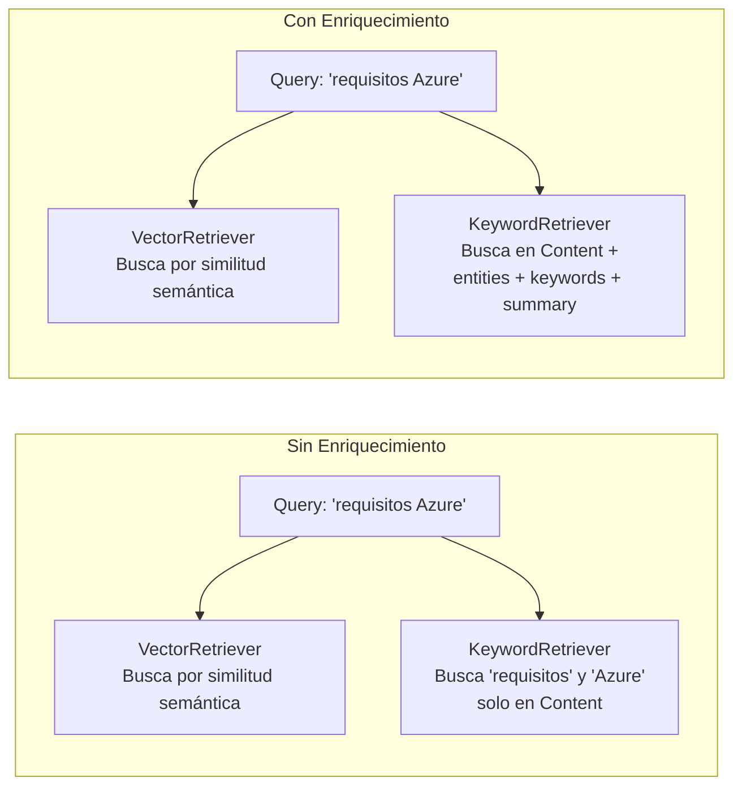
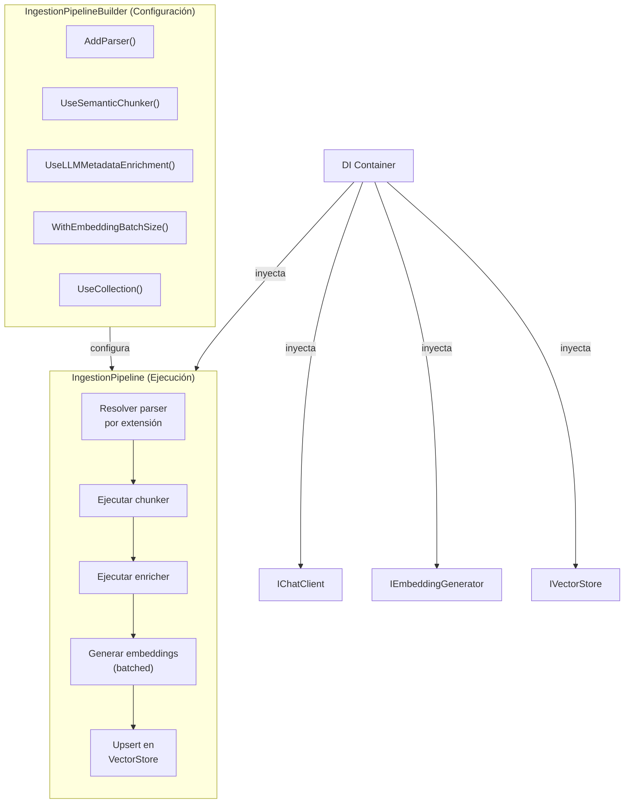

# 7. Diseño del Módulo de Ingestión Inteligente

## Parte 3 — Enriquecimiento, Embedding, Almacenamiento y Orquestación

> **Documento:** `docs/07-03-ingestion-enriquecimiento-y-orquestacion.md`  
> **Versión:** 1.0  
> **Última actualización:** 2026-05-01

---

## 7.4. Enriquecimiento de Metadatos (`IMetadataEnricher`)

### 7.4.1. Extracción Automática vía LLM

El enriquecimiento es la etapa que transforma chunks de texto plano en chunks **semánticamente anotados**. Utiliza un LLM (vía `IChatClient` de MEAI) para extraer automáticamente información estructurada de cada chunk.

**Implementación principal:** `LLMMetadataEnricher` en `RagNet.Core`

```csharp
public class LLMMetadataEnricher : IMetadataEnricher
{
    private readonly IChatClient _chatClient;
    private readonly LLMMetadataEnricherOptions _options;

    public LLMMetadataEnricher(
        IChatClient chatClient,
        IOptions<LLMMetadataEnricherOptions> options)
    {
        _chatClient = chatClient;
        _options = options.Value;
    }

    public async Task<IEnumerable<RagDocument>> EnrichAsync(
        IEnumerable<RagDocument> documents, CancellationToken ct = default)
    {
        // 1. Agrupar chunks en lotes (batch) según BatchSize
        // 2. Para cada lote, construir prompt de extracción
        // 3. Enviar al LLM vía IChatClient
        // 4. Parsear respuesta estructurada (JSON)
        // 5. Fusionar metadatos extraídos con Metadata existente
        // 6. Retornar documentos enriquecidos
    }
}
```

**Opciones de configuración:**

```csharp
public class LLMMetadataEnricherOptions
{
    /// <summary>Extraer entidades nombradas (personas, organizaciones, lugares).</summary>
    public bool ExtractEntities { get; set; } = true;

    /// <summary>Extraer palabras clave representativas.</summary>
    public bool ExtractKeywords { get; set; } = true;

    /// <summary>Generar un resumen breve (1-2 oraciones).</summary>
    public bool GenerateSummary { get; set; } = true;

    /// <summary>Detectar el idioma del contenido.</summary>
    public bool DetectLanguage { get; set; } = false;

    /// <summary>Clasificar por tema/categoría.</summary>
    public bool ClassifyTopic { get; set; } = false;

    /// <summary>Número de chunks a procesar por llamada al LLM.</summary>
    public int BatchSize { get; set; } = 5;

    /// <summary>Número máximo de llamadas concurrentes al LLM.</summary>
    public int MaxConcurrency { get; set; } = 3;
}
```

**Metadatos resultantes en `RagDocument.Metadata`:**

| Clave | Tipo | Ejemplo | Habilitado por |
|-------|------|---------|---------------|
| `"entities"` | `string[]` | `["Microsoft", "Azure", "Satya Nadella"]` | `ExtractEntities` |
| `"keywords"` | `string[]` | `["cloud computing", "serverless", "escalabilidad"]` | `ExtractKeywords` |
| `"summary"` | `string` | `"Describe la arquitectura serverless de Azure Functions"` | `GenerateSummary` |
| `"language"` | `string` | `"es"` | `DetectLanguage` |
| `"topic"` | `string` | `"Cloud Infrastructure"` | `ClassifyTopic` |
| `"source"` | `string` | `"manual.pdf"` | Siempre (del parser) |
| `"page"` | `int` | `12` | Siempre (del parser) |
| `"section"` | `string` | `"Instalación > Requisitos"` | Siempre (del chunker) |

### 7.4.2. Impacto en la Búsqueda Híbrida

El enriquecimiento es **crítico** para la eficacia del `HybridRetriever`:



- **Sin enriquecimiento:** El `KeywordRetriever` solo busca en el `Content` del chunk, limitando el recall.
- **Con enriquecimiento:** El `KeywordRetriever` puede buscar en `keywords`, `entities` y `summary`, encontrando chunks relevantes que no contienen el término exacto pero sí la entidad o concepto.

### 7.4.3. Diseño de Prompts para Enriquecimiento

**Prompt de ejemplo (simplificado):**

```
Analiza el siguiente fragmento de texto y extrae la información solicitada.
Responde ÚNICAMENTE con JSON válido.

FRAGMENTO:
"{chunk.Content}"

EXTRAER:
{
  "entities": ["lista de entidades nombradas mencionadas"],
  "keywords": ["3-5 palabras clave que resumen el fragmento"],
  "summary": "Resumen de 1-2 oraciones del contenido"
}
```

**Consideraciones del diseño de prompts:**

| Aspecto | Decisión |
|---------|---------|
| **Formato de respuesta** | JSON estricto para facilitar el parsing programático |
| **Batching** | Múltiples chunks en un solo prompt para reducir llamadas |
| **Idioma** | El prompt se adapta al idioma detectado del contenido |
| **Modelo** | Puede usar un modelo más económico (GPT-4o-mini) que el de generación |
| **Tolerancia a fallos** | Si el parsing JSON falla, el chunk se retorna sin enriquecimiento |

---

## 7.5. Generación de Embeddings (`IEmbeddingGenerator`)

### 7.5.1. Integración con MEAI

La generación de embeddings no es implementada por RagNet, sino delegada a `IEmbeddingGenerator<string, Embedding<float>>` de Microsoft.Extensions.AI. RagNet se limita a invocar esta abstracción en el momento adecuado del pipeline.

```csharp
// Dentro del pipeline de ingestión (pseudocódigo)
public async Task<IEnumerable<RagDocument>> EmbedDocumentsAsync(
    IEnumerable<RagDocument> documents,
    IEmbeddingGenerator<string, Embedding<float>> embeddingGenerator,
    CancellationToken ct)
{
    var texts = documents.Select(d => d.Content).ToList();

    // Genera embeddings en batch
    var embeddings = await embeddingGenerator.GenerateAsync(texts, cancellationToken: ct);

    // Asigna cada vector al documento correspondiente
    return documents.Zip(embeddings, (doc, emb) =>
        doc with { Vector = emb.Vector });
}
```

### 7.5.2. Procesamiento por Lotes (Batching)

Los proveedores de embeddings tienen límites de tokens por petición. El pipeline debe manejar el batching transparentemente:

```csharp
public class EmbeddingBatcher
{
    private readonly int _maxBatchSize;

    /// <summary>
    /// Divide los documentos en lotes y genera embeddings
    /// respetando los límites del proveedor.
    /// </summary>
    public async Task<IEnumerable<RagDocument>> EmbedInBatchesAsync(
        IEnumerable<RagDocument> documents,
        IEmbeddingGenerator<string, Embedding<float>> generator,
        CancellationToken ct)
    {
        var results = new List<RagDocument>();
        var batches = documents.Chunk(_maxBatchSize); // .NET 8 Chunk()

        foreach (var batch in batches)
        {
            ct.ThrowIfCancellationRequested();
            var texts = batch.Select(d => d.Content).ToList();
            var embeddings = await generator.GenerateAsync(texts, cancellationToken: ct);
            results.AddRange(batch.Zip(embeddings, (doc, emb) =>
                doc with { Vector = emb.Vector }));
        }

        return results;
    }
}
```

**Parámetros de batching:**

| Parámetro | Valor típico | Notas |
|-----------|-------------|-------|
| Batch size | 20-100 chunks | Depende del proveedor (OpenAI: hasta 2048 inputs) |
| Max tokens por batch | ~8000 tokens | Suma de tokens de todos los textos en el batch |
| Concurrencia | 1-3 batches paralelos | Balance entre velocidad y rate limits |

---

## 7.6. Almacenamiento Vectorial (`IVectorStore`)

### 7.6.1. `DefaultRagVectorRecord` y Mapeo de Registros

MEVD requiere clases anotadas con atributos específicos para el mapeo a la base de datos vectorial. RagNet proporciona una clase estándar lista para usar:

```csharp
namespace RagNet.Core;

/// <summary>
/// Registro vectorial por defecto para almacenar chunks RAG.
/// Compatible con cualquier proveedor de IVectorStore vía MEVD.
/// </summary>
public class DefaultRagVectorRecord
{
    [VectorStoreRecordKey]
    public string Id { get; set; } = string.Empty;

    [VectorStoreRecordData(IsFilterable = true)]
    public string Content { get; set; } = string.Empty;

    [VectorStoreRecordData(IsFilterable = true)]
    public string Source { get; set; } = string.Empty;

    [VectorStoreRecordData(IsFilterable = true)]
    public string Section { get; set; } = string.Empty;

    [VectorStoreRecordData(IsFullTextSearchable = true)]
    public string Keywords { get; set; } = string.Empty;

    [VectorStoreRecordData]
    public string Summary { get; set; } = string.Empty;

    [VectorStoreRecordData]
    public string EntitiesJson { get; set; } = string.Empty;

    [VectorStoreRecordData]
    public string MetadataJson { get; set; } = string.Empty;

    [VectorStoreRecordVector(Dimensions = 1536, DistanceFunction.CosineSimilarity)]
    public ReadOnlyMemory<float> Vector { get; set; }
}
```

**Mapeo `RagDocument` ↔ `DefaultRagVectorRecord`:**

| `RagDocument` | `DefaultRagVectorRecord` | Transformación |
|--------------|-------------------------|---------------|
| `Id` | `Id` | Directo |
| `Content` | `Content` | Directo |
| `Vector` | `Vector` | Directo |
| `Metadata["source"]` | `Source` | Extraer de diccionario |
| `Metadata["section"]` | `Section` | Extraer de diccionario |
| `Metadata["keywords"]` | `Keywords` | `string.Join(", ", keywords)` |
| `Metadata["summary"]` | `Summary` | Extraer de diccionario |
| `Metadata["entities"]` | `EntitiesJson` | Serializar como JSON |
| Resto de Metadata | `MetadataJson` | Serializar como JSON |

### 7.6.2. Esquemas de Colección y Configuración de Índices

El pipeline de ingestión puede crear o validar la colección automáticamente:

```csharp
// Pseudocódigo de creación de colección
var collection = vectorStore.GetCollection<string, DefaultRagVectorRecord>("rag-documents");
await collection.CreateCollectionIfNotExistsAsync(ct);

// Upsert de documentos (idempotente por Id)
foreach (var record in mappedRecords)
{
    await collection.UpsertAsync(record, ct);
}
```

**Campos con `IsFilterable = true`** permiten filtrar resultados por fuente, sección, etc., mejorando la precisión en escenarios multi-tenant o multi-documento.

**Campo con `IsFullTextSearchable = true`** (`Keywords`) habilita la búsqueda por keywords que usa el `KeywordRetriever`, fundamental para la búsqueda híbrida.

---

## 7.7. Orquestación: `IngestionPipelineBuilder`

El `IngestionPipelineBuilder` proporciona una API fluida para configurar el pipeline de ingestión completo.

### Diseño del Builder

```csharp
namespace RagNet;

public class IngestionPipelineBuilder
{
    /// <summary>Registra un parser de documentos.</summary>
    public IngestionPipelineBuilder AddParser<TParser>()
        where TParser : class, IDocumentParser;

    /// <summary>Configura el chunker semántico.</summary>
    public IngestionPipelineBuilder UseSemanticChunker<TChunker>(
        Action<object>? configure = null)
        where TChunker : class, ISemanticChunker;

    /// <summary>Configura el chunker con opciones tipadas.</summary>
    public IngestionPipelineBuilder UseSemanticChunker(
        SemanticChunkerOptions options);

    /// <summary>Habilita el enriquecimiento de metadatos vía LLM.</summary>
    public IngestionPipelineBuilder UseLLMMetadataEnrichment(
        bool extractEntities = true,
        bool extractKeywords = true,
        bool generateSummary = true);

    /// <summary>Configura el tamaño de batch para embedding.</summary>
    public IngestionPipelineBuilder WithEmbeddingBatchSize(int batchSize);

    /// <summary>Configura la colección vectorial destino.</summary>
    public IngestionPipelineBuilder UseCollection(string collectionName);
}
```

### Ejemplo de Configuración Completa

```csharp
builder.Services.AddAdvancedRag(rag =>
{
    rag.AddIngestion(ingest => ingest
        // Registrar parsers necesarios
        .AddParser<MarkdownDocumentParser>()
        .AddParser<PdfDocumentParser>()
        .AddParser<WordDocumentParser>()

        // Configurar chunking semántico
        .UseSemanticChunker<EmbeddingSimilarityChunker>(options =>
        {
            options.SimilarityThreshold = 0.85;
            options.MaxChunkSize = 1500;
            options.MinChunkSize = 200;
        })

        // Habilitar enriquecimiento
        .UseLLMMetadataEnrichment(
            extractEntities: true,
            extractKeywords: true,
            generateSummary: true)

        // Configurar embedding y almacenamiento
        .WithEmbeddingBatchSize(50)
        .UseCollection("my-rag-documents")
    );
});
```

### Diagrama de la Orquestación Interna



### Uso del Pipeline de Ingestión

```csharp
public class DocumentIngestionService
{
    private readonly IIngestionPipeline _pipeline;

    public DocumentIngestionService(IIngestionPipeline pipeline)
    {
        _pipeline = pipeline;
    }

    public async Task<IngestionResult> IngestFileAsync(
        Stream fileStream, string fileName, CancellationToken ct)
    {
        // El pipeline resuelve el parser, chunker, enricher, etc.
        var result = await _pipeline.IngestAsync(fileStream, fileName, ct);

        Console.WriteLine($"Chunks procesados: {result.ChunkCount}");
        Console.WriteLine($"Tiempo total: {result.Duration}");
        return result;
    }
}
```

---

> **Navegación de la sección 7:**
> - [Parte 1 — Visión General y Parsing de Documentos](./07-01-ingestion-vision-y-parsing.md)
> - [Parte 2 — Particionado Semántico](./07-02-ingestion-chunking-semantico.md)
> - **Parte 3 — Enriquecimiento, Embedding, Almacenamiento y Orquestación** *(este documento)*
