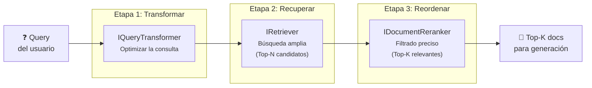
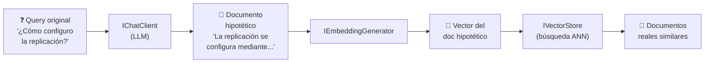

# 8. Diseño del Módulo de Recuperación Avanzada

## Parte 1 — Visión General y Transformación de Consultas

> **Documento:** `docs/08-01-retrieval-vision-y-transformacion.md`  
> **Versión:** 1.0  
> **Última actualización:** 2026-05-01

---

## 8.1. Visión General y Problema "Lost in the Middle"

El módulo de recuperación es responsable del flujo **online** del sistema RAG: recibe la consulta del usuario y retorna los documentos más relevantes para alimentar la generación de respuestas.

### El problema

Los sistemas RAG básicos ejecutan una sola búsqueda vectorial con la query original, lo que presenta múltiples limitaciones:

| Problema | Descripción | Impacto |
|----------|-------------|---------|
| **Query-document mismatch** | La query del usuario está formulada como pregunta; los documentos están redactados como afirmaciones | Baja similitud coseno entre query y documentos relevantes |
| **Ambigüedad** | Queries vagas o con múltiples interpretaciones | Resultados dispersos, baja precisión |
| **Vocabulary gap** | El usuario usa términos diferentes a los del documento | La búsqueda vectorial no encuentra coincidencias exactas |
| **Lost in the Middle** | Los LLMs prestan más atención al inicio y final del contexto, ignorando documentos "en el medio" | Documentos relevantes pero mal posicionados se desaprovechan |
| **Ruido en Top-K** | Un Top-K amplio incluye documentos irrelevantes que diluyen la calidad | El LLM puede generar respuestas imprecisas o alucinaciones |

### Solución: Pipeline de Recuperación en 3 Etapas

RagNet aborda estos problemas con un pipeline de tres etapas que progressivamente refina los resultados:



| Etapa | Interfaz | Objetivo | Analogía |
|-------|----------|----------|----------|
| 1. Transformar | `IQueryTransformer` | Mejorar el *recall* optimizando la consulta | "Hacer la pregunta correcta" |
| 2. Recuperar | `IRetriever` | Obtener un conjunto amplio de candidatos | "Lanzar una red amplia" |
| 3. Reordenar | `IDocumentReranker` | Quedarse solo con los mejores | "Seleccionar las mejores capturas" |

---

## 8.2. Transformación de Consultas (`IQueryTransformer`)

La transformación de consultas es la primera línea de optimización. Modifica la query original del usuario para mejorar la probabilidad de recuperar documentos relevantes.

**Interfaz (definida en `RagNet.Abstractions`):**

```csharp
public interface IQueryTransformer
{
    Task<IEnumerable<string>> TransformAsync(
        string originalQuery, CancellationToken ct = default);
}
```

---

### 8.2.1. `QueryRewriter` — Reescritura de Consultas Ambiguas

**Estrategia:** Usa un LLM (`IChatClient`) para reformular la consulta del usuario en una versión más clara, específica y optimizada para recuperación.

**Proyecto:** `RagNet.Core`  
**Dependencia:** MEAI (`IChatClient`)

```csharp
public class QueryRewriter : IQueryTransformer
{
    private readonly IChatClient _chatClient;

    public QueryRewriter(IChatClient chatClient)
    {
        _chatClient = chatClient;
    }

    public async Task<IEnumerable<string>> TransformAsync(
        string originalQuery, CancellationToken ct = default)
    {
        // 1. Construir prompt de reescritura
        // 2. Enviar al LLM
        // 3. Retornar la query reescrita (lista de 1 elemento)
    }
}
```

**Prompt de ejemplo:**

```
Eres un experto en optimización de consultas de búsqueda.
Reescribe la siguiente consulta del usuario para que sea más específica
y efectiva para buscar en una base de conocimiento técnico.
Responde SOLO con la consulta reescrita, sin explicaciones.

Consulta original: "{originalQuery}"
Consulta reescrita:
```

**Ejemplos de transformación:**

| Query original | Query reescrita |
|---------------|----------------|
| `"¿cómo lo instalo?"` | `"Guía de instalación paso a paso y requisitos previos del sistema"` |
| `"no funciona el login"` | `"Errores comunes de autenticación y solución de problemas en el módulo de login"` |
| `"precios"` | `"Tabla de precios, planes de suscripción y comparativa de funcionalidades"` |

**Cuándo usarlo:**
- Queries cortas o ambiguas de usuarios no técnicos.
- Chatbots conversacionales donde el contexto de la pregunta puede ser vago.
- Coste bajo: una sola llamada al LLM con prompt corto.

---

### 8.2.2. `HyDETransformer` — Hypothetical Document Embeddings

**Estrategia:** En lugar de buscar con la query, genera una **respuesta hipotética** usando el LLM y luego vectoriza esa respuesta para buscar documentos similares. La intuición es que una respuesta hipotética tiene más similitud coseno con los documentos reales que la pregunta original.

**Proyecto:** `RagNet.Core`  
**Dependencia:** MEAI (`IChatClient`)

**Paper:** [Precise Zero-Shot Dense Retrieval without Relevance Labels (Gao et al., 2022)](https://arxiv.org/abs/2212.10496)

```csharp
public class HyDETransformer : IQueryTransformer
{
    private readonly IChatClient _chatClient;

    public HyDETransformer(IChatClient chatClient)
    {
        _chatClient = chatClient;
    }

    public async Task<IEnumerable<string>> TransformAsync(
        string originalQuery, CancellationToken ct = default)
    {
        // 1. Pedir al LLM que genere una respuesta hipotética
        // 2. Retornar el documento hipotético como "query" para búsqueda vectorial
        // 3. El VectorRetriever vectorizará este texto y buscará similares
    }
}
```

**Prompt de ejemplo:**

```
Escribe un párrafo de documentación técnica que respondería directamente
a la siguiente pregunta. El párrafo debe ser informativo y detallado,
como si fuera un fragmento de un manual técnico real.

Pregunta: "{originalQuery}"
Párrafo de documentación:
```

**Ejemplo de funcionamiento:**

```
Query original:  "¿Cómo configuro la replicación en Qdrant?"

Documento hipotético generado:
"La replicación en Qdrant se configura mediante el parámetro replication_factor
en la definición de la colección. Este valor indica cuántas copias de cada
segmento se mantienen en el cluster. Para habilitar la replicación, se debe
configurar replication_factor >= 2 en el archivo config.yaml o mediante la
API REST al crear la colección..."

                    ↓ se vectoriza este texto

Búsqueda vectorial → encuentra documentos reales sobre replicación en Qdrant
                      (alta similitud coseno con el doc hipotético)
```

**Diagrama del flujo HyDE:**



**Cuándo usarlo:**
- Cuando hay un **vocabulary gap** significativo entre queries y documentos.
- Documentación técnica donde las preguntas y las respuestas usan terminología diferente.
- Trade-off: requiere una llamada adicional al LLM, pero mejora significativamente el recall.

---

### 8.2.3. `StepBackTransformer` — Abstracción de Consultas

**Estrategia:** Genera una versión más abstracta/general de la consulta que captura el concepto subyacente. Retorna **ambas** queries (original + abstraída) para maximizar el recall.

**Proyecto:** `RagNet.Core`  
**Dependencia:** MEAI (`IChatClient`)

**Paper:** [Take a Step Back: Evoking Reasoning via Abstraction (Zheng et al., 2023)](https://arxiv.org/abs/2310.06117)

```csharp
public class StepBackTransformer : IQueryTransformer
{
    private readonly IChatClient _chatClient;

    public StepBackTransformer(IChatClient chatClient)
    {
        _chatClient = chatClient;
    }

    public async Task<IEnumerable<string>> TransformAsync(
        string originalQuery, CancellationToken ct = default)
    {
        // 1. Pedir al LLM que extraiga el concepto/principio general
        // 2. Retornar AMBAS: la query original + la query abstraída
        //    para que el retriever busque con ambas
    }
}
```

**Prompt de ejemplo:**

```
Dada la siguiente pregunta específica, formula una pregunta más general
que capture el principio o concepto subyacente.
Responde SOLO con la pregunta generalizada.

Pregunta específica: "{originalQuery}"
Pregunta generalizada:
```

**Ejemplos de transformación:**

| Query original (específica) | Query abstraída (general) |
|----------------------------|--------------------------|
| `"¿Cuánta RAM necesita Qdrant para 1M de vectores?"` | `"¿Cuáles son los requisitos de hardware y dimensionamiento de bases de datos vectoriales?"` |
| `"¿Por qué falla mi HyDETransformer con timeout?"` | `"¿Cómo manejar errores de timeout en llamadas a LLM y configuración de resiliencia?"` |
| `"¿Qué embedding model usar con Azure OpenAI?"` | `"¿Cuáles son los modelos de embedding disponibles y sus características comparativas?"` |

**Flujo de resultados:**

```
Query original: "¿Cuánta RAM necesita Qdrant para 1M de vectores?"

StepBackTransformer retorna:
  [0] "¿Cuánta RAM necesita Qdrant para 1M de vectores?"    ← original
  [1] "Requisitos de hardware de bases de datos vectoriales"  ← abstraída

IRetriever busca con AMBAS queries → combina resultados → Top-N candidatos
```

**Cuándo usarlo:**
- Queries muy específicas que podrían no tener coincidencia directa.
- Cuando el usuario pregunta por un caso concreto pero la documentación cubre el tema de forma general.
- Complementa bien al `QueryRewriter`: uno mejora la especificidad, otro la generalidad.

---

### 8.2.4. Composición de Transformadores

Los transformadores pueden componerse en cadena para aplicar múltiples estrategias:

```csharp
public class CompositeQueryTransformer : IQueryTransformer
{
    private readonly IEnumerable<IQueryTransformer> _transformers;

    public CompositeQueryTransformer(IEnumerable<IQueryTransformer> transformers)
    {
        _transformers = transformers;
    }

    public async Task<IEnumerable<string>> TransformAsync(
        string originalQuery, CancellationToken ct = default)
    {
        var allQueries = new HashSet<string> { originalQuery };

        foreach (var transformer in _transformers)
        {
            var transformed = await transformer.TransformAsync(originalQuery, ct);
            allQueries.UnionWith(transformed);
        }

        return allQueries;
    }
}
```

**Ejemplo de composición:**

```
Query original: "¿Cómo configuro SSL?"

QueryRewriter  → "Configuración de certificados SSL/TLS y HTTPS"
StepBackTransformer → "Seguridad de comunicaciones y cifrado en tránsito"

Resultado combinado (3 queries para el retriever):
  [0] "¿Cómo configuro SSL?"
  [1] "Configuración de certificados SSL/TLS y HTTPS"
  [2] "Seguridad de comunicaciones y cifrado en tránsito"
```

**Comparativa de transformadores:**

| Transformador | Llamadas LLM | Queries generadas | Mejora en recall | Coste | Mejor para |
|--------------|-------------|-------------------|-----------------|-------|-----------|
| `QueryRewriter` | 1 | 1 | ⭐⭐⭐ Media | Bajo | Queries ambiguas |
| `HyDETransformer` | 1 | 1 | ⭐⭐⭐⭐⭐ Alta | Medio | Vocabulary gap |
| `StepBackTransformer` | 1 | 2 (original + abstracta) | ⭐⭐⭐⭐ Alta | Medio | Queries muy específicas |
| Composición | 2-3 | 3-4 | ⭐⭐⭐⭐⭐ Máxima | Alto | Máximo recall posible |

---

> [!NOTE]
> Continúa en [Parte 2 — Recuperación, Re-Ranking y Diagrama de Secuencia](./08-02-retrieval-recuperacion-y-reranking.md).
