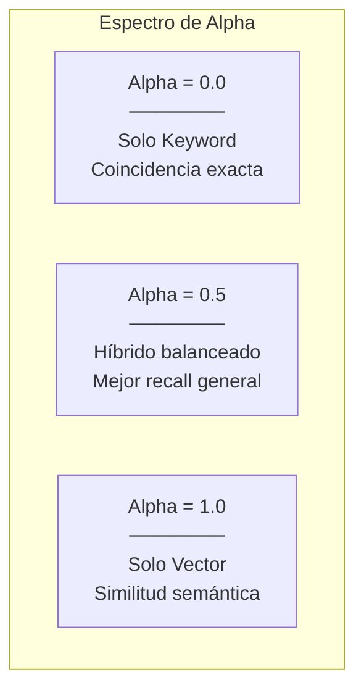
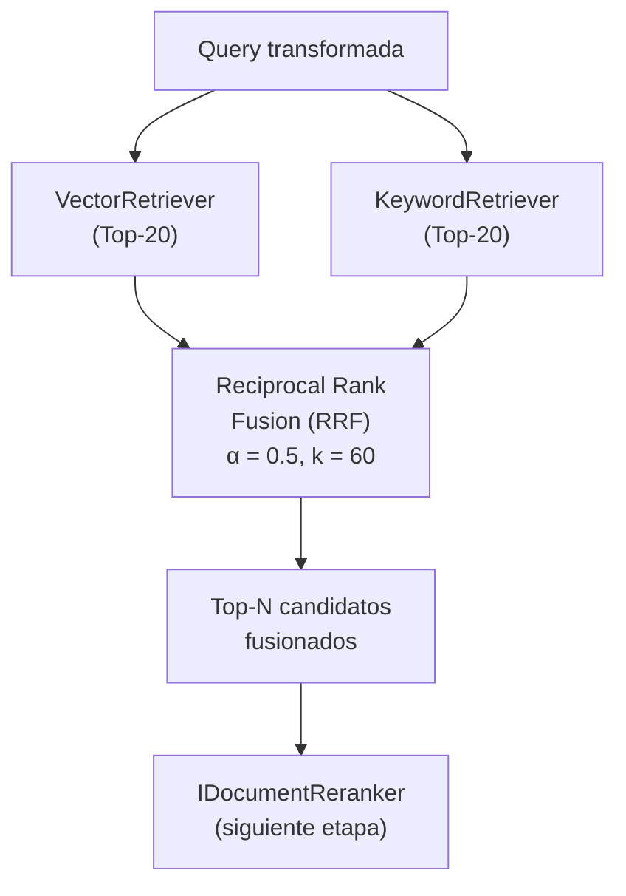
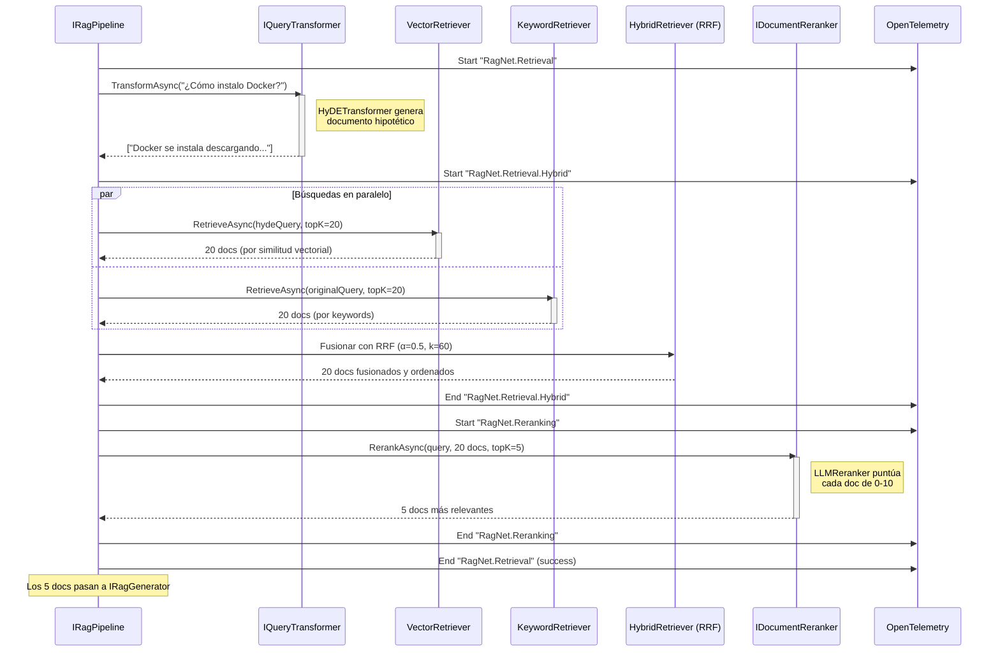

# 8. Diseño del Módulo de Recuperación Avanzada

## Parte 2 — Recuperación de Documentos, Re-Ranking y Diagrama de Secuencia

> **Documento:** `docs/08-02-retrieval-recuperacion-y-reranking.md`  
> **Versión:** 1.0  
> **Última actualización:** 2026-05-01

---

## 8.3. Recuperación de Documentos (`IRetriever`)

**Interfaz (definida en `RagNet.Abstractions`):**

```csharp
public interface IRetriever
{
    Task<IEnumerable<RagDocument>> RetrieveAsync(
        string query, int topK, CancellationToken ct = default);
}
```

---

### 8.3.1. `VectorRetriever` — Búsqueda Vectorial (MEVD)

**Estrategia:** Convierte la query en un embedding y busca los documentos más cercanos por similitud coseno en la base de datos vectorial.

**Proyecto:** `RagNet.Core`  
**Dependencias:** MEAI (`IEmbeddingGenerator`), MEVD (`IVectorStore`)

```csharp
public class VectorRetriever : IRetriever
{
    private readonly IEmbeddingGenerator<string, Embedding<float>> _embeddingGenerator;
    private readonly IVectorStoreRecordCollection<string, DefaultRagVectorRecord> _collection;

    public VectorRetriever(
        IEmbeddingGenerator<string, Embedding<float>> embeddingGenerator,
        IVectorStoreRecordCollection<string, DefaultRagVectorRecord> collection)
    {
        _embeddingGenerator = embeddingGenerator;
        _collection = collection;
    }

    public async Task<IEnumerable<RagDocument>> RetrieveAsync(
        string query, int topK, CancellationToken ct = default)
    {
        // 1. Generar embedding de la query
        var queryEmbedding = await _embeddingGenerator.GenerateAsync(query, ct);

        // 2. Buscar vectores similares en MEVD
        var searchResults = await _collection.VectorizedSearchAsync(
            queryEmbedding.Vector,
            new VectorSearchOptions { Top = topK },
            ct);

        // 3. Mapear resultados a RagDocument
        // 4. Incluir score en Metadata["_score"]
    }
}
```

**Características:**

| Aspecto | Detalle |
|---------|---------|
| **Tipo de búsqueda** | Approximate Nearest Neighbor (ANN) |
| **Métrica** | Similitud coseno (configurable por el VectorStore) |
| **Ventaja** | Captura similitud semántica: encuentra documentos relevantes aunque no compartan palabras |
| **Debilidad** | Puede fallar con términos técnicos exactos, nombres propios o acrónimos |

---

### 8.3.2. `KeywordRetriever` — Full-Text Search

**Estrategia:** Búsqueda clásica por palabras clave usando algoritmos como BM25 o TF-IDF. Complementa la búsqueda vectorial encontrando coincidencias exactas de términos.

**Proyecto:** `RagNet.Core`  
**Dependencias:** Proveedor FTS (puede ser el mismo VectorStore si lo soporta, e.g., Azure AI Search)

```csharp
public class KeywordRetriever : IRetriever
{
    private readonly IVectorStoreRecordCollection<string, DefaultRagVectorRecord> _collection;

    public KeywordRetriever(
        IVectorStoreRecordCollection<string, DefaultRagVectorRecord> collection)
    {
        _collection = collection;
    }

    public async Task<IEnumerable<RagDocument>> RetrieveAsync(
        string query, int topK, CancellationToken ct = default)
    {
        // 1. Ejecutar búsqueda de texto completo sobre campos marcados
        //    con IsFullTextSearchable = true (Content, Keywords)
        // 2. Ordenar por relevancia textual (BM25 score)
        // 3. Mapear a RagDocument con score en Metadata
    }
}
```

**Campos buscados:**

| Campo | Atributo MEVD | Contenido |
|-------|--------------|-----------|
| `Content` | `IsFullTextSearchable = true` | Texto del chunk |
| `Keywords` | `IsFullTextSearchable = true` | Palabras clave extraídas por `IMetadataEnricher` |

**Ventaja sobre VectorRetriever:**
- Coincidencia exacta de términos técnicos, IDs, nombres propios.
- Sin necesidad de generar embedding para la query.
- Rápido y económico.

**Debilidad:** No captura similitud semántica. "automóvil" no encuentra "coche".

---

### 8.3.3. `HybridRetriever` — Fusión Híbrida

**Estrategia:** Combina los resultados de `VectorRetriever` y `KeywordRetriever` usando el algoritmo de **Reciprocal Rank Fusion (RRF)** para obtener lo mejor de ambos mundos.

**Proyecto:** `RagNet.Core`

```csharp
public class HybridRetriever : IRetriever
{
    private readonly VectorRetriever _vectorRetriever;
    private readonly KeywordRetriever _keywordRetriever;
    private readonly HybridRetrieverOptions _options;

    public HybridRetriever(
        VectorRetriever vectorRetriever,
        KeywordRetriever keywordRetriever,
        IOptions<HybridRetrieverOptions> options)
    {
        _vectorRetriever = vectorRetriever;
        _keywordRetriever = keywordRetriever;
        _options = options.Value;
    }

    public async Task<IEnumerable<RagDocument>> RetrieveAsync(
        string query, int topK, CancellationToken ct = default)
    {
        // 1. Ejecutar AMBAS búsquedas en paralelo
        var vectorTask = _vectorRetriever.RetrieveAsync(query, _options.ExpandedTopK, ct);
        var keywordTask = _keywordRetriever.RetrieveAsync(query, _options.ExpandedTopK, ct);

        await Task.WhenAll(vectorTask, keywordTask);

        // 2. Fusionar resultados con RRF
        var fused = ReciprocalRankFusion(
            vectorResults: vectorTask.Result,
            keywordResults: keywordTask.Result,
            alpha: _options.Alpha,
            k: _options.RrfK);

        // 3. Retornar Top-K fusionados
        return fused.Take(topK);
    }
}
```

**Opciones de configuración:**

```csharp
public class HybridRetrieverOptions
{
    /// <summary>
    /// Balance entre vector y keyword (0.0 = solo keyword, 1.0 = solo vector).
    /// Valor 0.5 = peso igual para ambas estrategias.
    /// </summary>
    public double Alpha { get; set; } = 0.5;

    /// <summary>
    /// Top-K expandido para cada sub-retriever antes de la fusión.
    /// Debe ser mayor que el Top-K final para tener suficientes candidatos.
    /// </summary>
    public int ExpandedTopK { get; set; } = 20;

    /// <summary>
    /// Constante K del algoritmo RRF. Valores típicos: 60.
    /// Controla cuánto se penaliza a los documentos de ranking bajo.
    /// </summary>
    public int RrfK { get; set; } = 60;
}
```

#### 8.3.3.1. Algoritmo de Reciprocal Rank Fusion (RRF)

RRF combina múltiples listas rankeadas en una sola lista fusionada sin necesidad de normalizar scores (que pueden ser incomparables entre diferentes motores).

**Fórmula:**

```
RRF_score(doc) = Σ  α_i / (k + rank_i(doc))
```

Donde:
- `rank_i(doc)` = posición del documento en la lista i (1-indexed)
- `k` = constante de suavizado (típicamente 60)
- `α_i` = peso de la lista i (controlado por `Alpha`)

**Ejemplo numérico:**

```
Alpha = 0.5, K = 60

Vector Results:          Keyword Results:
  Rank 1: Doc-A (0.95)    Rank 1: Doc-C (12.5)
  Rank 2: Doc-B (0.87)    Rank 2: Doc-A (11.2)
  Rank 3: Doc-C (0.82)    Rank 3: Doc-D (9.8)
  Rank 4: Doc-D (0.75)    Rank 4: Doc-E (8.1)

RRF Scores:
  Doc-A: 0.5/(60+1) + 0.5/(60+2) = 0.00819 + 0.00806 = 0.01626  ← #1
  Doc-C: 0.5/(60+3) + 0.5/(60+1) = 0.00793 + 0.00819 = 0.01613  ← #2
  Doc-B: 0.5/(60+2) + 0/(no aparece)  = 0.00806                   ← #3
  Doc-D: 0.5/(60+4) + 0.5/(60+3) = 0.00781 + 0.00793 = 0.01575  ← #4 (sube!)
  Doc-E: 0/(no aparece) + 0.5/(60+4) = 0.00781                   ← #5
```

**Observación clave:** Doc-D estaba en posición 4 en ambas listas, pero RRF lo sube a posición 4 global porque aparece en **ambas** listas. Documentos que aparecen en múltiples fuentes son recompensados.

#### 8.3.3.2. Parámetro Alpha: Balance Vector/Keyword



**Guía de ajuste:**

| Valor Alpha | Escenario recomendado |
|-------------|----------------------|
| 0.3 | Dominios con terminología técnica precisa (medicina, derecho, código) |
| 0.5 | Balance general, recomendado como punto de partida |
| 0.7 | Documentación narrativa donde la semántica importa más que los términos |
| 1.0 | Cuando no se dispone de Full-Text Search en el proveedor vectorial |

**Diagrama del flujo completo del HybridRetriever:**



---

## 8.4. Reordenamiento de Resultados (`IDocumentReranker`)

**Interfaz (definida en `RagNet.Abstractions`):**

```csharp
public interface IDocumentReranker
{
    Task<IEnumerable<RagDocument>> RerankAsync(
        string query, IEnumerable<RagDocument> documents,
        int topK, CancellationToken ct = default);
}
```

### Patrón Retrieve-then-Rerank

```
Retriever → Top-20 candidatos (búsqueda rápida, recall alto)
                    │
                    ▼
Reranker  → Top-5 relevantes (análisis profundo, precisión alta)
                    │
                    ▼
Generator → Respuesta con 5 documentos de contexto óptimo
```

El reranker es un **filtro de precisión** que compensa la relativa falta de precisión de la búsqueda vectorial. Al operar sobre una lista reducida (20 docs vs. millones), puede usar modelos más costosos y lentos.

---

### 8.4.1. `CrossEncoderReranker` — Modelos Especializados

**Estrategia:** Usa modelos cross-encoder que reciben el par (query, documento) como entrada conjunta y producen un score de relevancia. Son más precisos que los bi-encoders (embeddings) porque ven ambos textos simultáneamente.

**Proyecto:** `RagNet.Core`

```csharp
public class CrossEncoderReranker : IDocumentReranker
{
    private readonly IChatClient _crossEncoderClient; // Modelo cross-encoder

    public CrossEncoderReranker(IChatClient crossEncoderClient)
    {
        _crossEncoderClient = crossEncoderClient;
    }

    public async Task<IEnumerable<RagDocument>> RerankAsync(
        string query, IEnumerable<RagDocument> documents,
        int topK, CancellationToken ct = default)
    {
        // 1. Para cada documento, crear par (query, doc.Content)
        // 2. Enviar al cross-encoder → obtener score de relevancia
        // 3. Ordenar por score descendente
        // 4. Retornar Top-K
    }
}
```

**Modelos cross-encoder comunes:**

| Modelo | Tamaño | Precisión | Latencia |
|--------|--------|-----------|----------|
| `ms-marco-MiniLM-L-6-v2` | 23M params | Buena | ~5ms/par |
| `ms-marco-MiniLM-L-12-v2` | 33M params | Muy buena | ~10ms/par |
| `bge-reranker-v2-m3` | 568M params | Excelente | ~50ms/par |

**Ventajas:**
- Muy rápido (modelos pequeños, ejecutables localmente).
- No consume tokens de LLM.
- Alta precisión para reranking.

---

### 8.4.2. `LLMReranker` — Puntuación por LLM

**Estrategia:** Usa un LLM general (`IChatClient` de MEAI) para evaluar la relevancia de cada documento respecto a la query. El LLM asigna una puntuación de 0 a 10.

**Proyecto:** `RagNet.Core`  
**Dependencia:** MEAI (`IChatClient`)

```csharp
public class LLMReranker : IDocumentReranker
{
    private readonly IChatClient _chatClient;

    public LLMReranker(IChatClient chatClient)
    {
        _chatClient = chatClient;
    }

    public async Task<IEnumerable<RagDocument>> RerankAsync(
        string query, IEnumerable<RagDocument> documents,
        int topK, CancellationToken ct = default)
    {
        // 1. Construir prompt con la query y todos los documentos
        // 2. Pedir al LLM que puntúe cada documento de 0 a 10
        // 3. Parsear las puntuaciones
        // 4. Ordenar por puntuación descendente → Top-K
    }
}
```

**Prompt de ejemplo:**

```
Evalúa la relevancia de cada documento para responder la consulta.
Puntúa de 0 (irrelevante) a 10 (perfectamente relevante).
Responde SOLO con JSON.

CONSULTA: "{query}"

DOCUMENTOS:
[1] "{doc1.Content}"
[2] "{doc2.Content}"
...
[N] "{docN.Content}"

PUNTUACIONES:
[{"doc": 1, "score": X}, {"doc": 2, "score": Y}, ...]
```

**Comparativa CrossEncoder vs. LLMReranker:**

| Aspecto | `CrossEncoderReranker` | `LLMReranker` |
|---------|----------------------|--------------|
| **Precisión** | ⭐⭐⭐⭐ Alta | ⭐⭐⭐⭐⭐ Muy alta |
| **Coste** | ⭐ Bajo (modelo local) | ⭐⭐⭐ Alto (tokens LLM) |
| **Latencia** | ⭐ Baja (~5-50ms/doc) | ⭐⭐⭐ Alta (~1-3s/batch) |
| **Infraestructura** | Requiere hosting de modelo | Usa el LLM ya configurado |
| **Capacidad de razonamiento** | Solo similitud textual | Entiende contexto y matices |
| **Mejor para** | Alto volumen, baja latencia | Máxima calidad, batch pequeños |

### 8.4.3. Estrategia Top-K: Ampliación y Recorte

La clave del patrón Retrieve-then-Rerank es la **proporción entre candidatos y seleccionados**:

| Retriever Top-N | Reranker Top-K | Ratio | Escenario |
|----------------|---------------|-------|-----------|
| 10 | 3 | 3:1 | Rápido, para queries simples |
| 20 | 5 | 4:1 | Balance general (recomendado) |
| 50 | 5 | 10:1 | Máxima calidad, queries complejas |
| 100 | 10 | 10:1 | Grandes bases de conocimiento |

> [!TIP]
> **Regla general:** Recuperar 4x-10x más candidatos de los que se usarán en la generación. Esto da al reranker suficiente material para encontrar los mejores documentos sin desperdicio excesivo.

---

## 8.5. Diagrama de Secuencia del Pipeline de Recuperación



---

> **Navegación de la sección 8:**
> - [Parte 1 — Visión General y Transformación de Consultas](./08-01-retrieval-vision-y-transformacion.md)
> - **Parte 2 — Recuperación, Re-Ranking y Diagrama de Secuencia** *(este documento)*
