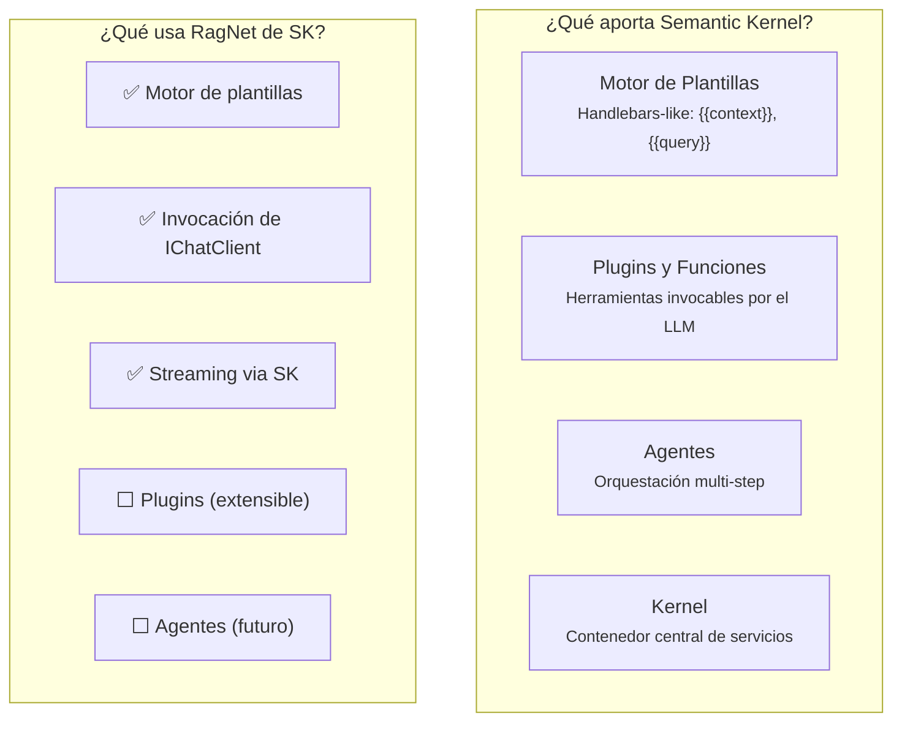
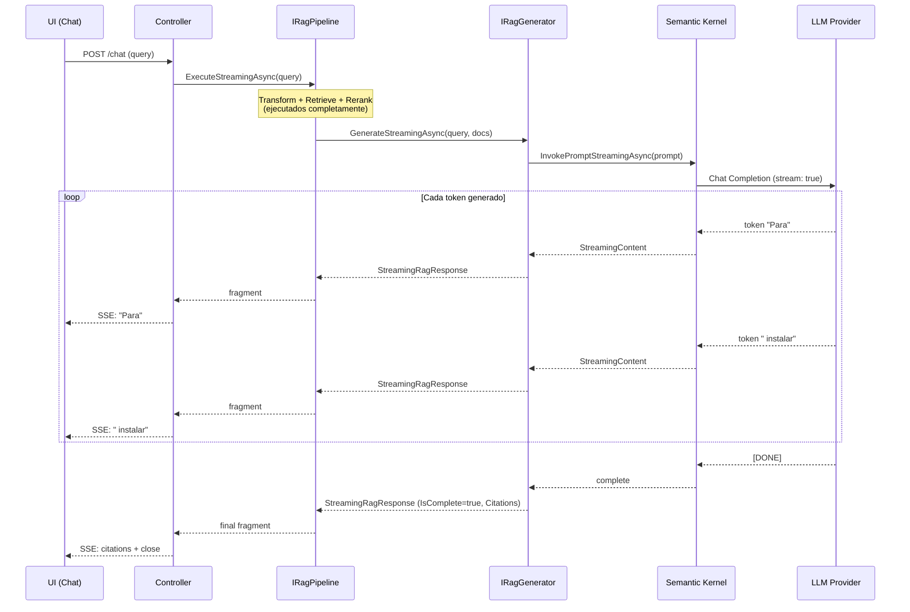

# 9. Diseño del Módulo de Generación

## Parte 1 — Semantic Kernel, IRagGenerator, Prompts y Streaming

> **Documento:** `docs/09-01-generacion-sk-prompts-streaming.md`  
> **Versión:** 1.0  
> **Última actualización:** 2026-05-01

---

## 9.1. Rol de Semantic Kernel en la Generación

El módulo de generación es la etapa final del pipeline RAG online. Recibe los documentos recuperados y reordenados, los fusiona con la consulta del usuario en un prompt, y genera una respuesta fundamentada.

RagNet separa la generación en un proyecto dedicado (`RagNet.SemanticKernel`) porque:

1. **Semantic Kernel es una dependencia robusta** (v1.75.0) con su propio ecosistema de plugins, agentes y funciones.
2. **Algunos usuarios prefieren MEAI directo**: no todos necesitan el motor de plantillas, plugins o agentes de SK.
3. **Evolución independiente**: SK tiene un ritmo de releases rápido; aislarlo protege al Core de breaking changes.



---

## 9.2. `IRagGenerator` y `SemanticKernelRagGenerator`

### Interfaz `IRagGenerator`

```csharp
public interface IRagGenerator
{
    Task<RagResponse> GenerateAsync(
        string query, IEnumerable<RagDocument> context,
        CancellationToken ct = default);

    IAsyncEnumerable<StreamingRagResponse> GenerateStreamingAsync(
        string query, IEnumerable<RagDocument> context,
        CancellationToken ct = default);
}
```

### Implementación: `SemanticKernelRagGenerator`

```csharp
namespace RagNet.SemanticKernel;

public class SemanticKernelRagGenerator : IRagGenerator
{
    private readonly Kernel _kernel;
    private readonly SemanticKernelGeneratorOptions _options;

    public SemanticKernelRagGenerator(
        Kernel kernel,
        IOptions<SemanticKernelGeneratorOptions> options)
    {
        _kernel = kernel;
        _options = options.Value;
    }

    public async Task<RagResponse> GenerateAsync(
        string query, IEnumerable<RagDocument> context,
        CancellationToken ct = default)
    {
        // 1. Validar que el contexto cabe en la ventana del LLM
        var fittedContext = await FitContextWindow(context, ct);

        // 2. Renderizar el prompt con el motor de plantillas de SK
        var prompt = await RenderPrompt(query, fittedContext);

        // 3. Invocar el LLM via Kernel
        var result = await _kernel.InvokePromptAsync(prompt, cancellationToken: ct);

        // 4. Extraer citas del contexto usado
        var citations = ExtractCitations(fittedContext, result);

        // 5. Construir RagResponse
        return new RagResponse
        {
            Answer = result.GetValue<string>() ?? string.Empty,
            Citations = citations,
            ExecutionMetadata = CollectMetadata(result)
        };
    }

    public async IAsyncEnumerable<StreamingRagResponse> GenerateStreamingAsync(
        string query, IEnumerable<RagDocument> context,
        [EnumeratorCancellation] CancellationToken ct = default)
    {
        var fittedContext = await FitContextWindow(context, ct);
        var prompt = await RenderPrompt(query, fittedContext);

        // Streaming via SK
        await foreach (var chunk in _kernel.InvokePromptStreamingAsync(
            prompt, cancellationToken: ct))
        {
            yield return new StreamingRagResponse
            {
                ContentFragment = chunk.ToString(),
                IsComplete = false
            };
        }

        // Fragmento final con citas
        yield return new StreamingRagResponse
        {
            ContentFragment = string.Empty,
            IsComplete = true,
            Citations = ExtractCitations(fittedContext)
        };
    }
}
```

**Opciones de configuración:**

```csharp
public class SemanticKernelGeneratorOptions
{
    /// <summary>Plantilla del prompt del sistema.</summary>
    public string SystemPromptTemplate { get; set; } =
        "Eres un asistente experto. Responde basándote SOLO en el contexto proporcionado.";

    /// <summary>Plantilla del prompt del usuario con contexto.</summary>
    public string UserPromptTemplate { get; set; } =
        """
        CONTEXTO:
        {{context}}

        PREGUNTA:
        {{query}}

        INSTRUCCIONES:
        - Responde basándote exclusivamente en el contexto proporcionado.
        - Si el contexto no contiene la información, indica que no tienes datos suficientes.
        - Cita las fuentes usando [1], [2], etc.
        """;

    /// <summary>Máximo de tokens de contexto antes de truncar/resumir.</summary>
    public int MaxContextTokens { get; set; } = 6000;

    /// <summary>Modelo de tokenización para contar tokens.</summary>
    public string TokenizerModel { get; set; } = "gpt-4";

    /// <summary>Habilitar validación Self-RAG (anti-alucinación).</summary>
    public bool EnableSelfRagValidation { get; set; } = false;
}
```

---

## 9.3. Gestión de Plantillas de Prompts

### 9.3.1. Inyección de Contexto (`{{context}}`)

La plantilla de prompt construye el contexto a partir de los `RagDocument` recuperados, numerándolos para que el LLM pueda referenciarlos:

```csharp
private async Task<string> RenderPrompt(
    string query, IEnumerable<RagDocument> context)
{
    // Construir bloque de contexto numerado
    var contextBuilder = new StringBuilder();
    int index = 1;
    foreach (var doc in context)
    {
        contextBuilder.AppendLine($"[{index}] Fuente: {doc.Metadata.GetValueOrDefault("source", "Desconocida")}");
        contextBuilder.AppendLine($"    Sección: {doc.Metadata.GetValueOrDefault("section", "")}");
        contextBuilder.AppendLine($"    Contenido: {doc.Content}");
        contextBuilder.AppendLine();
        index++;
    }

    // Renderizar con el motor de plantillas de SK
    var templateConfig = new PromptTemplateConfig(_options.UserPromptTemplate);
    var template = new KernelPromptTemplateFactory()
        .Create(templateConfig);

    return await template.RenderAsync(_kernel, new KernelArguments
    {
        ["context"] = contextBuilder.ToString(),
        ["query"] = query
    });
}
```

**Resultado renderizado (ejemplo):**

```
CONTEXTO:
[1] Fuente: manual-instalacion.pdf
    Sección: Requisitos > Hardware
    Contenido: El sistema requiere mínimo 16GB de RAM y 4 cores de CPU...

[2] Fuente: faq.md
    Sección: Preguntas Frecuentes
    Contenido: Para instalaciones en producción se recomienda SSD NVMe...

[3] Fuente: release-notes-v3.md
    Sección: Cambios en v3.0
    Contenido: A partir de la versión 3.0, el requisito mínimo de RAM...

PREGUNTA:
¿Cuánta RAM necesito para instalar el sistema en producción?

INSTRUCCIONES:
- Responde basándote exclusivamente en el contexto proporcionado.
- Si el contexto no contiene la información, indica que no tienes datos suficientes.
- Cita las fuentes usando [1], [2], etc.
```

### 9.3.2. Motor de Plantillas de SK

Semantic Kernel ofrece un motor de plantillas que soporta:

| Feature | Sintaxis | Ejemplo |
|---------|---------|---------|
| Variables | `{{variable}}` | `{{query}}`, `{{context}}` |
| Funciones | `{{plugin.function args}}` | `{{time.now}}` |
| Condicionales | `{{#if condition}}...{{/if}}` | `{{#if citations}}Fuentes:...{{/if}}` |
| Iteraciones | `{{#each items}}...{{/each}}` | `{{#each documents}}[{{this.id}}]{{/each}}` |

**Ventaja sobre string interpolation:** Las plantillas SK se pueden almacenar externamente (archivos, base de datos), modificar sin recompilar, y versionar independientemente del código.

---

## 9.4. Streaming End-to-End (`IAsyncEnumerable`)

### 9.4.1. Propagación de Tokens a la UI

El streaming permite que la UI muestre tokens a medida que el LLM los genera, eliminando la espera por la respuesta completa:



### 9.4.2. Integración con `StreamingRagResponse`

```csharp
// En un Controller ASP.NET Core
[HttpPost("chat/stream")]
public async IAsyncEnumerable<StreamingRagResponse> ChatStream(
    [FromBody] ChatRequest request,
    [EnumeratorCancellation] CancellationToken ct)
{
    var pipeline = _pipelineFactory.Create("default");

    await foreach (var fragment in pipeline.ExecuteStreamingAsync(request.Query, ct))
    {
        yield return fragment;
    }
}
```

**Transporte para streaming:**

| Protocolo | Caso de uso | Implementación |
|-----------|------------|---------------|
| **Server-Sent Events (SSE)** | Web browsers, HTTP simple | `text/event-stream`, compatible con `fetch` API |
| **WebSocket** | Chat bidireccional en tiempo real | SignalR Hub con `IAsyncEnumerable` |
| **gRPC streaming** | Microservicios, alto rendimiento | `IAsyncEnumerable` → gRPC server stream |

**Latencia percibida:**

```
Sin streaming:  [──── 3.5s de espera ────][Respuesta completa]
Con streaming:  [0.3s][T][o][k][e][n][ ][a][ ][t][o][k][e][n]...
                  ↑ Primer token visible casi inmediatamente
```

---

> [!NOTE]
> Continúa en [Parte 2 — Citas, Self-RAG, Context Window y Plugins](./09-02-generacion-citas-selfrag-context.md).
