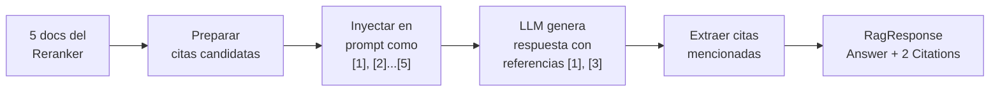
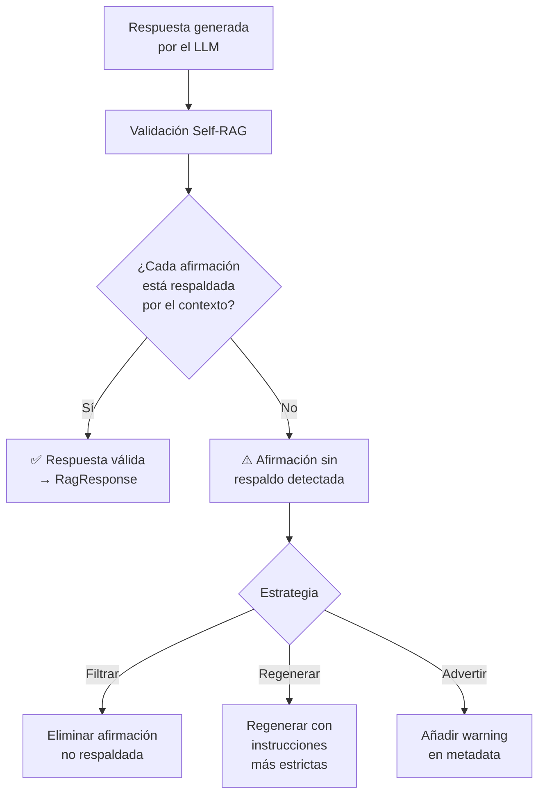
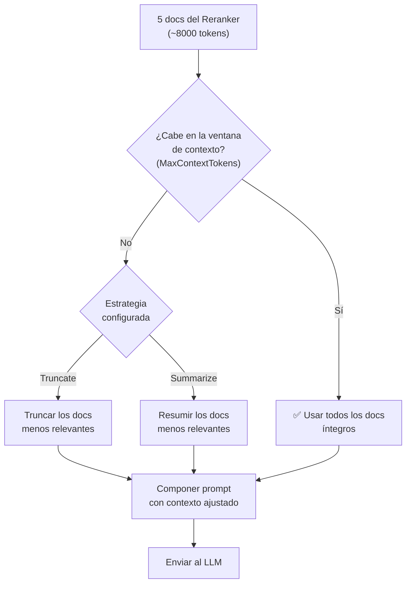
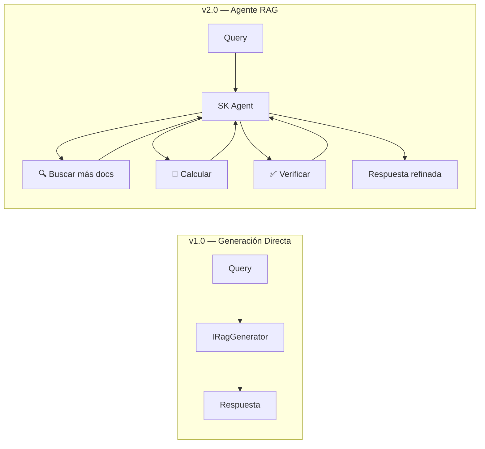

# 9. Diseño del Módulo de Generación

## Parte 2 — Citas, Self-RAG, Context Window y Plugins

> **Documento:** `docs/09-02-generacion-citas-selfrag-context.md`  
> **Versión:** 1.0  
> **Última actualización:** 2026-05-01

---

## 9.5. Inyección Automática de Citas y Referencias

### 9.5.1. Modelo `Citation` y `RelevanceScore`

Cada `RagResponse` incluye una lista de `Citation` que permite al consumidor mostrar las fuentes utilizadas y su grado de confianza:

```csharp
public record Citation(
    string DocumentId,       // ID único del chunk
    string SourceContent,    // Fragmento de texto usado como contexto
    double RelevanceScore,   // Score de relevancia (0.0-1.0) del reranker
    Dictionary<string, object> Metadata  // Fuente, página, sección, etc.
);
```

**Ejemplo de `RagResponse` con citas:**

```csharp
var response = await pipeline.ExecuteAsync("¿Requisitos de RAM?");

// response.Answer:
// "El sistema requiere mínimo 16GB de RAM para producción [1].
//  A partir de la v3.0, se recomienda 32GB para cargas pesadas [3]."

// response.Citations:
// [0] Citation { DocumentId = "doc-001-chunk-12",
//                SourceContent = "El sistema requiere mínimo 16GB...",
//                RelevanceScore = 0.95,
//                Metadata = { source: "manual.pdf", page: 23 } }
// [1] Citation { DocumentId = "doc-003-chunk-05",
//                SourceContent = "FAQ sobre requisitos de hardware...",
//                RelevanceScore = 0.82,
//                Metadata = { source: "faq.md", section: "Hardware" } }
// [2] Citation { DocumentId = "doc-007-chunk-01",
//                SourceContent = "A partir de v3.0, el requisito mínimo...",
//                RelevanceScore = 0.88,
//                Metadata = { source: "release-notes-v3.md" } }
```

### 9.5.2. Trazabilidad de Fuentes en la Respuesta

La generación de citas se produce en dos fases:

**Fase 1 — Pre-generación:** Las citas se preparan a partir de los documentos que se inyectan como contexto. Cada documento recuperado es un candidato a cita.

```csharp
private IReadOnlyList<Citation> PrepareCitations(IEnumerable<RagDocument> context)
{
    return context.Select((doc, index) => new Citation(
        DocumentId: doc.Id,
        SourceContent: doc.Content.Length > 200
            ? doc.Content[..200] + "..."
            : doc.Content,
        RelevanceScore: doc.Metadata.TryGetValue("_score", out var score)
            ? Convert.ToDouble(score)
            : 0.0,
        Metadata: doc.Metadata
    )).ToList();
}
```

**Fase 2 — Post-generación:** Se analiza la respuesta del LLM para identificar qué fuentes realmente se citaron (marcadas como `[1]`, `[2]`, etc.) y filtrar las que no se usaron.

```csharp
private IReadOnlyList<Citation> ExtractCitations(
    IEnumerable<RagDocument> context, string answer)
{
    var allCitations = PrepareCitations(context);

    // Detectar qué números de cita aparecen en la respuesta
    var citedIndices = Regex.Matches(answer, @"\[(\d+)\]")
        .Select(m => int.Parse(m.Groups[1].Value) - 1)
        .Where(i => i >= 0 && i < allCitations.Count)
        .Distinct()
        .ToHashSet();

    // Retornar solo las citas efectivamente usadas
    return allCitations
        .Where((_, index) => citedIndices.Contains(index))
        .ToList();
}
```

**Diagrama del flujo de citas:**



---

## 9.6. Validación de Alucinaciones (Self-RAG)

Self-RAG es un mecanismo de validación post-generación que verifica que la respuesta del LLM esté fundamentada en el contexto proporcionado.

**Paper:** [Self-RAG: Learning to Retrieve, Generate, and Critique (Asai et al., 2023)](https://arxiv.org/abs/2310.11511)

### Funcionamiento



### Implementación

```csharp
private async Task<RagResponse> ValidateSelfRag(
    string answer, IEnumerable<RagDocument> context, CancellationToken ct)
{
    if (!_options.EnableSelfRagValidation)
        return null; // Validación deshabilitada

    var validationPrompt = $"""
        Analiza la siguiente respuesta y verifica que cada afirmación
        esté respaldada por el contexto proporcionado.

        CONTEXTO:
        {FormatContext(context)}

        RESPUESTA A VALIDAR:
        {answer}

        Para cada afirmación en la respuesta, indica:
        - "SUPPORTED" si está respaldada por el contexto
        - "NOT_SUPPORTED" si NO está respaldada
        - "PARTIAL" si está parcialmente respaldada

        Responde en JSON:
        [{{"claim": "...", "status": "SUPPORTED|NOT_SUPPORTED|PARTIAL",
           "evidence": "fragmento del contexto que lo respalda"}}]
        """;

    var validation = await _kernel.InvokePromptAsync(validationPrompt, ct);
    // Parsear y decidir según la estrategia configurada
}
```

**Opciones de Self-RAG:**

```csharp
public class SelfRagOptions
{
    /// <summary>Habilitar validación Self-RAG.</summary>
    public bool Enabled { get; set; } = false;

    /// <summary>
    /// Estrategia cuando se detecta una alucinación.
    /// </summary>
    public HallucinationStrategy Strategy { get; set; } =
        HallucinationStrategy.Warn;

    /// <summary>Umbral: % mínimo de afirmaciones respaldadas.</summary>
    public double MinSupportedRatio { get; set; } = 0.8;
}

public enum HallucinationStrategy
{
    /// <summary>Solo añadir warning en ExecutionMetadata.</summary>
    Warn,
    /// <summary>Eliminar afirmaciones no respaldadas de la respuesta.</summary>
    Filter,
    /// <summary>Regenerar la respuesta con prompt más restrictivo.</summary>
    Regenerate
}
```

**Trade-offs:**

| Aspecto | Sin Self-RAG | Con Self-RAG |
|---------|-------------|-------------|
| Latencia | Normal | +1 llamada LLM adicional |
| Coste | Normal | ~2x tokens consumidos |
| Calidad | Posibles alucinaciones | Respuestas verificadas |
| Recomendado | Chatbots casuales | Aplicaciones críticas (salud, legal, finanzas) |

---

## 9.7. Manejo del Context Window

### 9.7.1. Tokenización (`Microsoft.ML.Tokenizers`)

El LLM tiene una ventana de contexto limitada (e.g., 8K, 32K, 128K tokens). Si los documentos recuperados exceden este límite, el pipeline debe actuar.

```csharp
using Microsoft.ML.Tokenizers;

public class ContextWindowManager
{
    private readonly Tokenizer _tokenizer;
    private readonly int _maxContextTokens;

    public ContextWindowManager(SemanticKernelGeneratorOptions options)
    {
        _tokenizer = TiktokenTokenizer.CreateForModel(options.TokenizerModel);
        _maxContextTokens = options.MaxContextTokens;
    }

    /// <summary>
    /// Cuenta los tokens de un texto.
    /// </summary>
    public int CountTokens(string text)
    {
        return _tokenizer.CountTokens(text);
    }

    /// <summary>
    /// Verifica si el contexto cabe en la ventana disponible.
    /// </summary>
    public bool FitsInWindow(IEnumerable<RagDocument> documents)
    {
        var totalTokens = documents.Sum(d => CountTokens(d.Content));
        return totalTokens <= _maxContextTokens;
    }
}
```

### 9.7.2. Truncamiento Inteligente

Cuando el contexto excede la ventana, se aplica truncamiento por prioridad (los documentos más relevantes primero):

```csharp
public IEnumerable<RagDocument> TruncateToFit(IEnumerable<RagDocument> documents)
{
    var tokenBudget = _maxContextTokens;
    var result = new List<RagDocument>();

    // Los documentos ya vienen ordenados por relevancia (del Reranker)
    foreach (var doc in documents)
    {
        var docTokens = CountTokens(doc.Content);

        if (docTokens <= tokenBudget)
        {
            result.Add(doc);
            tokenBudget -= docTokens;
        }
        else if (tokenBudget > 100) // Espacio para un fragmento parcial
        {
            // Truncar el documento al espacio disponible
            var truncatedContent = TruncateText(doc.Content, tokenBudget);
            result.Add(doc with { Content = truncatedContent + "..." });
            break;
        }
        else
        {
            break; // Sin espacio
        }
    }

    return result;
}
```

### 9.7.3. Resumen Dinámico de Contexto

Alternativa al truncamiento: usar el LLM para resumir documentos y comprimir el contexto.

```csharp
public async Task<IEnumerable<RagDocument>> SummarizeToFit(
    IEnumerable<RagDocument> documents, CancellationToken ct)
{
    if (FitsInWindow(documents))
        return documents; // Cabe, no hay que resumir

    // Estrategia: resumir los documentos menos relevantes
    var sorted = documents.ToList();
    var result = new List<RagDocument>();

    // Los primeros N (más relevantes) se mantienen íntegros
    int keepFull = Math.Max(1, sorted.Count / 2);
    result.AddRange(sorted.Take(keepFull));

    // El resto se resumen
    var toSummarize = sorted.Skip(keepFull);
    foreach (var doc in toSummarize)
    {
        var summary = await _kernel.InvokePromptAsync(
            $"Resume este texto en 2-3 oraciones: {doc.Content}", ct);
        result.Add(doc with { Content = summary.GetValue<string>() ?? doc.Content });
    }

    return result;
}
```

**Diagrama de decisión del Context Window:**



---

## 9.8. Plugins y Funciones de SK Específicos para RAG

El `SemanticKernelRagGenerator` puede registrar plugins de SK que enriquecen la generación:

### Plugins incluidos

```csharp
// Plugin de citación - formatea referencias automáticamente
public class CitationPlugin
{
    [KernelFunction("format_citation")]
    [Description("Formatea una referencia a un documento fuente")]
    public string FormatCitation(int documentIndex, string sourceFile)
    {
        return $"[{documentIndex}] ({sourceFile})";
    }
}

// Plugin de validación - verifica afirmaciones contra el contexto
public class FactCheckPlugin
{
    [KernelFunction("verify_claim")]
    [Description("Verifica si una afirmación está respaldada por el contexto")]
    public string VerifyClaim(string claim, string context)
    {
        // Búsqueda fuzzy del claim en el contexto
        return context.Contains(claim, StringComparison.OrdinalIgnoreCase)
            ? "VERIFIED" : "UNVERIFIED";
    }
}
```

### Registro de plugins personalizados

```csharp
builder.Services.AddAdvancedRag(rag =>
{
    rag.AddPipeline("advanced", pipeline => pipeline
        .UseQueryTransformation<HyDETransformer>()
        .UseHybridRetrieval(alpha: 0.5)
        .UseReranking<LLMReranker>(topK: 5)
        .UseSemanticKernelGenerator(gen =>
        {
            gen.PromptTemplate = "...";
            gen.MaxContextTokens = 6000;
            gen.EnableSelfRagValidation = true;

            // Registrar plugins adicionales
            gen.AddPlugin<CitationPlugin>();
            gen.AddPlugin<FactCheckPlugin>();
        })
    );
});
```

### Escenarios futuros con Agentes SK



En versiones futuras, el `IRagGenerator` podría evolucionar para usar **Agentes de SK** que iterativamente busquen más documentos, verifiquen hechos, y refinen la respuesta en múltiples pasos — un patrón conocido como **Agentic RAG**.

---

> **Navegación de la sección 9:**
> - [Parte 1 — Semantic Kernel, Prompts y Streaming](./09-01-generacion-sk-prompts-streaming.md)
> - **Parte 2 — Citas, Self-RAG, Context Window y Plugins** *(este documento)*
