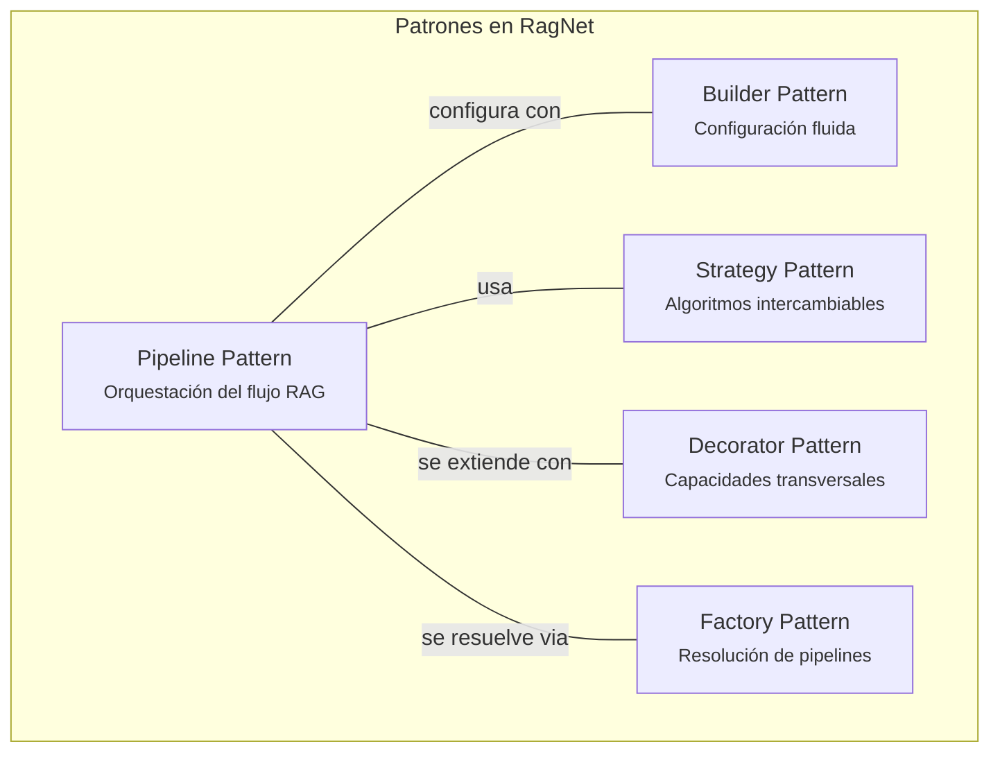
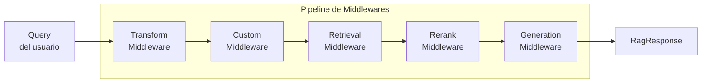
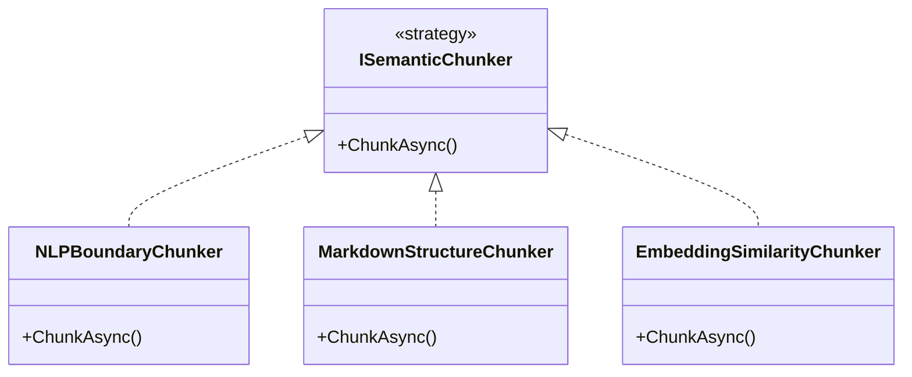

# 10. Patrones de Diseño y API Pública

## Parte 1 — Patrones de Diseño Aplicados

> **Documento:** `docs/10-01-patrones-diseno.md`  
> **Versión:** 1.0  
> **Última actualización:** 2026-05-01

---

## 10.1. Patrones de Diseño Aplicados

RagNet aplica cinco patrones de diseño clásicos adaptados al ecosistema .NET. La combinación de estos patrones permite que la biblioteca sea modular, extensible y fácil de consumir.



---

### 10.1.1. Pipeline Pattern (Middleware)

**Propósito:** Orquestar el flujo RAG como una cadena de pasos secuenciales donde cada paso puede ser interceptado, reemplazado o decorado.

**Analogía:** Funciona igual que el request pipeline de ASP.NET Core, donde cada middleware procesa la petición y pasa el control al siguiente.

#### Diseño del Pipeline

```csharp
namespace RagNet.Core;

/// <summary>
/// Delegado que representa un paso en el pipeline RAG.
/// Cada paso recibe el contexto y puede invocar al siguiente paso.
/// </summary>
public delegate Task<RagResponse> RagPipelineDelegate(RagPipelineContext context);

/// <summary>
/// Contexto mutable que fluye a través del pipeline.
/// Cada paso puede leer y modificar el estado.
/// </summary>
public class RagPipelineContext
{
    /// <summary>Consulta original del usuario.</summary>
    public string OriginalQuery { get; set; }

    /// <summary>Consultas transformadas (después de IQueryTransformer).</summary>
    public IEnumerable<string> TransformedQueries { get; set; }

    /// <summary>Documentos recuperados (después de IRetriever).</summary>
    public IEnumerable<RagDocument> RetrievedDocuments { get; set; }

    /// <summary>Documentos reordenados (después de IDocumentReranker).</summary>
    public IEnumerable<RagDocument> RankedDocuments { get; set; }

    /// <summary>Respuesta generada (después de IRagGenerator).</summary>
    public RagResponse? Response { get; set; }

    /// <summary>Token de cancelación.</summary>
    public CancellationToken CancellationToken { get; set; }

    /// <summary>Propiedades adicionales para pasos personalizados.</summary>
    public Dictionary<string, object> Properties { get; } = new();
}
```

#### Implementación del Pipeline

```csharp
public class DefaultRagPipeline : IRagPipeline
{
    private readonly RagPipelineDelegate _pipeline;

    internal DefaultRagPipeline(RagPipelineDelegate pipeline)
    {
        _pipeline = pipeline;
    }

    public async Task<RagResponse> ExecuteAsync(
        string query, CancellationToken ct = default)
    {
        var context = new RagPipelineContext
        {
            OriginalQuery = query,
            CancellationToken = ct
        };

        return await _pipeline(context);
    }

    // ExecuteStreamingAsync omitido por brevedad
}
```

#### Middlewares del Pipeline

Cada etapa del RAG es un middleware que procesa el contexto y llama al siguiente:

```csharp
// Middleware de transformación de queries
public class QueryTransformationMiddleware
{
    private readonly RagPipelineDelegate _next;
    private readonly IQueryTransformer _transformer;

    public QueryTransformationMiddleware(
        RagPipelineDelegate next, IQueryTransformer transformer)
    {
        _next = next;
        _transformer = transformer;
    }

    public async Task<RagResponse> InvokeAsync(RagPipelineContext context)
    {
        // 1. Ejecutar transformación
        context.TransformedQueries = await _transformer.TransformAsync(
            context.OriginalQuery, context.CancellationToken);

        // 2. Pasar al siguiente middleware
        return await _next(context);
    }
}

// Middleware de recuperación
public class RetrievalMiddleware
{
    private readonly RagPipelineDelegate _next;
    private readonly IRetriever _retriever;
    private readonly int _topK;

    public async Task<RagResponse> InvokeAsync(RagPipelineContext context)
    {
        var allDocs = new List<RagDocument>();

        // Buscar con cada query transformada
        foreach (var query in context.TransformedQueries)
        {
            var docs = await _retriever.RetrieveAsync(
                query, _topK, context.CancellationToken);
            allDocs.AddRange(docs);
        }

        // Deduplicar por Id
        context.RetrievedDocuments = allDocs
            .DistinctBy(d => d.Id)
            .ToList();

        return await _next(context);
    }
}
```

#### Pasos Personalizados

El desarrollador puede insertar middlewares propios:

```csharp
rag.AddPipeline("custom", pipeline => pipeline
    .UseQueryTransformation<HyDETransformer>()
    .Use(async (context, next) =>
    {
        // Middleware personalizado: logging antes de retrieval
        Console.WriteLine($"Buscando con {context.TransformedQueries.Count()} queries");
        var response = await next(context);
        Console.WriteLine($"Encontrados {context.RetrievedDocuments.Count()} docs");
        return response;
    })
    .UseHybridRetrieval(alpha: 0.5)
    .UseReranking<LLMReranker>(topK: 5)
    .UseSemanticKernelGenerator()
);
```

#### Diagrama del flujo de middlewares



---

### 10.1.2. Builder Pattern

**Propósito:** Proporcionar una API fluida (Fluent API) que permita configurar pipelines complejos de manera legible y progresiva.

RagNet define dos builders principales:

#### `RagPipelineBuilder`

```csharp
public class RagPipelineBuilder
{
    private readonly IServiceCollection _services;
    private readonly List<Func<RagPipelineDelegate, RagPipelineDelegate>> _middlewares = new();

    internal RagPipelineBuilder(IServiceCollection services)
    {
        _services = services;
    }

    /// <summary>Añade transformación de queries.</summary>
    public RagPipelineBuilder UseQueryTransformation<TTransformer>()
        where TTransformer : class, IQueryTransformer
    {
        _services.AddTransient<IQueryTransformer, TTransformer>();
        _middlewares.Add(next => ctx =>
        {
            var transformer = ctx.GetService<IQueryTransformer>();
            return new QueryTransformationMiddleware(next, transformer).InvokeAsync(ctx);
        });
        return this;
    }

    /// <summary>Añade recuperación híbrida.</summary>
    public RagPipelineBuilder UseHybridRetrieval(double alpha = 0.5, int expandedTopK = 20)
    {
        // Registrar HybridRetriever con opciones
        return this;
    }

    /// <summary>Añade reranking.</summary>
    public RagPipelineBuilder UseReranking<TReranker>(int topK = 5)
        where TReranker : class, IDocumentReranker
    {
        // Registrar reranker
        return this;
    }

    /// <summary>Añade generador de Semantic Kernel.</summary>
    public RagPipelineBuilder UseSemanticKernelGenerator(
        Action<SemanticKernelGeneratorOptions>? configure = null)
    {
        // Registrar generador con opciones
        return this;
    }

    /// <summary>Añade middleware personalizado.</summary>
    public RagPipelineBuilder Use(
        Func<RagPipelineContext, Func<RagPipelineContext, Task<RagResponse>>,
        Task<RagResponse>> middleware)
    {
        _middlewares.Add(next => ctx => middleware(ctx, next));
        return this;
    }

    /// <summary>Construye el pipeline compuesto.</summary>
    internal RagPipelineDelegate Build()
    {
        RagPipelineDelegate pipeline = ctx =>
            Task.FromResult(ctx.Response ?? new RagResponse { Answer = "" });

        // Componer middlewares en orden inverso (el primero registrado ejecuta primero)
        foreach (var middleware in _middlewares.AsEnumerable().Reverse())
        {
            pipeline = middleware(pipeline);
        }

        return pipeline;
    }
}
```

#### `IngestionPipelineBuilder`

Diseño análogo para la ingestión (detallado en la sección 7.7).

#### Beneficios del patrón Builder en RagNet

| Beneficio | Ejemplo |
|-----------|---------|
| **Legibilidad** | La configuración en `Program.cs` se lee como lenguaje natural |
| **Validación** | El builder puede verificar configuraciones inválidas (e.g., reranker sin retriever) |
| **Progresividad** | El desarrollador añade complejidad incrementalmente |
| **IntelliSense** | Los métodos disponibles guían al desarrollador sobre las opciones |
| **Seguridad de tipos** | Los genéricos (`UseReranking<LLMReranker>`) previenen errores en runtime |

---

### 10.1.3. Strategy Pattern

**Propósito:** Permitir el intercambio de algoritmos sin modificar el código que los consume.

Cada interfaz de `RagNet.Abstractions` es un **punto de estrategia**:



**Mapa completo de estrategias:**

| Interfaz (Strategy) | Implementaciones |
|---------------------|-----------------|
| `IDocumentParser` | `MarkdownDocumentParser`, `WordDocumentParser`, `ExcelDocumentParser`, `PdfDocumentParser` |
| `ISemanticChunker` | `NLPBoundaryChunker`, `MarkdownStructureChunker`, `EmbeddingSimilarityChunker` |
| `IQueryTransformer` | `QueryRewriter`, `HyDETransformer`, `StepBackTransformer` |
| `IRetriever` | `VectorRetriever`, `KeywordRetriever`, `HybridRetriever` |
| `IDocumentReranker` | `CrossEncoderReranker`, `LLMReranker` |
| `IRagGenerator` | `SemanticKernelRagGenerator`, (implementaciones custom) |

**Intercambio en DI:**

```csharp
// Cambiar de NLPBoundaryChunker a EmbeddingSimilarityChunker
// Solo requiere cambiar una línea de configuración:
rag.AddIngestion(ingest => ingest
    // .UseSemanticChunker<NLPBoundaryChunker>()      // antes
    .UseSemanticChunker<EmbeddingSimilarityChunker>()  // ahora
);
```

---

### 10.1.4. Decorator Pattern

**Propósito:** Añadir capacidades transversales (cross-cutting concerns) sin modificar la lógica core.

#### Semantic Caching

```csharp
public class CachedRetriever : IRetriever
{
    private readonly IRetriever _inner;
    private readonly IDistributedCache _cache;
    private readonly TimeSpan _ttl;

    public CachedRetriever(IRetriever inner, IDistributedCache cache, TimeSpan ttl)
    {
        _inner = inner;
        _cache = cache;
        _ttl = ttl;
    }

    public async Task<IEnumerable<RagDocument>> RetrieveAsync(
        string query, int topK, CancellationToken ct = default)
    {
        var cacheKey = $"rag:retrieve:{ComputeHash(query)}:{topK}";
        var cached = await _cache.GetAsync<IEnumerable<RagDocument>>(cacheKey, ct);

        if (cached is not null)
            return cached;

        var results = await _inner.RetrieveAsync(query, topK, ct);
        await _cache.SetAsync(cacheKey, results, _ttl, ct);
        return results;
    }
}
```

#### Logging de Prompts

```csharp
public class LoggingRagGenerator : IRagGenerator
{
    private readonly IRagGenerator _inner;
    private readonly ILogger<LoggingRagGenerator> _logger;

    public async Task<RagResponse> GenerateAsync(
        string query, IEnumerable<RagDocument> context,
        CancellationToken ct = default)
    {
        _logger.LogInformation("Generating response for query: {Query}", query);
        _logger.LogDebug("Context documents: {Count}", context.Count());

        var sw = Stopwatch.StartNew();
        var response = await _inner.GenerateAsync(query, context, ct);
        sw.Stop();

        _logger.LogInformation(
            "Response generated in {ElapsedMs}ms, citations: {CitationCount}",
            sw.ElapsedMilliseconds, response.Citations.Count);

        return response;
    }

    // GenerateStreamingAsync omitido por brevedad
}
```

#### Resiliencia con Polly

```csharp
public class ResilientQueryTransformer : IQueryTransformer
{
    private readonly IQueryTransformer _inner;
    private readonly ResiliencePipeline _pipeline;

    public ResilientQueryTransformer(
        IQueryTransformer inner, ResiliencePipeline pipeline)
    {
        _inner = inner;
        _pipeline = pipeline;
    }

    public async Task<IEnumerable<string>> TransformAsync(
        string originalQuery, CancellationToken ct = default)
    {
        return await _pipeline.ExecuteAsync(async token =>
            await _inner.TransformAsync(originalQuery, token), ct);
    }
}
```

#### Composición de Decoradores

Los decoradores se componen en capas, cada uno envolviendo al anterior:

```
CachedRetriever
  └── LoggingRetriever
        └── ResilientRetriever
              └── HybridRetriever   ← implementación real
```

```csharp
// Registro en DI con decoradores
services.AddTransient<IRetriever>(sp =>
{
    var inner = new HybridRetriever(...);
    var resilient = new ResilientRetriever(inner, retryPolicy);
    var logged = new LoggingRetriever(resilient, logger);
    var cached = new CachedRetriever(logged, cache, TimeSpan.FromMinutes(5));
    return cached;
});
```

---

### 10.1.5. Factory Pattern

**Propósito:** Resolver pipelines nombrados en tiempo de ejecución.

```csharp
public class RagPipelineFactory : IRagPipelineFactory
{
    private readonly IServiceProvider _serviceProvider;
    private readonly Dictionary<string, Func<IServiceProvider, IRagPipeline>> _registrations;

    public IRagPipeline Create(string pipelineName)
    {
        if (!_registrations.TryGetValue(pipelineName, out var factory))
            throw new InvalidOperationException(
                $"Pipeline '{pipelineName}' not registered. " +
                $"Available: {string.Join(", ", _registrations.Keys)}");

        return factory(_serviceProvider);
    }
}
```

**Escenarios de uso:**

| Escenario | Pipeline | Configuración |
|-----------|----------|--------------|
| Chat rápido | `"fast"` | `QueryRewriter` → `VectorRetriever` → Sin reranking |
| Búsqueda precisa | `"precise"` | `HyDE` → `HybridRetriever` → `LLMReranker` |
| Documentos legales | `"legal"` | `StepBack` → `Hybrid` → `CrossEncoder` → Self-RAG |
| Multi-idioma | `"multilang"` | Transformador con traducción → `Vector` → SK con prompt multilingüe |

---

> [!NOTE]
> Continúa en [Parte 2 — API Pública y Developer Experience](./10-02-api-publica-dx.md).
