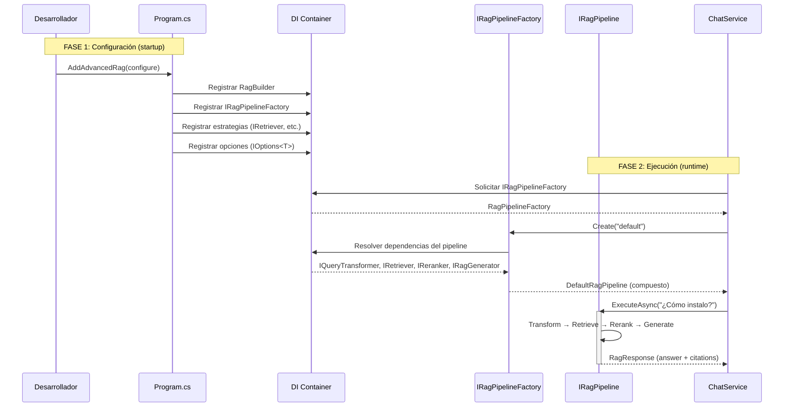

# 10. Patrones de Diseño y API Pública

## Parte 2 — API Pública y Developer Experience (DX)

> **Documento:** `docs/10-02-api-publica-dx.md`  
> **Versión:** 1.0  
> **Última actualización:** 2026-05-01

---

## 10.2. API Pública — Developer Experience (DX)

El éxito de RagNet como biblioteca .NET depende de que los desarrolladores puedan integrarla en minutos con una experiencia familiar y coherente con el ecosistema .NET.

### Principios de DX

1. **Familiaridad:** Seguir los mismos patrones que ASP.NET Core, Entity Framework y otros frameworks de Microsoft (`AddXxx()`, `UseXxx()`, Options Pattern).
2. **Progresividad:** Funcionar con configuración mínima y permitir complejidad incremental.
3. **Descubribilidad:** IntelliSense y XML docs deben guiar al desarrollador.
4. **Fail fast:** Errores de configuración deben detectarse en el arranque, no en runtime.

---

### 10.2.1. Registro en Inyección de Dependencias (`Program.cs`)

#### Punto de entrada: `AddAdvancedRag`

```csharp
namespace RagNet;

public static class RagServiceCollectionExtensions
{
    /// <summary>
    /// Registra los servicios de RagNet en el contenedor de DI.
    /// </summary>
    /// <param name="services">Colección de servicios.</param>
    /// <param name="configure">Acción de configuración del sistema RAG.</param>
    /// <returns>La colección de servicios para encadenamiento.</returns>
    public static IServiceCollection AddAdvancedRag(
        this IServiceCollection services,
        Action<RagBuilder> configure)
    {
        var builder = new RagBuilder(services);
        configure(builder);
        builder.Build(); // Valida y registra servicios
        return services;
    }
}
```

#### `RagBuilder` — Configurador raíz

```csharp
public class RagBuilder
{
    private readonly IServiceCollection _services;
    private readonly Dictionary<string, RagPipelineBuilder> _pipelines = new();
    private IngestionPipelineBuilder? _ingestion;

    internal RagBuilder(IServiceCollection services)
    {
        _services = services;
    }

    /// <summary>Configura el pipeline de ingestión.</summary>
    public RagBuilder AddIngestion(Action<IngestionPipelineBuilder> configure)
    {
        _ingestion = new IngestionPipelineBuilder(_services);
        configure(_ingestion);
        return this;
    }

    /// <summary>Registra un pipeline RAG nombrado.</summary>
    public RagBuilder AddPipeline(string name, Action<RagPipelineBuilder> configure)
    {
        var pipelineBuilder = new RagPipelineBuilder(_services);
        configure(pipelineBuilder);
        _pipelines[name] = pipelineBuilder;
        return this;
    }

    /// <summary>Valida la configuración y registra los servicios.</summary>
    internal void Build()
    {
        // Registrar IRagPipelineFactory con todos los pipelines
        _services.AddSingleton<IRagPipelineFactory>(sp =>
            new RagPipelineFactory(sp, _pipelines));

        // Si solo hay un pipeline, registrar también como IRagPipeline directo
        if (_pipelines.Count == 1)
        {
            _services.AddTransient<IRagPipeline>(sp =>
                sp.GetRequiredService<IRagPipelineFactory>()
                    .Create(_pipelines.Keys.First()));
        }

        // Registrar ingestión si fue configurada
        _ingestion?.Build();

        // Validaciones
        ValidateConfiguration();
    }

    private void ValidateConfiguration()
    {
        if (_pipelines.Count == 0 && _ingestion == null)
            throw new InvalidOperationException(
                "RagNet: Debe configurar al menos un pipeline o la ingestión.");
    }
}
```

#### Configuración de Ingestión (`AddIngestion`)

```csharp
builder.Services.AddAdvancedRag(rag =>
{
    rag.AddIngestion(ingest => ingest
        .AddParser<MarkdownDocumentParser>()
        .AddParser<PdfDocumentParser>()
        .UseSemanticChunker<EmbeddingSimilarityChunker>(opts =>
        {
            opts.SimilarityThreshold = 0.85;
            opts.MaxChunkSize = 1500;
        })
        .UseLLMMetadataEnrichment(
            extractEntities: true,
            extractKeywords: true)
        .WithEmbeddingBatchSize(50)
        .UseCollection("documents")
    );
});
```

#### Configuración de Pipelines Nombrados (`AddPipeline`)

```csharp
builder.Services.AddAdvancedRag(rag =>
{
    // Pipeline rápido para chat casual
    rag.AddPipeline("fast", pipeline => pipeline
        .UseQueryTransformation<QueryRewriter>()
        .UseRetrieval<VectorRetriever>(topK: 5)
        .UseSemanticKernelGenerator()
    );

    // Pipeline preciso para búsqueda profunda
    rag.AddPipeline("precise", pipeline => pipeline
        .UseQueryTransformation<HyDETransformer>()
        .UseHybridRetrieval(alpha: 0.5, expandedTopK: 30)
        .UseReranking<LLMReranker>(topK: 5)
        .UseSemanticKernelGenerator(gen =>
        {
            gen.MaxContextTokens = 8000;
            gen.EnableSelfRagValidation = true;
        })
    );
});
```

#### Ejemplo Completo de `Program.cs`

```csharp
var builder = WebApplication.CreateBuilder(args);

// 1. Infraestructura (Microsoft.Extensions.AI / VectorData)
builder.Services.AddChatClient(new AzureOpenAIClient(
    new Uri(builder.Configuration["AzureOpenAI:Endpoint"]!),
    new DefaultAzureCredential())
    .AsChatClient("gpt-4o"));

builder.Services.AddEmbeddingGenerator(new AzureOpenAIClient(
    new Uri(builder.Configuration["AzureOpenAI:Endpoint"]!),
    new DefaultAzureCredential())
    .AsEmbeddingGenerator("text-embedding-3-small"));

builder.Services.AddQdrantVectorStore(
    builder.Configuration["Qdrant:Endpoint"]!);

// 2. RagNet
builder.Services.AddAdvancedRag(rag =>
{
    rag.AddIngestion(ingest => ingest
        .AddParser<MarkdownDocumentParser>()
        .AddParser<PdfDocumentParser>()
        .AddParser<WordDocumentParser>()
        .UseSemanticChunker<EmbeddingSimilarityChunker>()
        .UseLLMMetadataEnrichment(extractEntities: true)
        .UseCollection("knowledge-base")
    );

    rag.AddPipeline("default", pipeline => pipeline
        .UseQueryTransformation<HyDETransformer>()
        .UseHybridRetrieval(alpha: 0.5)
        .UseReranking<LLMReranker>(topK: 5)
        .UseSemanticKernelGenerator(gen =>
        {
            gen.SystemPromptTemplate = "Eres un asistente experto...";
            gen.MaxContextTokens = 6000;
        })
    );
});

var app = builder.Build();
```

---

### 10.2.2. Uso en la Aplicación Consumidora

#### Inyección de `IRagPipelineFactory`

```csharp
public class ChatService
{
    private readonly IRagPipeline _pipeline;

    public ChatService(IRagPipelineFactory pipelineFactory)
    {
        _pipeline = pipelineFactory.Create("default");
    }

    public async Task<ChatResponse> AskAsync(string userQuery, CancellationToken ct)
    {
        var response = await _pipeline.ExecuteAsync(userQuery, ct);

        return new ChatResponse
        {
            Answer = response.Answer,
            Sources = response.Citations.Select(c => new SourceRef
            {
                Document = c.Metadata.GetValueOrDefault("source", "")?.ToString(),
                Relevance = c.RelevanceScore,
                Preview = c.SourceContent
            }).ToList()
        };
    }
}
```

#### Inyección directa de `IRagPipeline` (pipeline único)

Cuando solo hay un pipeline registrado, se puede inyectar directamente:

```csharp
public class SimpleService
{
    private readonly IRagPipeline _pipeline;

    // Inyección directa (solo si hay un único pipeline)
    public SimpleService(IRagPipeline pipeline)
    {
        _pipeline = pipeline;
    }

    public Task<RagResponse> AskAsync(string query, CancellationToken ct)
        => _pipeline.ExecuteAsync(query, ct);
}
```

#### Ejecución en Streaming (SignalR)

```csharp
public class ChatHub : Hub
{
    private readonly IRagPipelineFactory _factory;

    public ChatHub(IRagPipelineFactory factory)
    {
        _factory = factory;
    }

    public async IAsyncEnumerable<string> StreamAnswer(
        string query,
        [EnumeratorCancellation] CancellationToken ct)
    {
        var pipeline = _factory.Create("default");

        await foreach (var fragment in pipeline.ExecuteStreamingAsync(query, ct))
        {
            if (!string.IsNullOrEmpty(fragment.ContentFragment))
                yield return fragment.ContentFragment;

            if (fragment.IsComplete && fragment.Citations is not null)
            {
                // Enviar citas como mensaje final serializado
                yield return $"[CITATIONS]{JsonSerializer.Serialize(fragment.Citations)}";
            }
        }
    }
}
```

#### Uso del Pipeline de Ingestión

```csharp
public class DocumentController : ControllerBase
{
    private readonly IIngestionPipeline _ingestion;

    public DocumentController(IIngestionPipeline ingestion)
    {
        _ingestion = ingestion;
    }

    [HttpPost("upload")]
    public async Task<IActionResult> Upload(IFormFile file, CancellationToken ct)
    {
        using var stream = file.OpenReadStream();
        var result = await _ingestion.IngestAsync(stream, file.FileName, ct);

        return Ok(new
        {
            result.ChunkCount,
            result.Duration,
            result.DocumentId
        });
    }
}
```

---

### 10.2.3. Opciones de Configuración (`Options Pattern`)

RagNet sigue el `Options Pattern` estándar de .NET para todas las configuraciones, permitiendo:
- Binding desde `appsettings.json`
- Validación con `DataAnnotations`
- Recarga en caliente con `IOptionsMonitor<T>`

#### Catálogo de clases de opciones

| Clase | Proyecto | Parámetros principales |
|-------|---------|----------------------|
| `SemanticChunkerOptions` | Abstractions | `SimilarityThreshold`, `MaxChunkSize`, `MinChunkSize` |
| `NLPBoundaryChunkerOptions` | Core | `MaxChunkSize`, `OverlapSentences`, `IncludeSectionTitle` |
| `MarkdownStructureChunkerOptions` | Core | `ChunkAtHeadingLevel`, `IncludeBreadcrumb` |
| `EmbeddingSimilarityChunkerOptions` | Core | `SimilarityThreshold`, `WindowSize` |
| `LLMMetadataEnricherOptions` | Core | `ExtractEntities`, `ExtractKeywords`, `BatchSize` |
| `HybridRetrieverOptions` | Core | `Alpha`, `ExpandedTopK`, `RrfK` |
| `SemanticKernelGeneratorOptions` | SemanticKernel | `PromptTemplate`, `MaxContextTokens`, `EnableSelfRag` |
| `SelfRagOptions` | SemanticKernel | `Strategy`, `MinSupportedRatio` |

#### Binding desde `appsettings.json`

```json
{
  "RagNet": {
    "Ingestion": {
      "Chunker": {
        "SimilarityThreshold": 0.85,
        "MaxChunkSize": 1500,
        "MinChunkSize": 200
      },
      "Enrichment": {
        "ExtractEntities": true,
        "ExtractKeywords": true,
        "BatchSize": 5
      }
    },
    "Pipeline": {
      "HybridRetrieval": {
        "Alpha": 0.5,
        "ExpandedTopK": 20
      },
      "Generation": {
        "MaxContextTokens": 6000,
        "EnableSelfRagValidation": false
      }
    }
  }
}
```

```csharp
// Binding en Program.cs
builder.Services.Configure<EmbeddingSimilarityChunkerOptions>(
    builder.Configuration.GetSection("RagNet:Ingestion:Chunker"));

builder.Services.Configure<HybridRetrieverOptions>(
    builder.Configuration.GetSection("RagNet:Pipeline:HybridRetrieval"));
```

---

## 10.3. Diagrama de Interacción: Configuración → Ejecución



**Separación clara entre las dos fases:**

| Fase | Momento | Qué ocurre | Quién lo hace |
|------|---------|-----------|--------------|
| **Configuración** | `Program.cs` / Startup | Se registran servicios, opciones y pipelines en DI | Desarrollador (una vez) |
| **Ejecución** | Request time | Se resuelve el pipeline, se ejecuta la query | Framework + RagNet (cada request) |

Esta separación garantiza que los errores de configuración se detecten al arrancar la aplicación (fail fast), no cuando un usuario hace una consulta.

---

> **Navegación de la sección 10:**
> - [Parte 1 — Patrones de Diseño Aplicados](./10-01-patrones-diseno.md)
> - **Parte 2 — API Pública y Developer Experience** *(este documento)*
