# 11. Observabilidad y Trazabilidad

## Parte 1 — Estrategia de Instrumentación y Activity Spans

> **Documento:** `docs/11-01-observabilidad-instrumentacion.md`  
> **Versión:** 1.0  
> **Última actualización:** 2026-05-01

---

## 11.1. Estrategia de Instrumentación

La observabilidad es un pilar fundamental de RagNet. Un pipeline RAG involucra múltiples pasos (transformación, búsqueda, reranking, generación) cada uno con latencia, coste y posibilidad de fallo. Sin instrumentación, diagnosticar problemas de calidad o rendimiento se convierte en una tarea ciega.

### Principios de observabilidad en RagNet

1. **Integración nativa:** Usa `System.Diagnostics.Activity` (estándar de .NET para OpenTelemetry), no librerías propietarias.
2. **Zero-config por defecto:** Las trazas se emiten automáticamente al configurar RagNet; no requieren configuración adicional.
3. **Granularidad configurable:** Desde trazas de alto nivel (pipeline completo) hasta detalle por operación individual.
4. **Sin overhead en producción:** Si no hay listener de OpenTelemetry configurado, las `Activity` no se crean (lazy evaluation).

### Los tres pilares de observabilidad

| Pilar | Implementación en RagNet | Herramienta |
|-------|-------------------------|------------|
| **Traces** (trazas distribuidas) | `System.Diagnostics.Activity` | OpenTelemetry → Jaeger, Aspire, App Insights |
| **Metrics** (métricas) | `System.Diagnostics.Metrics` | OpenTelemetry → Prometheus, Azure Monitor |
| **Logs** (logging estructurado) | `Microsoft.Extensions.Logging` | Serilog, NLog → Elasticsearch, Seq |

---

## 11.2. Integración con `System.Diagnostics.Activity`

### 11.2.1. Activity Sources por Módulo

Cada módulo funcional de RagNet define su propia `ActivitySource`, siguiendo la convención de nombres de OpenTelemetry:

```csharp
namespace RagNet.Core.Diagnostics;

/// <summary>
/// Fuentes de actividad centralizadas para toda la instrumentación de RagNet.
/// </summary>
public static class RagNetActivitySources
{
    public const string RootName = "RagNet";

    /// <summary>Source para el pipeline principal.</summary>
    public static readonly ActivitySource Pipeline =
        new($"{RootName}.Pipeline", "1.0.0");

    /// <summary>Source para operaciones de ingestión.</summary>
    public static readonly ActivitySource Ingestion =
        new($"{RootName}.Ingestion", "1.0.0");

    /// <summary>Source para operaciones de recuperación.</summary>
    public static readonly ActivitySource Retrieval =
        new($"{RootName}.Retrieval", "1.0.0");

    /// <summary>Source para reranking.</summary>
    public static readonly ActivitySource Reranking =
        new($"{RootName}.Reranking", "1.0.0");

    /// <summary>Source para generación.</summary>
    public static readonly ActivitySource Generation =
        new($"{RootName}.Generation", "1.0.0");

    /// <summary>
    /// Todos los sources para registro en OpenTelemetry.
    /// </summary>
    public static IEnumerable<string> AllSourceNames => new[]
    {
        $"{RootName}.Pipeline",
        $"{RootName}.Ingestion",
        $"{RootName}.Retrieval",
        $"{RootName}.Reranking",
        $"{RootName}.Generation"
    };
}
```

**Registro en OpenTelemetry:**

```csharp
// Program.cs
builder.Services.AddOpenTelemetry()
    .WithTracing(tracing => tracing
        .AddSource("RagNet.Pipeline")
        .AddSource("RagNet.Ingestion")
        .AddSource("RagNet.Retrieval")
        .AddSource("RagNet.Reranking")
        .AddSource("RagNet.Generation")
        // O más conciso:
        .AddSource(RagNetActivitySources.AllSourceNames.ToArray())
        .AddAspNetCoreInstrumentation()
        .AddOtlpExporter());
```

**Método helper para registro simplificado:**

```csharp
public static class RagNetTelemetryExtensions
{
    /// <summary>
    /// Registra todas las fuentes de actividad de RagNet en OpenTelemetry.
    /// </summary>
    public static TracerProviderBuilder AddRagNetInstrumentation(
        this TracerProviderBuilder builder)
    {
        foreach (var source in RagNetActivitySources.AllSourceNames)
            builder.AddSource(source);
        return builder;
    }
}

// Uso simplificado
builder.Services.AddOpenTelemetry()
    .WithTracing(tracing => tracing
        .AddRagNetInstrumentation()  // Una sola línea
        .AddOtlpExporter());
```

### 11.2.2. Spans Definidos

Cada operación significativa del pipeline crea un `Activity` span con tags estandarizados.

#### Catálogo completo de spans

```mermaid
graph TD
    subgraph QUERY["Pipeline de Consulta"]
        S1["RagNet.Pipeline.Execute<br/><small>Span raíz de la consulta</small>"]
        S2["RagNet.Retrieval.Transform<br/><small>Transformación de queries</small>"]
        S3["RagNet.Retrieval.Search<br/><small>Búsqueda de documentos</small>"]
        S3a["RagNet.Retrieval.Vector<br/><small>Búsqueda vectorial</small>"]
        S3b["RagNet.Retrieval.Keyword<br/><small>Búsqueda por keywords</small>"]
        S3c["RagNet.Retrieval.Fusion<br/><small>RRF fusion</small>"]
        S4["RagNet.Reranking.Execute<br/><small>Reordenamiento</small>"]
        S5["RagNet.Generation.Execute<br/><small>Generación de respuesta</small>"]

        S1 --> S2 --> S3 --> S4 --> S5
        S3 --> S3a
        S3 --> S3b
        S3a --> S3c
        S3b --> S3c
    end

    subgraph INGEST["Pipeline de Ingestión"]
        I1["RagNet.Ingestion.Execute<br/><small>Span raíz de ingestión</small>"]
        I2["RagNet.Ingestion.Parse<br/><small>Parsing del documento</small>"]
        I3["RagNet.Ingestion.Chunk<br/><small>Particionado semántico</small>"]
        I4["RagNet.Ingestion.Enrich<br/><small>Enriquecimiento LLM</small>"]
        I5["RagNet.Ingestion.Embed<br/><small>Generación de embeddings</small>"]
        I6["RagNet.Ingestion.Store<br/><small>Almacenamiento vectorial</small>"]

        I1 --> I2 --> I3 --> I4 --> I5 --> I6
    end
```



#### Implementación de spans en el pipeline

```csharp
// Ejemplo: Middleware de Retrieval con instrumentación
public class InstrumentedRetrievalMiddleware
{
    private readonly RagPipelineDelegate _next;
    private readonly IRetriever _retriever;

    public async Task<RagResponse> InvokeAsync(RagPipelineContext context)
    {
        using var activity = RagNetActivitySources.Retrieval.StartActivity(
            "RagNet.Retrieval.Search",
            ActivityKind.Internal);

        activity?.SetTag("ragnet.query.original", context.OriginalQuery);
        activity?.SetTag("ragnet.query.transformed_count",
            context.TransformedQueries.Count());

        try
        {
            var docs = await _retriever.RetrieveAsync(
                context.TransformedQueries.First(), 20, context.CancellationToken);

            context.RetrievedDocuments = docs;

            activity?.SetTag("ragnet.retrieval.document_count", docs.Count());
            activity?.SetTag("ragnet.retrieval.top_score",
                docs.FirstOrDefault()?.Metadata.GetValueOrDefault("_score"));
            activity?.SetStatus(ActivityStatusCode.Ok);

            return await _next(context);
        }
        catch (Exception ex)
        {
            activity?.SetStatus(ActivityStatusCode.Error, ex.Message);
            activity?.RecordException(ex);
            throw;
        }
    }
}
```

#### Tabla de Tags por Span

**Pipeline de Consulta:**

| Span | Tags | Tipo |
|------|------|------|
| `Pipeline.Execute` | `ragnet.pipeline.name`, `ragnet.query.original`, `ragnet.query.length` | string, string, int |
| `Retrieval.Transform` | `ragnet.transformer.type`, `ragnet.query.transformed_count` | string, int |
| `Retrieval.Search` | `ragnet.retriever.type`, `ragnet.retrieval.top_k`, `ragnet.retrieval.document_count`, `ragnet.retrieval.top_score` | string, int, int, double |
| `Retrieval.Vector` | `ragnet.vector.dimensions`, `ragnet.vector.similarity_metric` | int, string |
| `Retrieval.Keyword` | `ragnet.keyword.fields_searched` | string |
| `Retrieval.Fusion` | `ragnet.fusion.alpha`, `ragnet.fusion.rrf_k`, `ragnet.fusion.input_count`, `ragnet.fusion.output_count` | double, int, int, int |
| `Reranking.Execute` | `ragnet.reranker.type`, `ragnet.reranking.input_count`, `ragnet.reranking.output_count`, `ragnet.reranking.top_score` | string, int, int, double |
| `Generation.Execute` | `ragnet.generator.type`, `ragnet.generation.context_tokens`, `ragnet.generation.response_tokens`, `ragnet.generation.citation_count`, `ragnet.generation.streaming` | string, int, int, int, bool |

**Pipeline de Ingestión:**

| Span | Tags | Tipo |
|------|------|------|
| `Ingestion.Execute` | `ragnet.ingestion.file_name`, `ragnet.ingestion.file_size_bytes` | string, long |
| `Ingestion.Parse` | `ragnet.parser.type`, `ragnet.parse.node_count`, `ragnet.parse.format` | string, int, string |
| `Ingestion.Chunk` | `ragnet.chunker.type`, `ragnet.chunk.count`, `ragnet.chunk.avg_size` | string, int, double |
| `Ingestion.Enrich` | `ragnet.enricher.type`, `ragnet.enrich.batch_count`, `ragnet.enrich.entities_extracted` | string, int, int |
| `Ingestion.Embed` | `ragnet.embed.model`, `ragnet.embed.dimensions`, `ragnet.embed.batch_count` | string, int, int |
| `Ingestion.Store` | `ragnet.store.collection`, `ragnet.store.upserted_count` | string, int |

---

## 11.3. Métricas y Tags Personalizados

### Definición de Métricas

```csharp
namespace RagNet.Core.Diagnostics;

public static class RagNetMetrics
{
    private static readonly Meter Meter = new("RagNet", "1.0.0");

    // Contadores
    public static readonly Counter<long> QueriesProcessed =
        Meter.CreateCounter<long>(
            "ragnet.queries.processed",
            description: "Total de consultas procesadas");

    public static readonly Counter<long> DocumentsIngested =
        Meter.CreateCounter<long>(
            "ragnet.documents.ingested",
            description: "Total de documentos ingestados");

    public static readonly Counter<long> ChunksCreated =
        Meter.CreateCounter<long>(
            "ragnet.chunks.created",
            description: "Total de chunks creados");

    public static readonly Counter<long> LlmCallsTotal =
        Meter.CreateCounter<long>(
            "ragnet.llm.calls.total",
            description: "Total de llamadas al LLM");

    // Histogramas
    public static readonly Histogram<double> QueryLatency =
        Meter.CreateHistogram<double>(
            "ragnet.query.duration",
            unit: "ms",
            description: "Latencia del pipeline de consulta");

    public static readonly Histogram<double> IngestionLatency =
        Meter.CreateHistogram<double>(
            "ragnet.ingestion.duration",
            unit: "ms",
            description: "Latencia del pipeline de ingestión");

    public static readonly Histogram<int> RetrievedDocumentCount =
        Meter.CreateHistogram<int>(
            "ragnet.retrieval.document_count",
            description: "Documentos recuperados por consulta");

    public static readonly Histogram<double> TopRelevanceScore =
        Meter.CreateHistogram<double>(
            "ragnet.retrieval.top_score",
            description: "Score del documento más relevante");

    public static readonly Histogram<int> TokensConsumed =
        Meter.CreateHistogram<int>(
            "ragnet.generation.tokens",
            description: "Tokens consumidos por generación");
}
```

### Uso en los componentes

```csharp
// En el pipeline de consulta
public async Task<RagResponse> ExecuteAsync(string query, CancellationToken ct)
{
    var sw = Stopwatch.StartNew();

    var response = await _pipeline(new RagPipelineContext { OriginalQuery = query });

    sw.Stop();
    RagNetMetrics.QueriesProcessed.Add(1,
        new KeyValuePair<string, object?>("pipeline", _pipelineName));
    RagNetMetrics.QueryLatency.Record(sw.Elapsed.TotalMilliseconds,
        new KeyValuePair<string, object?>("pipeline", _pipelineName));

    return response;
}
```

### Registro de métricas en OpenTelemetry

```csharp
builder.Services.AddOpenTelemetry()
    .WithMetrics(metrics => metrics
        .AddMeter("RagNet")
        .AddPrometheusExporter()  // o AddOtlpExporter()
    );
```

---

> [!NOTE]
> Continúa en [Parte 2 — Exportación, Logging Estructurado y Health Checks](./11-02-observabilidad-exportacion-logging.md).
