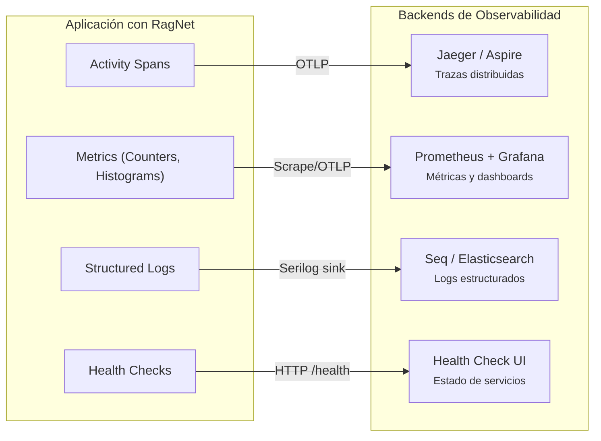

# 11. Observabilidad y Trazabilidad

## Parte 2 — Exportación, Logging Estructurado y Health Checks

> **Documento:** `docs/11-02-observabilidad-exportacion-logging.md`  
> **Versión:** 1.0  
> **Última actualización:** 2026-05-01

---

## 11.4. Exportación a Backends de Observabilidad

### 11.4.1. .NET Aspire Dashboard

El Aspire Dashboard es la opción más natural para desarrollo local. Muestra trazas, métricas y logs en una UI integrada.

```csharp
// Program.cs — Configuración para Aspire
builder.Services.AddOpenTelemetry()
    .WithTracing(tracing => tracing
        .AddRagNetInstrumentation()
        .AddAspNetCoreInstrumentation()
        .AddHttpClientInstrumentation()
        .AddOtlpExporter())  // Aspire escucha OTLP por defecto
    .WithMetrics(metrics => metrics
        .AddMeter("RagNet")
        .AddAspNetCoreInstrumentation()
        .AddOtlpExporter());
```

**Vista de ejemplo en Aspire Dashboard:**

```
Pipeline.Execute (350ms)
├── Retrieval.Transform (45ms)        transformer=HyDETransformer, queries=1
├── Retrieval.Search (120ms)          retriever=HybridRetriever, docs=20
│   ├── Retrieval.Vector (80ms)       dimensions=1536, score=0.92
│   └── Retrieval.Keyword (55ms)      fields=Content,Keywords
│   └── Retrieval.Fusion (2ms)        alpha=0.5, input=35, output=20
├── Reranking.Execute (85ms)          reranker=LLMReranker, in=20, out=5
└── Generation.Execute (100ms)        tokens=450, citations=3, streaming=false
```

### 11.4.2. Azure Application Insights

Para producción en Azure, Application Insights ofrece análisis avanzado, alertas y correlación con otros servicios Azure.

```csharp
builder.Services.AddOpenTelemetry()
    .WithTracing(tracing => tracing
        .AddRagNetInstrumentation()
        .AddAzureMonitorTraceExporter(o =>
            o.ConnectionString = config["AppInsights:ConnectionString"]))
    .WithMetrics(metrics => metrics
        .AddMeter("RagNet")
        .AddAzureMonitorMetricExporter(o =>
            o.ConnectionString = config["AppInsights:ConnectionString"]));
```

**Queries KQL útiles para RagNet en App Insights:**

```kusto
// Latencia promedio por etapa del pipeline
dependencies
| where name startswith "RagNet."
| summarize avg(duration) by name
| order by avg_duration desc

// Queries más lentas (P95)
dependencies
| where name == "RagNet.Pipeline.Execute"
| summarize percentile(duration, 95) by bin(timestamp, 1h)

// Tasa de error por componente
dependencies
| where name startswith "RagNet."
| summarize total=count(), errors=countif(success == false) by name
| extend error_rate = round(100.0 * errors / total, 2)

// Distribución de documentos recuperados
dependencies
| where name == "RagNet.Retrieval.Search"
| extend doc_count = toint(customDimensions["ragnet.retrieval.document_count"])
| summarize avg(doc_count), percentile(doc_count, 50), percentile(doc_count, 95)
```

### 11.4.3. Jaeger / Zipkin

Para entornos on-premise o multi-cloud:

```csharp
// Jaeger via OTLP
builder.Services.AddOpenTelemetry()
    .WithTracing(tracing => tracing
        .AddRagNetInstrumentation()
        .AddOtlpExporter(o =>
        {
            o.Endpoint = new Uri("http://jaeger:4317");
            o.Protocol = OtlpExportProtocol.Grpc;
        }));

// Zipkin
builder.Services.AddOpenTelemetry()
    .WithTracing(tracing => tracing
        .AddRagNetInstrumentation()
        .AddZipkinExporter(o =>
            o.Endpoint = new Uri("http://zipkin:9411/api/v2/spans")));
```

### Resumen de configuración por backend

| Backend | Paquete NuGet | Protocolo | Mejor para |
|---------|-------------|-----------|-----------|
| Aspire Dashboard | `OpenTelemetry.Exporter.OpenTelemetryProtocol` | OTLP/gRPC | Desarrollo local |
| Application Insights | `Azure.Monitor.OpenTelemetry.Exporter` | HTTPS | Producción en Azure |
| Jaeger | `OpenTelemetry.Exporter.OpenTelemetryProtocol` | OTLP/gRPC | On-premise, multi-cloud |
| Zipkin | `OpenTelemetry.Exporter.Zipkin` | HTTP/JSON | Ecosistema Zipkin existente |
| Prometheus (métricas) | `OpenTelemetry.Exporter.Prometheus.AspNetCore` | HTTP scrape | Métricas con Grafana |

---

## 11.5. Logging Estructurado

RagNet usa `ILogger<T>` de `Microsoft.Extensions.Logging` con mensajes estructurados para que los logs sean parseables por herramientas como Elasticsearch, Seq o Loki.

### Convenciones de logging

```csharp
public class DefaultRagPipeline : IRagPipeline
{
    private readonly ILogger<DefaultRagPipeline> _logger;

    public async Task<RagResponse> ExecuteAsync(string query, CancellationToken ct)
    {
        _logger.LogInformation(
            "RagNet pipeline '{PipelineName}' started for query: {Query}",
            _pipelineName, query);

        // ... ejecutar pipeline ...

        _logger.LogInformation(
            "RagNet pipeline '{PipelineName}' completed in {ElapsedMs}ms. " +
            "Documents: {DocCount}, Citations: {CitationCount}",
            _pipelineName, elapsed, docCount, citationCount);
    }
}
```

### Niveles de log por operación

| Nivel | Cuándo | Ejemplo |
|-------|--------|---------|
| `Trace` | Detalle extremo (contenido de chunks, prompts completos) | `"Prompt sent to LLM: {Prompt}"` |
| `Debug` | Flujo interno (scores, decisiones de chunking) | `"RRF fusion: {InputDocs} → {OutputDocs} docs"` |
| `Information` | Operaciones principales completadas | `"Pipeline executed in {ElapsedMs}ms"` |
| `Warning` | Degradación sin fallo (fallback activado, cache miss) | `"Reranker fallback: using retriever order"` |
| `Error` | Fallo de operación con recuperación | `"LLM call failed, retrying: {Exception}"` |
| `Critical` | Fallo irrecuperable | `"VectorStore unreachable: {Exception}"` |

### Logging de prompts (nivel Trace)

Para debugging de calidad del RAG, se puede habilitar logging de los prompts enviados al LLM:

```csharp
public class PromptLoggingDecorator : IRagGenerator
{
    private readonly IRagGenerator _inner;
    private readonly ILogger _logger;

    public async Task<RagResponse> GenerateAsync(
        string query, IEnumerable<RagDocument> context, CancellationToken ct)
    {
        if (_logger.IsEnabled(LogLevel.Trace))
        {
            _logger.LogTrace(
                "RagNet prompt - Query: {Query}, Context docs: {DocCount}, " +
                "Context size: {ContextChars} chars",
                query, context.Count(),
                context.Sum(d => d.Content.Length));

            foreach (var (doc, i) in context.Select((d, i) => (d, i)))
            {
                _logger.LogTrace(
                    "Context[{Index}] Id={DocId} Score={Score:F3} Source={Source}",
                    i, doc.Id,
                    doc.Metadata.GetValueOrDefault("_score", 0.0),
                    doc.Metadata.GetValueOrDefault("source", "unknown"));
            }
        }

        return await _inner.GenerateAsync(query, context, ct);
    }
}
```

> [!WARNING]
> El logging de prompts a nivel `Trace` puede contener datos sensibles del usuario. En producción, asegúrate de que el nivel `Trace` esté deshabilitado o que los logs se almacenen en un sistema con acceso controlado.

### Integración con Serilog

```csharp
// Program.cs
builder.Host.UseSerilog((context, config) => config
    .ReadFrom.Configuration(context.Configuration)
    .Enrich.FromLogContext()
    .Enrich.WithProperty("Application", "MyRagApp")
    .WriteTo.Console(outputTemplate:
        "[{Timestamp:HH:mm:ss} {Level:u3}] {SourceContext}: {Message:lj}{NewLine}{Exception}")
    .WriteTo.Seq("http://seq:5341")  // Logging estructurado
    .Filter.ByExcluding(e =>
        e.Level == LogEventLevel.Verbose &&
        e.Properties.ContainsKey("SourceContext") &&
        e.Properties["SourceContext"].ToString().Contains("RagNet"))
);
```

---

## 11.6. Health Checks

RagNet expone health checks para verificar que los servicios externos necesarios están disponibles.

### Implementación de Health Checks

```csharp
namespace RagNet.Core.Diagnostics;

/// <summary>
/// Health check que verifica la conectividad con el VectorStore.
/// </summary>
public class VectorStoreHealthCheck : IHealthCheck
{
    private readonly IVectorStore _vectorStore;

    public VectorStoreHealthCheck(IVectorStore vectorStore)
    {
        _vectorStore = vectorStore;
    }

    public async Task<HealthCheckResult> CheckHealthAsync(
        HealthCheckContext context, CancellationToken ct = default)
    {
        try
        {
            // Intentar listar colecciones como prueba de conectividad
            await _vectorStore.ListCollectionNamesAsync(ct).FirstAsync(ct);
            return HealthCheckResult.Healthy("VectorStore is reachable");
        }
        catch (Exception ex)
        {
            return HealthCheckResult.Unhealthy(
                "VectorStore is unreachable", ex);
        }
    }
}

/// <summary>
/// Health check que verifica la conectividad con el LLM provider.
/// </summary>
public class LlmProviderHealthCheck : IHealthCheck
{
    private readonly IChatClient _chatClient;

    public LlmProviderHealthCheck(IChatClient chatClient)
    {
        _chatClient = chatClient;
    }

    public async Task<HealthCheckResult> CheckHealthAsync(
        HealthCheckContext context, CancellationToken ct = default)
    {
        try
        {
            var response = await _chatClient.CompleteAsync(
                "Reply with OK", cancellationToken: ct);

            return response.Message.Text is not null
                ? HealthCheckResult.Healthy("LLM provider is responsive")
                : HealthCheckResult.Degraded("LLM responded with empty message");
        }
        catch (Exception ex)
        {
            return HealthCheckResult.Unhealthy(
                "LLM provider is unreachable", ex);
        }
    }
}
```

### Registro de Health Checks

```csharp
// Program.cs
builder.Services.AddHealthChecks()
    .AddCheck<VectorStoreHealthCheck>(
        "ragnet-vectorstore",
        failureStatus: HealthStatus.Unhealthy,
        tags: new[] { "ragnet", "infrastructure" })
    .AddCheck<LlmProviderHealthCheck>(
        "ragnet-llm",
        failureStatus: HealthStatus.Degraded,
        tags: new[] { "ragnet", "infrastructure" });

// Endpoint
app.MapHealthChecks("/health/ragnet", new HealthCheckOptions
{
    Predicate = check => check.Tags.Contains("ragnet"),
    ResponseWriter = UIResponseWriter.WriteHealthCheckUIResponse
});
```

**Método helper para registro simplificado:**

```csharp
public static class RagNetHealthCheckExtensions
{
    /// <summary>
    /// Registra todos los health checks de RagNet.
    /// </summary>
    public static IHealthChecksBuilder AddRagNetHealthChecks(
        this IHealthChecksBuilder builder)
    {
        return builder
            .AddCheck<VectorStoreHealthCheck>("ragnet-vectorstore",
                tags: new[] { "ragnet" })
            .AddCheck<LlmProviderHealthCheck>("ragnet-llm",
                tags: new[] { "ragnet" });
    }
}

// Uso
builder.Services.AddHealthChecks().AddRagNetHealthChecks();
```

### Respuesta del Health Check

```json
{
  "status": "Healthy",
  "totalDuration": "00:00:00.234",
  "entries": {
    "ragnet-vectorstore": {
      "status": "Healthy",
      "description": "VectorStore is reachable",
      "duration": "00:00:00.089"
    },
    "ragnet-llm": {
      "status": "Healthy",
      "description": "LLM provider is responsive",
      "duration": "00:00:00.145"
    }
  }
}
```

### Dashboard de Observabilidad Integrado



---

> **Navegación de la sección 11:**
> - [Parte 1 — Estrategia de Instrumentación y Activity Spans](./11-01-observabilidad-instrumentacion.md)
> - **Parte 2 — Exportación, Logging Estructurado y Health Checks** *(este documento)*
