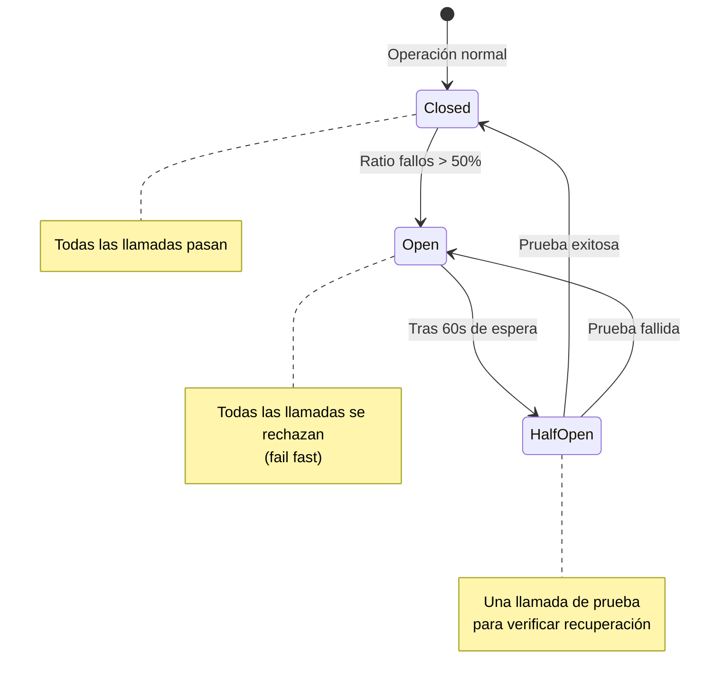

# 12. Consideraciones Transversales

## Parte 1 — Compatibilidad, Resiliencia, Rendimiento y Seguridad

> **Documento:** `docs/12-01-transversales-resiliencia-rendimiento.md`  
> **Versión:** 1.0  
> **Última actualización:** 2026-05-01

---

## 12.1. Compatibilidad de Vectores y Registros

### 12.1.1. `DefaultRagVectorRecord` con Atributos MEVD

`Microsoft.Extensions.VectorData` utiliza genéricos fuertemente tipados (`IVectorStoreRecordCollection<TKey, TRecord>`). Esto significa que cada proveedor de Vector Store necesita una clase de registro anotada con atributos MEVD para saber qué campos almacenar, indexar y buscar.

RagNet proporciona `DefaultRagVectorRecord` como clase lista para usar:

```csharp
public class DefaultRagVectorRecord
{
    [VectorStoreRecordKey]
    public string Id { get; set; }

    [VectorStoreRecordData(IsFilterable = true)]
    public string Content { get; set; }

    [VectorStoreRecordData(IsFilterable = true)]
    public string Source { get; set; }

    [VectorStoreRecordData(IsFullTextSearchable = true)]
    public string Keywords { get; set; }

    [VectorStoreRecordData]
    public string Summary { get; set; }

    [VectorStoreRecordData]
    public string MetadataJson { get; set; }

    [VectorStoreRecordVector(Dimensions = 1536, DistanceFunction.CosineSimilarity)]
    public ReadOnlyMemory<float> Vector { get; set; }
}
```

**Problema:** El número de dimensiones (`1536`) está hardcodeado. Diferentes modelos de embedding generan vectores de distintas dimensiones:

| Modelo | Dimensiones |
|--------|------------|
| OpenAI `text-embedding-3-small` | 1536 |
| OpenAI `text-embedding-3-large` | 3072 |
| Azure OpenAI `text-embedding-ada-002` | 1536 |
| Cohere `embed-multilingual-v3` | 1024 |
| Modelos locales (Ollama) | Variable (384-4096) |

**Solución:** Proporcionar un builder de registros dinámico y permitir clases personalizadas:

```csharp
// Opción 1: Usar DefaultRagVectorRecord con dimensiones configurables
rag.AddIngestion(ingest => ingest
    .UseVectorDimensions(3072)  // Ajustar al modelo usado
    .UseCollection("documents")
);

// Opción 2: Clase de registro personalizada del usuario
rag.AddIngestion(ingest => ingest
    .UseCustomRecord<MyVectorRecord>(mapper: doc => new MyVectorRecord
    {
        Id = doc.Id,
        Content = doc.Content,
        Embedding = doc.Vector,
        // Campos personalizados del dominio
        Department = doc.Metadata["department"]?.ToString(),
        SecurityLevel = (int)doc.Metadata["securityLevel"]
    })
);
```

### 12.1.2. Mapeo de Clases de Usuario

Para escenarios empresariales, los usuarios necesitan mapear `RagDocument` a sus propias clases de dominio:

```csharp
public interface IRagDocumentMapper<TRecord>
{
    TRecord ToRecord(RagDocument document);
    RagDocument FromRecord(TRecord record);
}
```

```csharp
// Implementación personalizada
public class LegalDocumentMapper : IRagDocumentMapper<LegalCaseRecord>
{
    public LegalCaseRecord ToRecord(RagDocument doc) => new()
    {
        CaseId = doc.Id,
        CaseContent = doc.Content,
        Vector = doc.Vector,
        Jurisdiction = doc.Metadata["jurisdiction"]?.ToString(),
        CaseYear = Convert.ToInt32(doc.Metadata["year"]),
        IsConfidential = Convert.ToBoolean(doc.Metadata["confidential"])
    };

    public RagDocument FromRecord(LegalCaseRecord record) => new(
        Id: record.CaseId,
        Content: record.CaseContent,
        Vector: record.Vector,
        Metadata: new Dictionary<string, object>
        {
            ["jurisdiction"] = record.Jurisdiction,
            ["year"] = record.CaseYear,
            ["confidential"] = record.IsConfidential
        });
}
```

---

## 12.2. Gestión de Errores y Resiliencia

Los sistemas RAG dependen de servicios externos (LLM providers, Vector DBs) que pueden fallar. RagNet debe ser resiliente por diseño.

### 12.2.1. Políticas de Retry con Polly

```csharp
using Polly;

// Política de retry para llamadas al LLM
var llmRetryPolicy = new ResiliencePipelineBuilder()
    .AddRetry(new RetryStrategyOptions
    {
        MaxRetryAttempts = 3,
        Delay = TimeSpan.FromSeconds(1),
        BackoffType = DelayBackoffType.Exponential,
        ShouldHandle = new PredicateBuilder()
            .Handle<HttpRequestException>()
            .Handle<TaskCanceledException>()
            .Handle<RateLimitExceededException>(),
        OnRetry = args =>
        {
            Log.Warning("LLM retry {Attempt} tras {Delay}ms: {Exception}",
                args.AttemptNumber, args.RetryDelay.TotalMilliseconds,
                args.Outcome.Exception?.Message);
            return ValueTask.CompletedTask;
        }
    })
    .Build();
```

**Puntos de aplicación de retry:**

| Componente | Operación externa | Errores a reintentar |
|-----------|------------------|---------------------|
| `IQueryTransformer` (HyDE, Rewriter) | `IChatClient.CompleteAsync` | Timeout, 429 (rate limit), 500-503 |
| `IMetadataEnricher` | `IChatClient.CompleteAsync` | Timeout, 429, 500-503 |
| `IEmbeddingGenerator` | API de embeddings | Timeout, 429, 500-503 |
| `IRetriever` (Vector) | `IVectorStore` query | Timeout, conexión perdida |
| `IRagGenerator` | `Kernel.InvokePromptAsync` | Timeout, 429, 500-503 |

### 12.2.2. Circuit Breaker para Llamadas a LLM

Cuando un proveedor LLM está degradado, un circuit breaker evita cascadas de fallos:

```csharp
var circuitBreaker = new ResiliencePipelineBuilder()
    .AddCircuitBreaker(new CircuitBreakerStrategyOptions
    {
        FailureRatio = 0.5,             // Abrir si falla el 50%
        SamplingDuration = TimeSpan.FromSeconds(30),
        MinimumThroughput = 5,           // Mínimo 5 llamadas para evaluar
        BreakDuration = TimeSpan.FromSeconds(60),  // Esperar 60s antes de reintentar
        ShouldHandle = new PredicateBuilder()
            .Handle<HttpRequestException>()
            .Handle<TaskCanceledException>()
    })
    .Build();
```

**Estados del circuit breaker:**



### 12.2.3. Fallback Strategies

Cuando la resiliencia no es suficiente, los fallbacks proporcionan respuestas degradadas pero funcionales:

```csharp
// Fallback: si el reranker LLM falla, usar orden del retriever
var rerankerWithFallback = new ResiliencePipelineBuilder<IEnumerable<RagDocument>>()
    .AddFallback(new FallbackStrategyOptions<IEnumerable<RagDocument>>
    {
        FallbackAction = args =>
        {
            Log.Warning("Reranker fallback: usando orden del retriever");
            // Retornar los primeros topK sin reranking
            return Outcome.FromResultAsValueTask(
                args.Context.Properties.GetValue<IEnumerable<RagDocument>>(
                    "retrieved_docs").Take(5));
        }
    })
    .Build();
```

**Matriz de fallbacks por componente:**

| Componente | Fallo | Fallback |
|-----------|-------|----------|
| `IQueryTransformer` | LLM no disponible | Usar la query original sin transformar |
| `IMetadataEnricher` | LLM no disponible | Almacenar chunks sin metadatos enriquecidos |
| `HybridRetriever` | Keyword search falla | Usar solo `VectorRetriever` |
| `IDocumentReranker` | LLM/modelo no disponible | Usar el orden original del retriever |
| `IRagGenerator` | LLM no disponible | Retornar mensaje de servicio no disponible |

**Registro de resiliencia en DI:**

```csharp
builder.Services.AddAdvancedRag(rag =>
{
    rag.AddPipeline("resilient", pipeline => pipeline
        .UseQueryTransformation<HyDETransformer>()
        .WithResiliency(policy => policy
            .RetryOnLLMFailure(maxAttempts: 3)
            .CircuitBreaker(failureThreshold: 0.5)
            .FallbackToOriginalQuery())
        .UseHybridRetrieval(alpha: 0.5)
        .UseReranking<LLMReranker>(topK: 5)
            .WithFallback(FallbackStrategy.SkipReranking)
        .UseSemanticKernelGenerator()
    );
});
```

---

## 12.3. Rendimiento y Escalabilidad

### 12.3.1. Procesamiento Asíncrono End-to-End

Todas las interfaces de RagNet son `async` por diseño. Las reglas clave:

| Regla | Descripción |
|-------|-------------|
| **No bloquear** | Nunca usar `.Result` o `.Wait()`. Todo es `await`. |
| **`ConfigureAwait(false)`** | En código de biblioteca, usar `ConfigureAwait(false)` para evitar captura de contexto de sincronización. |
| **`CancellationToken`** | Propagar siempre el token de cancelación para permitir abortar operaciones costosas. |
| **`IAsyncEnumerable`** | Usar para streaming; no materializar colecciones innecesariamente. |

```csharp
// ✅ Correcto: paralelo donde sea posible
public async Task<IEnumerable<RagDocument>> RetrieveAsync(...)
{
    var vectorTask = _vectorRetriever.RetrieveAsync(query, topK, ct);
    var keywordTask = _keywordRetriever.RetrieveAsync(query, topK, ct);
    await Task.WhenAll(vectorTask, keywordTask); // Paralelo
    return Fuse(vectorTask.Result, keywordTask.Result);
}

// ❌ Incorrecto: secuencial innecesario
var vectorDocs = await _vectorRetriever.RetrieveAsync(query, topK, ct);
var keywordDocs = await _keywordRetriever.RetrieveAsync(query, topK, ct); // Espera sin razón
```

### 12.3.2. Batching en Ingestión y Embedding

| Operación | Sin batching | Con batching | Mejora |
|-----------|-------------|-------------|--------|
| Embedding de 100 chunks | 100 llamadas HTTP | 2 llamadas (batch=50) | ~50x menos latencia |
| Enriquecimiento de 100 chunks | 100 prompts al LLM | 20 prompts (batch=5) | ~5x menos coste |
| Upsert en VectorStore | 100 inserts | 5 bulk upserts (batch=20) | ~20x menos latencia |

### 12.3.3. Semantic Caching

El caching semántico evita reprocesar queries similares:

```csharp
public class SemanticCache
{
    private readonly IEmbeddingGenerator<string, Embedding<float>> _embeddings;
    private readonly IVectorStoreRecordCollection<string, CacheRecord> _cache;
    private readonly double _similarityThreshold;

    public async Task<RagResponse?> GetAsync(string query, CancellationToken ct)
    {
        // 1. Generar embedding de la query
        var queryVector = await _embeddings.GenerateAsync(query, ct);

        // 2. Buscar en cache por similitud vectorial
        var results = await _cache.VectorizedSearchAsync(
            queryVector.Vector,
            new VectorSearchOptions { Top = 1 }, ct);

        var best = results.FirstOrDefault();

        // 3. Si la similitud supera el umbral, retornar del cache
        if (best?.Score >= _similarityThreshold)
            return JsonSerializer.Deserialize<RagResponse>(best.Record.ResponseJson);

        return null; // Cache miss
    }

    public async Task SetAsync(string query, RagResponse response, CancellationToken ct)
    {
        var queryVector = await _embeddings.GenerateAsync(query, ct);
        await _cache.UpsertAsync(new CacheRecord
        {
            Id = Guid.NewGuid().ToString(),
            QueryVector = queryVector.Vector,
            ResponseJson = JsonSerializer.Serialize(response),
            CreatedAt = DateTimeOffset.UtcNow
        }, ct);
    }
}
```

**Diferencia con cache tradicional:**

| Aspecto | Cache por clave exacta | Semantic Cache |
|---------|----------------------|----------------|
| `"¿Cómo instalo Docker?"` → HIT | Solo si la query es idéntica | — |
| `"¿Cómo puedo instalar Docker?"` → HIT | ❌ MISS (diferente texto) | ✅ HIT (similitud ~0.97) |
| `"Pasos para instalar Docker"` → HIT | ❌ MISS | ✅ HIT (similitud ~0.93) |

---

## 12.4. Seguridad

### 12.4.1. Sanitización de Entradas al LLM

Las queries del usuario se envían al LLM como parte de prompts. Se deben prevenir ataques de **prompt injection**:

```csharp
public static class InputSanitizer
{
    /// <summary>
    /// Sanitiza la entrada del usuario para prevenir prompt injection.
    /// </summary>
    public static string Sanitize(string userInput)
    {
        // 1. Limitar longitud
        if (userInput.Length > 2000)
            userInput = userInput[..2000];

        // 2. Escapar delimitadores de prompt
        userInput = userInput
            .Replace("```", "")        // Bloques de código
            .Replace("{{", "{")        // Plantillas SK
            .Replace("}}", "}")
            .Replace("SYSTEM:", "")    // Inyección de rol
            .Replace("ASSISTANT:", "");

        // 3. Detectar patrones sospechosos
        if (ContainsInjectionPattern(userInput))
            throw new SecurityException("Potential prompt injection detected");

        return userInput;
    }

    private static bool ContainsInjectionPattern(string input)
    {
        var patterns = new[]
        {
            "ignore previous instructions",
            "ignore all instructions",
            "you are now",
            "new instructions:",
            "override system prompt"
        };
        return patterns.Any(p =>
            input.Contains(p, StringComparison.OrdinalIgnoreCase));
    }
}
```

**Aplicación en el pipeline:**

```csharp
// El middleware de transformación sanitiza antes de procesar
public async Task<RagResponse> InvokeAsync(RagPipelineContext context)
{
    context.OriginalQuery = InputSanitizer.Sanitize(context.OriginalQuery);
    return await _next(context);
}
```

### 12.4.2. Gestión de Secretos y Credenciales

| Secreto | Mecanismo recomendado | Anti-patrón |
|---------|----------------------|-------------|
| API keys de LLM | Azure Key Vault / `IConfiguration` | Hardcoded en código |
| Connection strings Vector DB | User Secrets (dev) / Managed Identity (prod) | En `appsettings.json` sin cifrar |
| Credenciales de Azure | `DefaultAzureCredential` (Managed Identity) | API keys estáticas |

```csharp
// ✅ Correcto: Managed Identity
builder.Services.AddChatClient(new AzureOpenAIClient(
    new Uri(config["AzureOpenAI:Endpoint"]!),
    new DefaultAzureCredential())  // Sin API key
    .AsChatClient("gpt-4o"));

// ❌ Incorrecto: API key expuesta
builder.Services.AddChatClient(new OpenAIClient(
    "sk-abc123...hardcoded...")  // Nunca hacer esto
    .AsChatClient("gpt-4o"));
```

---

> [!NOTE]
> Continúa en [Parte 2 — Testing, Extensibilidad y Guía de Migración](./12-02-transversales-testing-extensibilidad.md).
