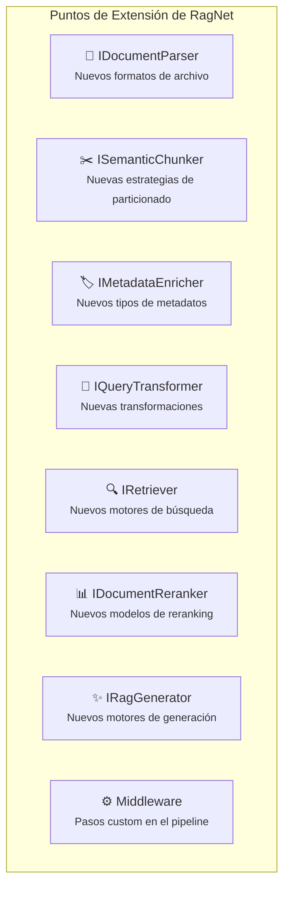

# 12. Consideraciones Transversales

## Parte 2 — Testing, Extensibilidad y Guía de Migración

> **Documento:** `docs/12-02-transversales-testing-extensibilidad.md`  
> **Versión:** 1.0  
> **Última actualización:** 2026-05-01

---

## 12.5. Testing

### 12.5.1. Unit Testing con Mocks de Interfaces

Gracias a que toda la lógica se programa contra interfaces de `RagNet.Abstractions`, cada componente se puede testear en aislamiento usando mocks.

**Ejemplo: Test unitario del `DefaultRagPipeline`:**

```csharp
[Fact]
public async Task ExecuteAsync_TransformsQuery_RetrievesDocs_Reranks_Generates()
{
    // Arrange
    var mockTransformer = new Mock<IQueryTransformer>();
    mockTransformer
        .Setup(t => t.TransformAsync("¿Qué es RAG?", It.IsAny<CancellationToken>()))
        .ReturnsAsync(new[] { "Definición de Retrieval Augmented Generation" });

    var mockRetriever = new Mock<IRetriever>();
    mockRetriever
        .Setup(r => r.RetrieveAsync(It.IsAny<string>(), 20, It.IsAny<CancellationToken>()))
        .ReturnsAsync(new[]
        {
            new RagDocument("doc-1", "RAG combina recuperación...",
                default, new Dictionary<string, object> { ["_score"] = 0.95 }),
            new RagDocument("doc-2", "La generación aumentada...",
                default, new Dictionary<string, object> { ["_score"] = 0.87 })
        });

    var mockReranker = new Mock<IDocumentReranker>();
    mockReranker
        .Setup(r => r.RerankAsync(
            It.IsAny<string>(), It.IsAny<IEnumerable<RagDocument>>(),
            5, It.IsAny<CancellationToken>()))
        .ReturnsAsync((string q, IEnumerable<RagDocument> docs, int k, CancellationToken _)
            => docs.Take(k));

    var mockGenerator = new Mock<IRagGenerator>();
    mockGenerator
        .Setup(g => g.GenerateAsync(
            It.IsAny<string>(), It.IsAny<IEnumerable<RagDocument>>(),
            It.IsAny<CancellationToken>()))
        .ReturnsAsync(new RagResponse
        {
            Answer = "RAG es una técnica que combina...",
            Citations = new[] { new Citation("doc-1", "RAG combina...", 0.95, new()) }
        });

    var pipeline = BuildPipeline(
        mockTransformer.Object, mockRetriever.Object,
        mockReranker.Object, mockGenerator.Object);

    // Act
    var response = await pipeline.ExecuteAsync("¿Qué es RAG?");

    // Assert
    Assert.NotNull(response);
    Assert.Contains("RAG", response.Answer);
    Assert.Single(response.Citations);
    Assert.Equal("doc-1", response.Citations[0].DocumentId);

    mockTransformer.Verify(t => t.TransformAsync("¿Qué es RAG?", default), Times.Once);
    mockRetriever.Verify(r => r.RetrieveAsync(It.IsAny<string>(), 20, default), Times.Once);
    mockReranker.Verify(r => r.RerankAsync(
        It.IsAny<string>(), It.IsAny<IEnumerable<RagDocument>>(), 5, default), Times.Once);
}
```

**Ejemplo: Test unitario del `EmbeddingSimilarityChunker`:**

```csharp
[Fact]
public async Task ChunkAsync_SplitsOnSemanticBoundary()
{
    // Arrange
    var mockEmbedding = new Mock<IEmbeddingGenerator<string, Embedding<float>>>();

    // Simular embeddings: las 3 primeras frases son similares,
    // la 4ta es diferente (nuevo tema)
    var embeddings = new[]
    {
        CreateEmbedding(new float[] { 1.0f, 0.0f }),  // Tema A
        CreateEmbedding(new float[] { 0.95f, 0.05f }), // Tema A (similar)
        CreateEmbedding(new float[] { 0.90f, 0.10f }), // Tema A (similar)
        CreateEmbedding(new float[] { 0.1f, 0.9f }),   // Tema B (diferente!)
        CreateEmbedding(new float[] { 0.15f, 0.85f })  // Tema B (similar)
    };

    mockEmbedding
        .Setup(e => e.GenerateAsync(It.IsAny<IEnumerable<string>>(),
            It.IsAny<EmbeddingGenerationOptions>(), It.IsAny<CancellationToken>()))
        .ReturnsAsync(embeddings);

    var chunker = new EmbeddingSimilarityChunker(
        mockEmbedding.Object,
        Options.Create(new EmbeddingSimilarityChunkerOptions
        {
            SimilarityThreshold = 0.85
        }));

    var document = CreateDocumentNode(sentences: 5);

    // Act
    var chunks = (await chunker.ChunkAsync(document)).ToList();

    // Assert
    Assert.Equal(2, chunks.Count);  // Dos chunks: tema A y tema B
    Assert.Contains("frase 1", chunks[0].Content);
    Assert.Contains("frase 3", chunks[0].Content);
    Assert.Contains("frase 4", chunks[1].Content);
}
```

### 12.5.2. Integration Testing del Pipeline

Los integration tests verifican el pipeline completo con implementaciones reales (o emuladores):

```csharp
public class RagPipelineIntegrationTests : IClassFixture<RagTestFixture>
{
    private readonly RagTestFixture _fixture;

    public RagPipelineIntegrationTests(RagTestFixture fixture)
    {
        _fixture = fixture;
    }

    [Fact]
    public async Task FullPipeline_IngestAndQuery_ReturnsRelevantAnswer()
    {
        // Arrange: Ingestar un documento de prueba
        var ingestionPipeline = _fixture.ServiceProvider
            .GetRequiredService<IIngestionPipeline>();

        var testDoc = "La fotosíntesis es el proceso por el cual...";
        using var stream = new MemoryStream(Encoding.UTF8.GetBytes(testDoc));
        await ingestionPipeline.IngestAsync(stream, "test.md");

        // Act: Consultar
        var queryPipeline = _fixture.ServiceProvider
            .GetRequiredService<IRagPipeline>();
        var response = await queryPipeline.ExecuteAsync(
            "¿Qué es la fotosíntesis?");

        // Assert
        Assert.NotNull(response.Answer);
        Assert.NotEmpty(response.Answer);
        Assert.Contains(response.Citations,
            c => c.Metadata.ContainsValue("test.md"));
    }
}

/// <summary>
/// Fixture que configura un entorno de test completo
/// con LLM mock y VectorStore in-memory.
/// </summary>
public class RagTestFixture : IAsyncLifetime
{
    public IServiceProvider ServiceProvider { get; private set; }

    public async Task InitializeAsync()
    {
        var services = new ServiceCollection();

        // LLM mock o modelo local ligero
        services.AddChatClient(new MockChatClient());
        services.AddEmbeddingGenerator(new MockEmbeddingGenerator());

        // VectorStore in-memory
        services.AddInMemoryVectorStore();

        // RagNet
        services.AddAdvancedRag(rag =>
        {
            rag.AddIngestion(ingest => ingest
                .AddParser<MarkdownDocumentParser>()
                .UseSemanticChunker<NLPBoundaryChunker>()
                .UseCollection("test-collection"));

            rag.AddPipeline("default", pipeline => pipeline
                .UseRetrieval<VectorRetriever>(topK: 3)
                .UseGenerator<MockRagGenerator>());
        });

        ServiceProvider = services.BuildServiceProvider();
    }

    public Task DisposeAsync() => Task.CompletedTask;
}
```

### 12.5.3. Benchmarking de Calidad RAG

Más allá de tests funcionales, es fundamental medir la **calidad** del sistema RAG con métricas específicas:

**Métricas de recuperación:**

| Métrica | Qué mide | Cómo calcularla |
|---------|---------|----------------|
| **Recall@K** | % de docs relevantes en el Top-K | `relevantes_en_topK / total_relevantes` |
| **Precision@K** | % del Top-K que es relevante | `relevantes_en_topK / K` |
| **MRR** (Mean Reciprocal Rank) | Posición media del primer doc relevante | `1 / posición_primer_relevante` |
| **NDCG** | Calidad del ranking considerando posiciones | Normalizado por ranking ideal |

**Métricas de generación:**

| Métrica | Qué mide | Herramienta |
|---------|---------|-------------|
| **Faithfulness** | ¿La respuesta es fiel al contexto? | LLM como evaluador |
| **Relevance** | ¿La respuesta responde la pregunta? | LLM como evaluador |
| **Groundedness** | ¿Cada afirmación tiene soporte en las fuentes? | Self-RAG / LLM |

**Framework de evaluación:**

```csharp
public class RagBenchmark
{
    private readonly IRagPipeline _pipeline;
    private readonly List<BenchmarkCase> _testCases;

    public async Task<BenchmarkReport> RunAsync()
    {
        var results = new List<BenchmarkResult>();

        foreach (var testCase in _testCases)
        {
            var response = await _pipeline.ExecuteAsync(testCase.Query);

            results.Add(new BenchmarkResult
            {
                Query = testCase.Query,
                ExpectedAnswer = testCase.ExpectedAnswer,
                ActualAnswer = response.Answer,
                RecallAtK = CalculateRecall(response.Citations, testCase.ExpectedSources),
                Latency = response.ExecutionMetadata["duration"],
                CitationCount = response.Citations.Count
            });
        }

        return new BenchmarkReport(results);
    }
}
```

---

## 12.6. Extensibilidad

### 12.6.1. Cómo Añadir un Nuevo `IDocumentParser`

**Escenario:** Añadir soporte para archivos HTML.

```
1. Crear proyecto: RagNet.Parsers.Html
2. Añadir referencia: RagNet.Abstractions
3. Añadir dependencia: HtmlAgilityPack (NuGet)
4. Implementar IDocumentParser
5. Registrar en DI
```

```csharp
// RagNet.Parsers.Html/HtmlDocumentParser.cs
public class HtmlDocumentParser : IDocumentParser
{
    public IReadOnlySet<string> SupportedExtensions { get; } =
        new HashSet<string> { ".html", ".htm" };

    public async Task<DocumentNode> ParseAsync(
        Stream documentStream, string fileName, CancellationToken ct = default)
    {
        var doc = new HtmlDocument();
        doc.Load(documentStream);

        return ConvertToDocumentNode(doc.DocumentNode);
    }

    private DocumentNode ConvertToDocumentNode(HtmlNode htmlNode)
    {
        // Mapear <h1>-<h6> → Heading
        // Mapear <p> → Paragraph
        // Mapear <ul>/<ol> → List
        // Mapear <table> → Table
        // Construir jerarquía por headings
    }
}

// Registro
rag.AddIngestion(ingest => ingest.AddParser<HtmlDocumentParser>());
```

### 12.6.2. Cómo Añadir un Nuevo `IRetriever`

**Escenario:** Integrar un motor de búsqueda externo (e.g., Elasticsearch).

```csharp
public class ElasticsearchRetriever : IRetriever
{
    private readonly IElasticClient _elastic;
    private readonly string _indexName;

    public ElasticsearchRetriever(IElasticClient elastic, string indexName)
    {
        _elastic = elastic;
        _indexName = indexName;
    }

    public async Task<IEnumerable<RagDocument>> RetrieveAsync(
        string query, int topK, CancellationToken ct = default)
    {
        var response = await _elastic.SearchAsync<ElasticDocument>(s => s
            .Index(_indexName)
            .Size(topK)
            .Query(q => q
                .MultiMatch(mm => mm
                    .Query(query)
                    .Fields(f => f
                        .Field(d => d.Content, boost: 2)
                        .Field(d => d.Keywords, boost: 1.5)
                        .Field(d => d.Summary)))),
            ct);

        return response.Documents.Select(d => new RagDocument(
            d.Id, d.Content, default,
            new Dictionary<string, object>
            {
                ["_score"] = d.Score,
                ["source"] = d.Source
            }));
    }
}

// Registro
rag.AddPipeline("elastic", pipeline => pipeline
    .UseRetrieval<ElasticsearchRetriever>(topK: 20)
    .UseReranking<CrossEncoderReranker>(topK: 5)
    .UseSemanticKernelGenerator()
);
```

### 12.6.3. Cómo Añadir un Nuevo `IQueryTransformer`

**Escenario:** Transformador que traduce queries multilingües al inglés antes de buscar.

```csharp
public class TranslationTransformer : IQueryTransformer
{
    private readonly IChatClient _chatClient;

    public TranslationTransformer(IChatClient chatClient)
    {
        _chatClient = chatClient;
    }

    public async Task<IEnumerable<string>> TransformAsync(
        string originalQuery, CancellationToken ct = default)
    {
        var response = await _chatClient.CompleteAsync(
            $"Translate the following to English. Reply with ONLY the translation: " +
            $"\"{originalQuery}\"", cancellationToken: ct);

        var translated = response.Message.Text ?? originalQuery;

        // Retornar ambas: original (para keyword search) + traducida (para vector)
        return new[] { originalQuery, translated };
    }
}

// Registro
rag.AddPipeline("multilang", pipeline => pipeline
    .UseQueryTransformation<TranslationTransformer>()
    .UseHybridRetrieval(alpha: 0.5)
    .UseSemanticKernelGenerator()
);
```

### Resumen de Puntos de Extensión



---

## 12.7. Guía de Migración y Adopción Incremental

RagNet está diseñado para **adopción incremental**. No es necesario implementar todas las capacidades desde el día uno.

### Niveles de adopción

| Nivel | Complejidad | Qué se usa | Configuración |
|-------|------------|-----------|--------------|
| **1. Básico** | Mínima | Vector search + generación directa | Sin chunker semántico, sin reranking, sin enriquecimiento |
| **2. Intermedio** | Media | Chunking semántico + retrieval híbrido | `MarkdownStructureChunker` + `HybridRetriever` |
| **3. Avanzado** | Alta | Pipeline completo con HyDE + reranking + Self-RAG | Todas las capacidades |

### Nivel 1: Configuración Básica

```csharp
builder.Services.AddAdvancedRag(rag =>
{
    rag.AddIngestion(ingest => ingest
        .AddParser<MarkdownDocumentParser>()
        .UseSemanticChunker<NLPBoundaryChunker>()
        .UseCollection("docs"));

    rag.AddPipeline("basic", pipeline => pipeline
        .UseRetrieval<VectorRetriever>(topK: 5)
        .UseSemanticKernelGenerator());
});
```

### Nivel 2: Añadir Retrieval Híbrido

```csharp
// Solo cambia la configuración del pipeline
rag.AddPipeline("hybrid", pipeline => pipeline
    .UseQueryTransformation<QueryRewriter>()          // NUEVO
    .UseHybridRetrieval(alpha: 0.5)                   // CAMBIADO
    .UseSemanticKernelGenerator());

// Y habilitar enriquecimiento en ingestión
rag.AddIngestion(ingest => ingest
    .AddParser<MarkdownDocumentParser>()
    .UseSemanticChunker<MarkdownStructureChunker>()   // CAMBIADO
    .UseLLMMetadataEnrichment(extractKeywords: true)  // NUEVO
    .UseCollection("docs"));
```

### Nivel 3: Pipeline Completo

```csharp
rag.AddPipeline("full", pipeline => pipeline
    .UseQueryTransformation<HyDETransformer>()        // CAMBIADO
    .UseHybridRetrieval(alpha: 0.5)
    .UseReranking<LLMReranker>(topK: 5)               // NUEVO
    .UseSemanticKernelGenerator(gen =>
    {
        gen.EnableSelfRagValidation = true;            // NUEVO
        gen.MaxContextTokens = 8000;
    }));

rag.AddIngestion(ingest => ingest
    .AddParser<MarkdownDocumentParser>()
    .AddParser<PdfDocumentParser>()                    // NUEVO
    .UseSemanticChunker<EmbeddingSimilarityChunker>()  // CAMBIADO
    .UseLLMMetadataEnrichment(
        extractEntities: true,                         // NUEVO
        extractKeywords: true,
        generateSummary: true)                         // NUEVO
    .UseCollection("docs"));
```

> [!TIP]
> **Estrategia recomendada:** Comenzar con el Nivel 1, medir la calidad de las respuestas con el framework de benchmarking (sección 12.5.3), e ir activando capacidades incrementalmente según las métricas muestren necesidad de mejora.

---

> **Navegación de la sección 12:**
> - [Parte 1 — Compatibilidad, Resiliencia, Rendimiento y Seguridad](./12-01-transversales-resiliencia-rendimiento.md)
> - **Parte 2 — Testing, Extensibilidad y Guía de Migración** *(este documento)*
