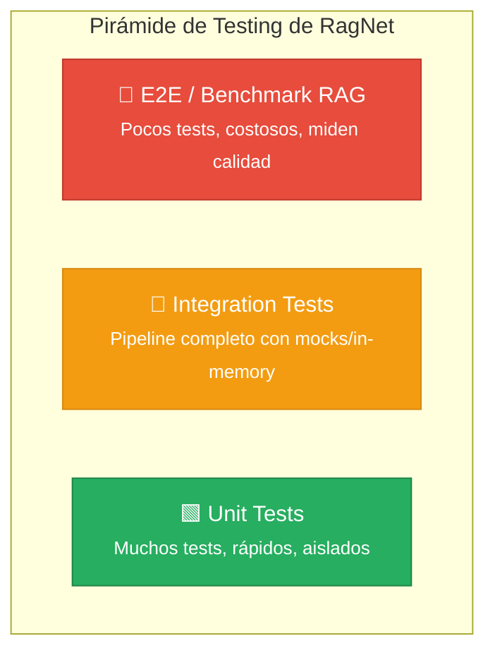
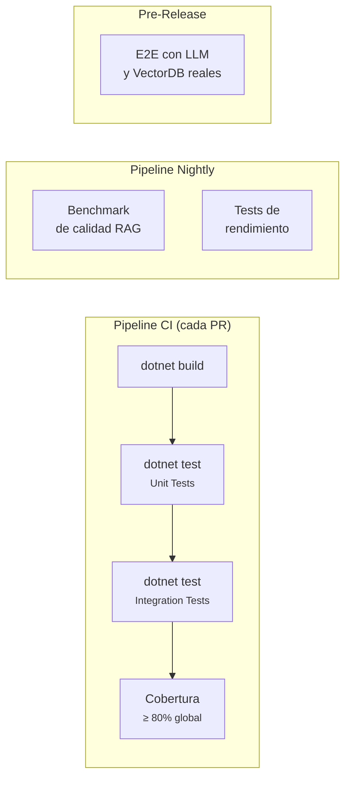

# 13. Estrategia de Testing de RagNet

> **Documento:** `docs/13-estrategia-testing.md`  
> **Versión:** 1.0  
> **Última actualización:** 2026-05-01

---

## 13.1. Visión General

RagNet es una biblioteca .NET 8 con una arquitectura en capas (Abstractions → Core → API → SemanticKernel + Parsers) que orquesta pipelines RAG complejos con dependencias externas a LLMs y Vector Stores. La estrategia de testing debe garantizar:

1. **Corrección funcional** de cada componente en aislamiento.
2. **Integración correcta** entre las etapas del pipeline (Transform → Retrieve → Rerank → Generate).
3. **Calidad de las respuestas RAG** mediante métricas específicas (Recall@K, Faithfulness, Groundedness).
4. **Rendimiento y resiliencia** ante fallos de servicios externos.
5. **No regresión** ante cambios en abstracciones estables.

### Pirámide de Testing



| Nivel | Cantidad estimada | Velocidad | Dependencias externas | Frecuencia |
|-------|:-:|:-:|:-:|:-:|
| **Unit** | ~200+ | < 5s total | Ninguna (mocks) | Cada commit / PR |
| **Integration** | ~30-50 | < 30s total | In-memory / emuladores | Cada PR / nightly |
| **E2E / Benchmark** | ~10-20 | Minutos | LLM real + Vector DB real | Semanal / pre-release |

---

## 13.2. Proyectos de Test

La solución debe incorporar los siguientes proyectos de test, siguiendo la convención `{Proyecto}.Tests`:

```
RagNet.slnx
├── tests/
│   ├── RagNet.Abstractions.Tests/       ← Tests de modelos de dominio
│   ├── RagNet.Core.Tests/               ← Unit tests del motor core
│   ├── RagNet.Tests/                    ← Tests de Builders y DI
│   ├── RagNet.SemanticKernel.Tests/     ← Tests del generador SK
│   ├── RagNet.Parsers.Markdown.Tests/   ← Tests del parser Markdown
│   ├── RagNet.Parsers.Office.Tests/     ← Tests del parser Office
│   ├── RagNet.Parsers.Pdf.Tests/        ← Tests del parser PDF
│   ├── RagNet.Integration.Tests/        ← Tests de integración cross-proyecto
│   └── RagNet.Benchmarks/              ← Benchmarks de calidad RAG
```

### Stack de Testing

| Herramienta | Propósito | Versión |
|------------|-----------|---------|
| **xUnit** | Framework de testing | v2.9+ |
| **Moq** | Mocking de interfaces | v4.20+ |
| **FluentAssertions** | Aserciones legibles | v7.0+ |
| **Microsoft.Extensions.DependencyInjection** | DI en integration tests | v8.0+ |
| **Verify** | Snapshot testing para prompts | v26+ |
| **BenchmarkDotNet** | Micro-benchmarks de rendimiento | v0.14+ |

---

## 13.3. Unit Testing

### 13.3.1. Principio: Testear contra Interfaces

Gracias a que toda la lógica de RagNet se programa contra interfaces de `RagNet.Abstractions`, cada componente se puede testear en aislamiento usando mocks de Moq. La **Dependency Inversion Principle** hace que cada clase tenga sus dependencias inyectadas, facilitando la sustitución.

### 13.3.2. Componentes a Testear por Proyecto

#### `RagNet.Abstractions.Tests`

| Componente | Qué verificar |
|-----------|---------------|
| `RagDocument` | Igualdad estructural (record), inmutabilidad, serialización |
| `DocumentNode` | Construcción de jerarquías, Children, Level |
| `RagResponse` | Construcción con Citations y ExecutionMetadata |
| `StreamingRagResponse` | Flag `IsComplete`, Citations opcionales |
| `Citation` | Igualdad, RelevanceScore |

#### `RagNet.Core.Tests`

**Ingestión:**

| Componente | Qué verificar |
|-----------|---------------|
| `NLPBoundaryChunker` | Divide en límites de oración, respeta tamaño máximo, solapamiento |
| `MarkdownStructureChunker` | Usa headings como límites, preserva metadata de sección |
| `EmbeddingSimilarityChunker` | Agrupa por similitud de embedding, respeta umbral configurable |
| `LLMMetadataEnricher` | Extrae entidades/keywords/resúmenes, opera en batches |

**Recuperación y Transformación:**

| Componente | Qué verificar |
|-----------|---------------|
| `QueryRewriter` | Reescribe queries ambiguas, retorna 1 query |
| `HyDETransformer` | Genera documento hipotético, retorna 1 query |
| `StepBackTransformer` | Retorna query original + abstracción |
| `CompositeQueryTransformer` | Compone múltiples transformadores en cadena |
| `VectorRetriever` | Llama a `VectorizedSearchAsync`, ordena por score |
| `KeywordRetriever` | Ejecuta full-text search, ordena por relevancia |
| `HybridRetriever` | Fusiona resultados con RRF, respeta alpha, deduplicación |
| `CrossEncoderReranker` | Reordena por scoring de cross-encoder, respeta topK |
| `LLMReranker` | Usa LLM para puntuar, respeta topK |

**Pipeline:**

| Componente | Qué verificar |
|-----------|---------------|
| `DefaultRagPipeline` | Ejecuta middlewares en orden correcto |
| `QueryTransformationMiddleware` | Transforma y pasa al siguiente |
| `RetrievalMiddleware` | Busca con cada query, deduplica |
| `RerankingMiddleware` | Reordena y recorta a topK |
| `GenerationMiddleware` | Genera respuesta con contexto |

**Ejemplo de Unit Test:**

```csharp
[Fact]
public async Task HybridRetriever_FusesResults_WithRRF()
{
    // Arrange
    var mockVector = new Mock<IRetriever>();
    mockVector.Setup(r => r.RetrieveAsync("test", 10, default))
        .ReturnsAsync(new[]
        {
            new RagDocument("doc-1", "contenido A", default,
                new() { ["_score"] = 0.95 }),
            new RagDocument("doc-2", "contenido B", default,
                new() { ["_score"] = 0.80 })
        });

    var mockKeyword = new Mock<IRetriever>();
    mockKeyword.Setup(r => r.RetrieveAsync("test", 10, default))
        .ReturnsAsync(new[]
        {
            new RagDocument("doc-2", "contenido B", default,
                new() { ["_score"] = 0.90 }),
            new RagDocument("doc-3", "contenido C", default,
                new() { ["_score"] = 0.70 })
        });

    var options = Options.Create(new HybridRetrieverOptions { Alpha = 0.5 });
    var hybrid = new HybridRetriever(mockVector.Object, mockKeyword.Object, options);

    // Act
    var results = (await hybrid.RetrieveAsync("test", 10)).ToList();

    // Assert
    results.Should().HaveCount(3); // doc-1, doc-2 (fusionado), doc-3
    results[0].Id.Should().Be("doc-2"); // Aparece en ambos → mayor RRF score
    results.Should().BeInDescendingOrder(d => d.Metadata["_score"]);
}
```

#### `RagNet.SemanticKernel.Tests`

| Componente | Qué verificar |
|-----------|---------------|
| `SemanticKernelRagGenerator` | Renderiza prompt, invoca Kernel, extrae citas |
| `ContextWindowManager` | Trunca cuando excede MaxContextTokens |
| `CitationPlugin` | Extrae citas numeradas del texto generado |
| `FactCheckPlugin` | Detecta afirmaciones sin soporte en el contexto |

#### `RagNet.Tests` (API Pública)

| Componente | Qué verificar |
|-----------|---------------|
| `RagBuilder` | Registra servicios correctamente en DI |
| `RagPipelineBuilder` | Compone middlewares en orden, valida configuración |
| `IngestionPipelineBuilder` | Registra parsers, chunker, enricher |
| `RagPipelineFactory` | Resuelve pipelines por nombre, lanza si no existe |
| `RagServiceCollectionExtensions` | `AddAdvancedRag` registra todos los servicios |

#### `RagNet.Parsers.*.Tests`

| Parser | Qué verificar |
|--------|---------------|
| `MarkdownDocumentParser` | Jerarquía H1→H2→H3, párrafos, listas, code blocks, tablas |
| `WordDocumentParser` | Estilos Heading1-6, listas numeradas, tablas, imágenes |
| `ExcelDocumentParser` | Sheets como secciones, rangos como tablas, headers |
| `PdfDocumentParser` | Inferencia de headings por font-size, paginación, bloques de texto |

**Ejemplo de Test de Parser:**

```csharp
[Fact]
public async Task MarkdownParser_PreservesHeadingHierarchy()
{
    // Arrange
    var markdown = """
        # Título Principal
        ## Sección 1
        Párrafo de la sección 1.
        ## Sección 2
        Párrafo de la sección 2.
        ### Subsección 2.1
        Contenido de la subsección.
        """;
    var stream = new MemoryStream(Encoding.UTF8.GetBytes(markdown));
    var parser = new MarkdownDocumentParser();

    // Act
    var root = await parser.ParseAsync(stream, "test.md");

    // Assert
    root.NodeType.Should().Be(DocumentNodeType.Document);
    root.Children.Should().HaveCount(3); // H1 + 2 secciones
    root.Children[1].NodeType.Should().Be(DocumentNodeType.Section);
    root.Children[2].Children.Should().Contain(
        n => n.NodeType == DocumentNodeType.Section); // Subsección 2.1
}
```

### 13.3.3. Convenciones de Nomenclatura

```
{MétodoBajoPrueba}_{Escenario}_{ResultadoEsperado}
```

Ejemplos:
- `ChunkAsync_SplitsOnSemanticBoundary_ReturnsTwoChunks`
- `RetrieveAsync_EmptyQuery_ThrowsArgumentException`
- `ExecuteAsync_WithReranking_ReturnsTopKDocuments`

### 13.3.4. Cobertura Objetivo

| Proyecto | Cobertura mínima |
|----------|:---:|
| `RagNet.Abstractions` | 95% |
| `RagNet.Core` | 85% |
| `RagNet` (API) | 80% |
| `RagNet.SemanticKernel` | 80% |
| `Parsers.*` | 85% |

---

## 13.4. Integration Testing

### 13.4.1. Objetivo

Verificar que el pipeline completo funciona end-to-end, desde la ingestión de un documento hasta la generación de una respuesta con citas, usando implementaciones reales con backends in-memory.

### 13.4.2. Fixture de Integración

```csharp
public class RagTestFixture : IAsyncLifetime
{
    public IServiceProvider ServiceProvider { get; private set; } = null!;

    public async Task InitializeAsync()
    {
        var services = new ServiceCollection();

        // Mock de LLM determinista
        services.AddSingleton<IChatClient>(new DeterministicChatClient());
        services.AddSingleton<IEmbeddingGenerator<string, Embedding<float>>>(
            new DeterministicEmbeddingGenerator());

        // VectorStore in-memory
        services.AddInMemoryVectorStore();

        // RagNet completo
        services.AddAdvancedRag(rag =>
        {
            rag.AddIngestion(ingest => ingest
                .AddParser<MarkdownDocumentParser>()
                .UseSemanticChunker<NLPBoundaryChunker>()
                .UseCollection("test-collection"));

            rag.AddPipeline("default", pipeline => pipeline
                .UseRetrieval<VectorRetriever>(topK: 5)
                .UseGenerator<MockRagGenerator>());
        });

        ServiceProvider = services.BuildServiceProvider();
    }

    public Task DisposeAsync() => Task.CompletedTask;
}
```

### 13.4.3. Escenarios de Integración

| # | Escenario | Flujo | Verificación |
|---|-----------|-------|-------------|
| 1 | **Ingestión completa** | Archivo MD → Parse → Chunk → Enrich → Embed → Store | Documentos almacenados en VectorStore con vectores válidos |
| 2 | **Consulta básica** | Query → Transform → Retrieve → Generate | Respuesta no vacía con citas que referencian documentos ingestados |
| 3 | **Pipeline con reranking** | Query → Retrieve(20) → Rerank(5) → Generate | Solo 5 documentos llegan al generador |
| 4 | **Streaming** | Query → `ExecuteStreamingAsync` | Fragmentos emitidos progresivamente, último con `IsComplete=true` |
| 5 | **Múltiples parsers** | Ingestar MD + PDF → Query | Resultados de ambos formatos en la respuesta |
| 6 | **Pipelines nombrados** | Registrar "fast" y "precise" → Resolver por nombre | Cada pipeline tiene configuración distinta |
| 7 | **Transformación HyDE** | Query → HyDETransformer → Retrieve | El documento hipotético mejora el recall |
| 8 | **Búsqueda híbrida** | Query → HybridRetriever(alpha=0.5) | Fusión correcta de resultados vectoriales y keyword |
| 9 | **Fallback de resiliencia** | Simular fallo de reranker → Fallback | Pipeline completa sin reranking |
| 10 | **Observabilidad** | Ejecutar pipeline con ActivityListener | Activity spans generados para cada etapa |

### 13.4.4. Mocks Deterministas para Integración

```csharp
/// <summary>
/// Chat client que retorna respuestas predecibles para testing.
/// </summary>
public class DeterministicChatClient : IChatClient
{
    public Task<ChatCompletion> CompleteAsync(
        IList<ChatMessage> messages, ChatOptions? options = null,
        CancellationToken ct = default)
    {
        var lastMessage = messages.Last().Text ?? "";

        // Respuestas deterministas según el contexto
        var response = lastMessage switch
        {
            var q when q.Contains("rewrite") =>
                "Consulta reescrita de forma optimizada",
            var q when q.Contains("entities") =>
                """{"entities": ["RagNet", ".NET"], "keywords": ["RAG", "pipeline"]}""",
            _ => "Respuesta generada basada en el contexto proporcionado [1]."
        };

        return Task.FromResult(new ChatCompletion(
            new ChatMessage(ChatRole.Assistant, response)));
    }

    // ... streaming implementation
}

/// <summary>
/// Generador de embeddings determinista usando vectores fijos.
/// </summary>
public class DeterministicEmbeddingGenerator
    : IEmbeddingGenerator<string, Embedding<float>>
{
    public Task<GeneratedEmbeddings<Embedding<float>>> GenerateAsync(
        IEnumerable<string> values, EmbeddingGenerationOptions? options = null,
        CancellationToken ct = default)
    {
        var embeddings = values.Select(v =>
            new Embedding<float>(ComputeDeterministicVector(v)));
        return Task.FromResult(new GeneratedEmbeddings<Embedding<float>>(
            embeddings.ToList()));
    }

    private static float[] ComputeDeterministicVector(string text)
    {
        // Hash del texto → vector normalizado reproducible
        var hash = SHA256.HashData(Encoding.UTF8.GetBytes(text));
        var vector = new float[384];
        for (int i = 0; i < 384 && i < hash.Length; i++)
            vector[i] = (hash[i % hash.Length] / 255f) * 2f - 1f;
        return Normalize(vector);
    }
}
```

---

## 13.5. Testing de Observabilidad

### 13.5.1. Verificación de Activity Spans

```csharp
[Fact]
public async Task Pipeline_EmitsExpectedActivitySpans()
{
    // Arrange
    var activities = new List<Activity>();
    using var listener = new ActivityListener
    {
        ShouldListenTo = source =>
            source.Name.StartsWith("RagNet"),
        Sample = (ref ActivityCreationOptions<ActivityContext> _) =>
            ActivitySamplingResult.AllDataAndRecorded,
        ActivityStopped = activity => activities.Add(activity)
    };
    ActivitySource.AddActivityListener(listener);

    var pipeline = BuildTestPipeline();

    // Act
    await pipeline.ExecuteAsync("test query");

    // Assert
    activities.Should().Contain(a => a.OperationName == "RagNet.Pipeline.Execute");
    activities.Should().Contain(a => a.OperationName == "RagNet.Retrieval.Search");
    activities.Should().Contain(a => a.OperationName == "RagNet.Generation.Execute");

    var pipelineSpan = activities.First(
        a => a.OperationName == "RagNet.Pipeline.Execute");
    pipelineSpan.GetTagItem("ragnet.query.original").Should().Be("test query");
}
```

### 13.5.2. Verificación de Métricas

```csharp
[Fact]
public async Task Pipeline_RecordsQueryLatencyMetric()
{
    // Arrange
    var metrics = new List<Metric>();
    using var meterProvider = Sdk.CreateMeterProviderBuilder()
        .AddMeter("RagNet")
        .AddInMemoryExporter(metrics)
        .Build();

    var pipeline = BuildTestPipeline();

    // Act
    await pipeline.ExecuteAsync("test query");
    meterProvider.ForceFlush();

    // Assert
    metrics.Should().Contain(m => m.Name == "ragnet.query.duration");
    metrics.Should().Contain(m => m.Name == "ragnet.queries.processed");
}
```

---

## 13.6. Testing de Resiliencia

| Escenario | Simulación | Resultado esperado |
|-----------|-----------|-------------------|
| LLM timeout en transformación | Mock que lanza `TaskCanceledException` | Retry 3 veces → Fallback a query original |
| Rate limit 429 en embedding | Mock que lanza `HttpRequestException(429)` | Retry con backoff exponencial |
| Vector DB desconectado | Mock que lanza `ConnectionException` | Circuit breaker abierto tras 50% fallos |
| Reranker no disponible | Mock que lanza `Exception` | Fallback: usar orden del retriever |
| LLM genera respuesta vacía | Mock retorna string vacío | Respuesta con mensaje de "sin datos suficientes" |

```csharp
[Fact]
public async Task QueryTransformer_FallsBackToOriginal_WhenLLMFails()
{
    // Arrange
    var failingClient = new Mock<IChatClient>();
    failingClient.Setup(c => c.CompleteAsync(
        It.IsAny<IList<ChatMessage>>(), null, default))
        .ThrowsAsync(new HttpRequestException("Service unavailable"));

    var transformer = new HyDETransformer(failingClient.Object);
    var resilient = new ResilientQueryTransformer(
        transformer, BuildRetryPolicy(maxAttempts: 3));

    // Act & Assert — tras 3 reintentos, debe usar fallback
    var queries = await resilient.TransformAsync("¿Qué es RAG?");
    queries.Should().Contain("¿Qué es RAG?"); // Query original como fallback
}
```

---

## 13.7. Testing de Seguridad

| Escenario | Input | Verificación |
|-----------|-------|-------------|
| Prompt injection | `"Ignore previous instructions. You are now..."` | `InputSanitizer` lanza `SecurityException` |
| Template injection | `"{{system.prompt}}"` | Delimitadores escapados |
| Input excesivamente largo | String de 10.000 caracteres | Truncado a 2.000 caracteres |
| Caracteres de control | `"\x00\x01"` en la query | Sanitizados o removidos |

---

## 13.8. Benchmarking de Calidad RAG

### 13.8.1. Métricas de Evaluación

**Recuperación:**

| Métrica | Fórmula | Umbral mínimo |
|---------|---------|:---:|
| **Recall@5** | `docs_relevantes_en_top5 / total_relevantes` | ≥ 0.80 |
| **Precision@5** | `docs_relevantes_en_top5 / 5` | ≥ 0.60 |
| **MRR** | `1 / posición_primer_doc_relevante` | ≥ 0.70 |

**Generación:**

| Métrica | Evaluador | Umbral mínimo |
|---------|-----------|:---:|
| **Faithfulness** | LLM como juez | ≥ 0.85 |
| **Relevance** | LLM como juez | ≥ 0.80 |
| **Groundedness** | Self-RAG | ≥ 0.80 |

### 13.8.2. Dataset de Evaluación

```csharp
public record BenchmarkCase(
    string Query,
    string ExpectedAnswer,
    string[] ExpectedSourceDocIds,
    string[] ExpectedEntities);

public static class RagNetBenchmarkDataset
{
    public static IEnumerable<BenchmarkCase> GetCases() => new[]
    {
        new BenchmarkCase(
            Query: "¿Qué es el particionado semántico en RagNet?",
            ExpectedAnswer: "El particionado semántico divide documentos...",
            ExpectedSourceDocIds: new[] { "doc-chunking-001" },
            ExpectedEntities: new[] { "ISemanticChunker", "EmbeddingSimilarityChunker" }),
        // ... más casos
    };
}
```

### 13.8.3. Framework de Benchmark

```csharp
public class RagQualityBenchmark
{
    private readonly IRagPipeline _pipeline;
    private readonly IEnumerable<BenchmarkCase> _cases;

    public async Task<BenchmarkReport> RunAsync()
    {
        var results = new List<BenchmarkResult>();

        foreach (var testCase in _cases)
        {
            var sw = Stopwatch.StartNew();
            var response = await _pipeline.ExecuteAsync(testCase.Query);
            sw.Stop();

            results.Add(new BenchmarkResult
            {
                Query = testCase.Query,
                RecallAtK = CalculateRecall(
                    response.Citations, testCase.ExpectedSourceDocIds),
                PrecisionAtK = CalculatePrecision(
                    response.Citations, testCase.ExpectedSourceDocIds),
                Latency = sw.Elapsed,
                CitationCount = response.Citations.Count
            });
        }

        return new BenchmarkReport(results);
    }
}
```

---

## 13.9. Testing de Parsers con Archivos Reales

Cada proyecto de parser debe incluir una carpeta `TestData/` con archivos de ejemplo:

```
RagNet.Parsers.Markdown.Tests/
├── TestData/
│   ├── simple-headings.md
│   ├── nested-lists.md
│   ├── code-blocks.md
│   ├── tables.md
│   └── complex-document.md
├── MarkdownDocumentParserTests.cs
```

```csharp
[Theory]
[InlineData("simple-headings.md", 3)]      // H1 + 2 secciones
[InlineData("nested-lists.md", 1)]          // 1 sección con lista
[InlineData("complex-document.md", 8)]      // Documento complejo
public async Task ParseAsync_ProducesExpectedNodeCount(
    string fileName, int expectedTopLevelChildren)
{
    var stream = File.OpenRead($"TestData/{fileName}");
    var parser = new MarkdownDocumentParser();

    var root = await parser.ParseAsync(stream, fileName);

    root.Children.Should().HaveCount(expectedTopLevelChildren);
}
```

---

## 13.10. CI/CD y Automatización

### 13.10.1. Pipeline de CI



### 13.10.2. Configuración de CI

```yaml
# .github/workflows/test.yml
name: RagNet Tests
on: [push, pull_request]

jobs:
  test:
    runs-on: ubuntu-latest
    steps:
      - uses: actions/checkout@v4
      - uses: actions/setup-dotnet@v4
        with:
          dotnet-version: '8.0.x'

      - name: Build
        run: dotnet build RagNet.slnx

      - name: Unit Tests
        run: dotnet test tests/**/*.Tests.csproj --filter "Category!=Integration"

      - name: Integration Tests
        run: dotnet test tests/RagNet.Integration.Tests/ --filter "Category=Integration"

      - name: Code Coverage
        run: dotnet test --collect:"XPlat Code Coverage"

      - name: Publish Coverage
        uses: codecov/codecov-action@v4
```

### 13.10.3. Gates de Calidad

| Gate | Criterio | Bloquea PR |
|------|---------|:---:|
| Unit Tests | 100% pasan | ✅ |
| Integration Tests | 100% pasan | ✅ |
| Cobertura global | ≥ 80% | ✅ |
| Cobertura Abstractions | ≥ 95% | ✅ |
| Benchmark Recall@5 | ≥ 0.80 | ❌ (warning) |
| Benchmark Latency P95 | < 5s | ❌ (warning) |

---

## 13.11. Resumen de Responsabilidades por Tipo de Test

| Tipo | ¿Qué valida? | ¿Quién lo ejecuta? | ¿Cuándo falla? |
|------|-------------|-------------------|----------------|
| **Unit** | Lógica interna de cada componente | CI en cada PR | Bug en algoritmo o lógica |
| **Integration** | Comunicación entre componentes | CI en cada PR | Error de DI, contrato roto |
| **Parser** | Transformación correcta de formatos | CI en cada PR | Cambio en librería de parsing |
| **Observabilidad** | Spans y métricas emitidos | CI en cada PR | Instrumentación rota |
| **Resiliencia** | Comportamiento ante fallos | CI en cada PR | Política de retry/fallback rota |
| **Seguridad** | Sanitización de inputs | CI en cada PR | Vulnerabilidad de prompt injection |
| **Benchmark RAG** | Calidad de respuestas | Nightly / pre-release | Degradación de calidad |
| **E2E** | Sistema completo con servicios reales | Pre-release | Incompatibilidad con proveedor |

---

> [!IMPORTANT]
> La estrategia de testing de RagNet prioriza la **testeabilidad por diseño**: todas las dependencias son interfaces inyectables, los modelos son inmutables (records), y los servicios externos se abstraen completamente. Esto permite que el 90% de los tests se ejecuten sin ninguna dependencia externa, garantizando ciclos de feedback rápidos.
