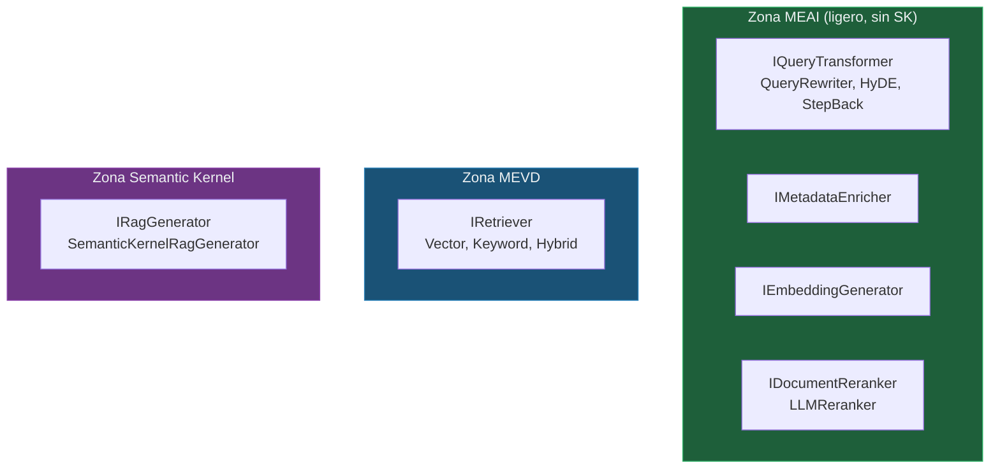
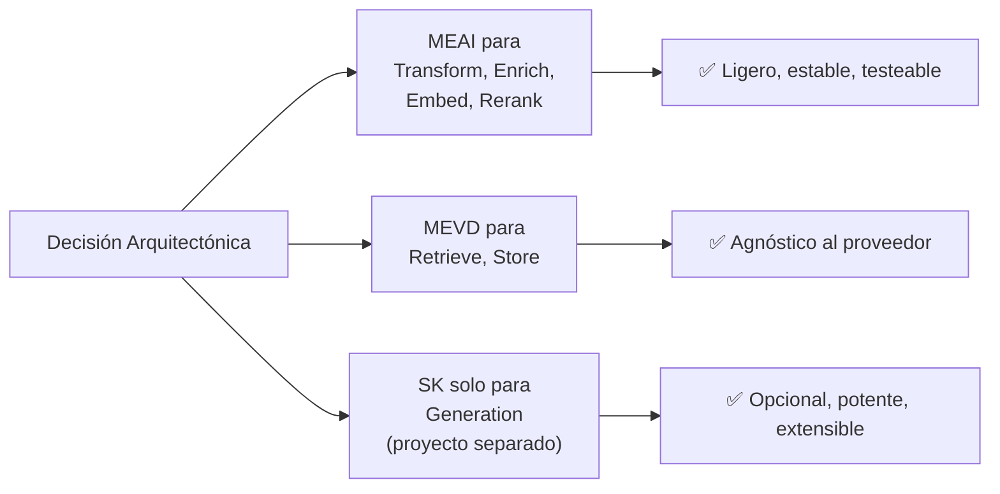

# Apéndice C — Matriz de Decisión: Semantic Kernel vs. MEAI Directo

> **Documento:** `docs/apendice-c-sk-vs-meai.md`  
> **Versión:** 1.0  
> **Última actualización:** 2026-05-01

---

## C.1. Contexto de la Decisión

RagNet se construye sobre dos stacks de Microsoft para interactuar con modelos de lenguaje:

- **Microsoft.Extensions.AI (MEAI):** Abstracciones ligeras y estándar (`IChatClient`, `IEmbeddingGenerator`). Parte del runtime de .NET.
- **Semantic Kernel (SK):** Framework de orquestación completo con plantillas de prompts, plugins, agentes y tool use. Dependencia externa más pesada.

La decisión de cuándo usar cada uno impacta directamente en la arquitectura de RagNet y en las opciones que tiene el consumidor. Este apéndice documenta la matriz de decisión que justifica el diseño elegido.

---

## C.2. Comparativa General

| Aspecto | Microsoft.Extensions.AI (MEAI) | Semantic Kernel (SK) |
|---------|-------------------------------|---------------------|
| **Naturaleza** | Abstracciones de bajo nivel (interfaces) | Framework de orquestación de alto nivel |
| **Paquete NuGet** | `Microsoft.Extensions.AI` (v10.5.0) | `Microsoft.SemanticKernel` (v1.75.0) |
| **Tamaño de dependencia** | Ligero (~pocas DLLs) | Pesado (~múltiples DLLs + transitividades) |
| **Abstracción principal** | `IChatClient`, `IEmbeddingGenerator` | `Kernel`, `KernelFunction`, `ChatCompletionService` |
| **Modelo de extensión** | Middleware pipeline (decoradores) | Plugins, filtros, agentes |
| **Plantillas de prompts** | No incluye | Sí (Handlebars-like, Liquid) |
| **Invocación de herramientas** | Manual (via `ChatOptions.Tools`) | Automática (auto function calling) |
| **Agentes** | No incluye | Sí (`Agent Framework`) |
| **Estabilidad de API** | Muy estable (parte del BCL de .NET) | Evolución rápida (releases frecuentes) |
| **Curva de aprendizaje** | Baja | Media-Alta |

---

## C.3. Matriz de Decisión por Componente de RagNet

### ¿Qué stack usa cada componente y por qué?

| Componente | Stack elegido | Justificación |
|-----------|--------------|---------------|
| **`IQueryTransformer`** (QueryRewriter, HyDE, StepBack) | **MEAI** (`IChatClient`) | Solo necesita enviar un prompt y recibir texto. No requiere plantillas, plugins ni orquestación. MEAI es suficiente y más ligero. |
| **`IMetadataEnricher`** | **MEAI** (`IChatClient`) | Extracción de metadatos via prompt simple con respuesta JSON. No necesita capacidades de SK. |
| **`IEmbeddingGenerator`** (embedding de chunks y queries) | **MEAI** (`IEmbeddingGenerator`) | Es la abstracción nativa de .NET para embeddings. SK también la usa internamente. |
| **`IRetriever`** (Vector, Keyword, Hybrid) | **MEVD** (`IVectorStore`) | Ni MEAI ni SK; usa `Microsoft.Extensions.VectorData` directamente. |
| **`IDocumentReranker`** (LLMReranker) | **MEAI** (`IChatClient`) | El reranking por LLM solo necesita enviar un prompt de scoring. No requiere SK. |
| **`IRagGenerator`** (SemanticKernelRagGenerator) | **SK** (`Kernel`) | Aquí sí se justifica SK: plantillas de prompts complejas, streaming integrado, potencial de plugins y agentes futuros. |

### Diagrama visual



---

## C.4. ¿Por Qué No Usar SK para Todo?

Sería más simple usar Semantic Kernel como único stack. Sin embargo, hay razones de peso para limitar su uso:

### Argumentos contra "SK para todo"

| Problema | Impacto |
|----------|---------|
| **Dependencia pesada** | SK arrastra múltiples paquetes NuGet. Si un usuario solo necesita ingestión, no debería instalar SK. |
| **Evolución rápida** | SK tiene releases frecuentes con breaking changes. Aislar su uso protege al resto de la biblioteca. |
| **Acoplamiento innecesario** | Un `QueryRewriter` que solo envía un prompt no necesita un `Kernel`, `KernelFunction` ni `KernelArguments`. Es sobreingeniería. |
| **Testabilidad** | Mockear `IChatClient` (1 método) es trivial. Mockear `Kernel` (ecosistema completo) es complejo. |
| **Alternativas del consumidor** | Algunos usuarios prefieren no depender de SK y usar MEAI directamente para todo, incluyendo la generación. |

### Argumentos a favor de "SK para la generación"

| Ventaja | Detalle |
|---------|---------|
| **Plantillas de prompts** | El motor de plantillas de SK (`{{variable}}`, `{{#if}}`, `{{#each}}`) es más potente que string interpolation. |
| **Streaming nativo** | `Kernel.InvokePromptStreamingAsync` simplifica el streaming sin boilerplate. |
| **Plugins** | Permiten extender la generación con herramientas (cálculos, verificación de hechos, búsquedas adicionales). |
| **Agentes** | Habilita patrones futuros como Agentic RAG (el LLM decide cuándo buscar más contexto). |
| **Ecosistema** | Acceso a conectores, filtros, telemetría y la comunidad de SK. |

---

## C.5. Escenarios de Decisión para el Consumidor

### Escenario 1: "Quiero el pipeline RAG completo con todas las capacidades"

**→ Usar `RagNet` + `RagNet.SemanticKernel`**

```csharp
// Instalar: RagNet, RagNet.SemanticKernel, Parsers que necesite
builder.Services.AddAdvancedRag(rag =>
{
    rag.AddPipeline("full", pipeline => pipeline
        .UseQueryTransformation<HyDETransformer>()      // MEAI internamente
        .UseHybridRetrieval(alpha: 0.5)                  // MEVD internamente
        .UseReranking<LLMReranker>(topK: 5)              // MEAI internamente
        .UseSemanticKernelGenerator(gen => { ... })       // SK
    );
});
```

### Escenario 2: "No quiero depender de Semantic Kernel"

**→ Usar `RagNet` + implementación propia de `IRagGenerator`**

```csharp
// No instalar RagNet.SemanticKernel
// Implementar IRagGenerator con MEAI directo
public class MeaiRagGenerator : IRagGenerator
{
    private readonly IChatClient _chatClient;

    public async Task<RagResponse> GenerateAsync(
        string query, IEnumerable<RagDocument> context, CancellationToken ct)
    {
        var prompt = $"""
            Contexto: {string.Join("\n", context.Select(d => d.Content))}
            Pregunta: {query}
            Responde basándote solo en el contexto.
            """;

        var response = await _chatClient.CompleteAsync(prompt, cancellationToken: ct);
        return new RagResponse { Answer = response.Message.Text ?? "" };
    }

    // GenerateStreamingAsync con IChatClient.CompleteStreamingAsync...
}

// Registrar
rag.AddPipeline("no-sk", pipeline => pipeline
    .UseHybridRetrieval(alpha: 0.5)
    .UseGenerator<MeaiRagGenerator>()   // Sin SK
);
```

### Escenario 3: "Solo necesito la ingestión, ya tengo mi propio RAG"

**→ Usar `RagNet` (solo ingestión) + Parsers**

```csharp
// No instalar RagNet.SemanticKernel
// No configurar pipelines de consulta
builder.Services.AddAdvancedRag(rag =>
{
    rag.AddIngestion(ingest => ingest  // Solo ingestión
        .AddParser<PdfDocumentParser>()
        .UseSemanticChunker<EmbeddingSimilarityChunker>()
        .UseLLMMetadataEnrichment(extractKeywords: true)  // MEAI
        .UseCollection("my-docs")
    );
    // Sin AddPipeline → no necesita SK
});
```

### Escenario 4: "Quiero máximo control, solo dame las interfaces"

**→ Usar solo `RagNet.Abstractions` + implementaciones propias**

```csharp
// Solo instalar RagNet.Abstractions (0 dependencias pesadas)
// Implementar todas las interfaces manualmente
services.AddTransient<IRetriever, MyCustomRetriever>();
services.AddTransient<IRagGenerator, MyCustomGenerator>();
// etc.
```

---

## C.6. Mapa de Paquetes por Escenario

| Escenario | Abstractions | Core | RagNet | SK | Parsers | Deps externas |
|-----------|:-----------:|:----:|:------:|:--:|:-------:|:-------------:|
| RAG completo | ✅ | ✅ | ✅ | ✅ | ✅ | MEAI + MEVD + SK |
| RAG sin SK | ✅ | ✅ | ✅ | ❌ | ✅ | MEAI + MEVD |
| Solo ingestión | ✅ | ✅ | ✅ | ❌ | ✅ | MEAI + MEVD |
| Solo interfaces | ✅ | ❌ | ❌ | ❌ | ❌ | Ninguna |

---

## C.7. Resumen de la Decisión Arquitectónica

> [!IMPORTANT]
> **Decisión:** Usar MEAI como stack principal para toda la biblioteca y reservar Semantic Kernel exclusivamente para el módulo de generación, aislado en su propio proyecto (`RagNet.SemanticKernel`).

**Principios que justifican esta decisión:**

1. **Mínima dependencia necesaria:** Cada componente usa el stack mínimo que necesita.
2. **Opcionalidad:** SK es opcional; el consumidor decide si lo adopta.
3. **Aislamiento de volatilidad:** Los cambios frecuentes de SK no afectan al Core.
4. **Testabilidad:** Los componentes MEAI son más fáciles de mockear y testear.
5. **Adopción incremental:** Un consumidor puede empezar con MEAI directo y migrar a SK cuando necesite plantillas o agentes.


